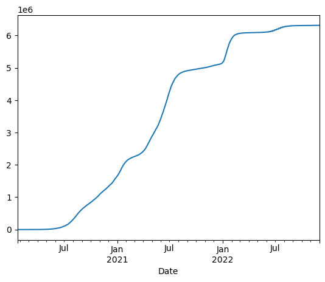
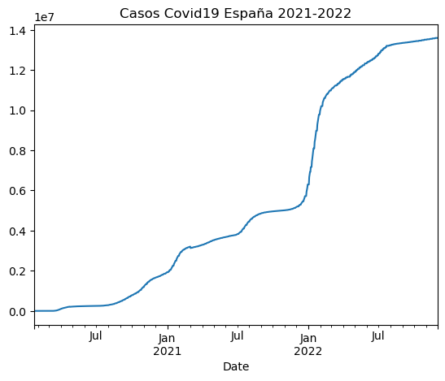
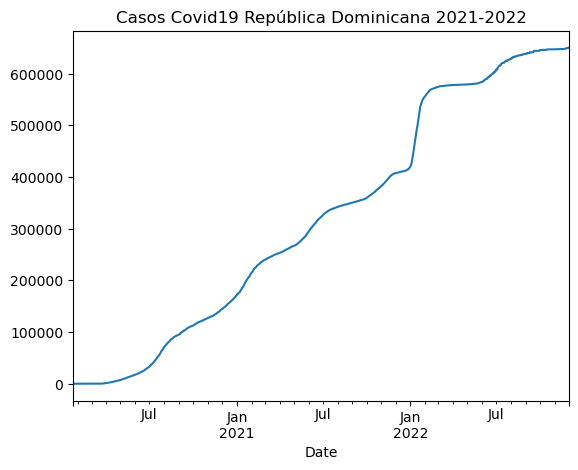

# Uso De la API del Covid-19 con Pandas

A continuación trabajaremos con los datos facilitados por la página api.covid19api, cuyo fin es recopilar información se los contagias de covid 19 en todo el planeta. 

En este ejercicio implementaremos la función **Pandas**,  librería externa de Python, con la trabajáremos los datos del Covid para aprender a crear gráficas de líneas.

[ad4.ipynb](docs/ad4.ipynb)

La url: https://api.covid19api.com/countries

## Instalación de librerias:

Para la instalación las librerías con la que trabajaremos se utiliza **!pip**. Como se está ejecutando **bash**, el cual es el CLI por defecto en la mayoría de distribuciones Linux, debe ser acompañado por un símbolo de exclamación.

`pip` es un manejador de paquetes para Python


```python
!pip install pandas
```

    Requirement already satisfied: pandas in c:\users\gabri\anaconda3\lib\site-packages (1.4.4)
    Requirement already satisfied: python-dateutil>=2.8.1 in c:\users\gabri\anaconda3\lib\site-packages (from pandas) (2.8.2)
    Requirement already satisfied: pytz>=2020.1 in c:\users\gabri\anaconda3\lib\site-packages (from pandas) (2022.1)
    Requirement already satisfied: numpy>=1.18.5 in c:\users\gabri\anaconda3\lib\site-packages (from pandas) (1.21.5)
    Requirement already satisfied: six>=1.5 in c:\users\gabri\anaconda3\lib\site-packages (from python-dateutil>=2.8.1->pandas) (1.16.0)
    

## Configuración de Pandas 

Al instalar el pandas este se importa como **pd**


```python
import pandas as pd
```

Para que **Python** carga todas las bibliotecas. Se tiene que usar el enunciado `import` en nuestro código para usar las funciones de la biblioteca. E importar la biblioteca **Pandas** empleando su abreviatura `pd`.

## Mi url

Luego creamos la variable `miurl` para designar la dirección de la página deseada que incluiremos en la fórmula dentro de comillas simples.


```python
miurl = "https://api.covid19api.com/countries"
```

Para certificar el correcto funcionamiento de la variable creada, escribimos miurl y debería mostrar el link de la página con que trabajaremos. 


```python
miurl
```


    'https://api.covid19api.com/countries'


Si queremos saber qué tipo de variable representa miurl, solo tengo que encerrarlo en paréntesis y entrar en una función type


```python
type(miurl)
```


    str


## Ejecutamos función Panda
#### dataframe

La abreviatura de dataframe es **df**. Con función **read_json()** que lee el formato **json**. dentro del parentecer ponemos lo que queremos leer. Ejemplo, un miurl. 


```python
df = pd.read_json(miurl)
```

Para visualizar los datos llamamos el objeto y panda identifica una de las entradas del dataframe.

para visualizar los datos llamos al objeto. Observamos una tabla de Panda que identifica las entradas del dataframe.


```python
df
```


<div>
<style scoped>
    .dataframe tbody tr th:only-of-type {
        vertical-align: middle;
    }

    .dataframe tbody tr th {
        vertical-align: top;
    }

    .dataframe thead th {
        text-align: right;
    }
</style>
<table border="1" class="dataframe">
  <thead>
    <tr style="text-align: right;">
      <th></th>
      <th>Country</th>
      <th>Slug</th>
      <th>ISO2</th>
    </tr>
  </thead>
  <tbody>
    <tr>
      <th>0</th>
      <td>Bhutan</td>
      <td>bhutan</td>
      <td>BT</td>
    </tr>
    <tr>
      <th>1</th>
      <td>British Virgin Islands</td>
      <td>british-virgin-islands</td>
      <td>VG</td>
    </tr>
    <tr>
      <th>2</th>
      <td>Côte d'Ivoire</td>
      <td>cote-divoire</td>
      <td>CI</td>
    </tr>
    <tr>
      <th>3</th>
      <td>Namibia</td>
      <td>namibia</td>
      <td>NA</td>
    </tr>
    <tr>
      <th>4</th>
      <td>Slovakia</td>
      <td>slovakia</td>
      <td>SK</td>
    </tr>
    <tr>
      <th>...</th>
      <td>...</td>
      <td>...</td>
      <td>...</td>
    </tr>
    <tr>
      <th>243</th>
      <td>Jordan</td>
      <td>jordan</td>
      <td>JO</td>
    </tr>
    <tr>
      <th>244</th>
      <td>Lesotho</td>
      <td>lesotho</td>
      <td>LS</td>
    </tr>
    <tr>
      <th>245</th>
      <td>United Kingdom</td>
      <td>united-kingdom</td>
      <td>GB</td>
    </tr>
    <tr>
      <th>246</th>
      <td>Falkland Islands (Malvinas)</td>
      <td>falkland-islands-malvinas</td>
      <td>FK</td>
    </tr>
    <tr>
      <th>247</th>
      <td>Trinidad and Tobago</td>
      <td>trinidad-and-tobago</td>
      <td>TT</td>
    </tr>
  </tbody>
</table>
<p>248 rows × 3 columns</p>
</div>


## Exploracion de la tabla

Para ver las primeras entradas de la tabla utilizaremos la siguiente función: 6 para ver las seis primeras.  


```python
df.head(6)
```


<div>
<style scoped>
    .dataframe tbody tr th:only-of-type {
        vertical-align: middle;
    }

    .dataframe tbody tr th {
        vertical-align: top;
    }

    .dataframe thead th {
        text-align: right;
    }
</style>
<table border="1" class="dataframe">
  <thead>
    <tr style="text-align: right;">
      <th></th>
      <th>Country</th>
      <th>Slug</th>
      <th>ISO2</th>
    </tr>
  </thead>
  <tbody>
    <tr>
      <th>0</th>
      <td>Bhutan</td>
      <td>bhutan</td>
      <td>BT</td>
    </tr>
    <tr>
      <th>1</th>
      <td>British Virgin Islands</td>
      <td>british-virgin-islands</td>
      <td>VG</td>
    </tr>
    <tr>
      <th>2</th>
      <td>Côte d'Ivoire</td>
      <td>cote-divoire</td>
      <td>CI</td>
    </tr>
    <tr>
      <th>3</th>
      <td>Namibia</td>
      <td>namibia</td>
      <td>NA</td>
    </tr>
    <tr>
      <th>4</th>
      <td>Slovakia</td>
      <td>slovakia</td>
      <td>SK</td>
    </tr>
    <tr>
      <th>5</th>
      <td>US Minor Outlying Islands</td>
      <td>us-minor-outlying-islands</td>
      <td>UM</td>
    </tr>
  </tbody>
</table>
</div>


Con **df.tail()** Vemos las ultimas


```python
df.tail(6)
```


<div>
<style scoped>
    .dataframe tbody tr th:only-of-type {
        vertical-align: middle;
    }

    .dataframe tbody tr th {
        vertical-align: top;
    }

    .dataframe thead th {
        text-align: right;
    }
</style>
<table border="1" class="dataframe">
  <thead>
    <tr style="text-align: right;">
      <th></th>
      <th>Country</th>
      <th>Slug</th>
      <th>ISO2</th>
    </tr>
  </thead>
  <tbody>
    <tr>
      <th>242</th>
      <td>Guyana</td>
      <td>guyana</td>
      <td>GY</td>
    </tr>
    <tr>
      <th>243</th>
      <td>Jordan</td>
      <td>jordan</td>
      <td>JO</td>
    </tr>
    <tr>
      <th>244</th>
      <td>Lesotho</td>
      <td>lesotho</td>
      <td>LS</td>
    </tr>
    <tr>
      <th>245</th>
      <td>United Kingdom</td>
      <td>united-kingdom</td>
      <td>GB</td>
    </tr>
    <tr>
      <th>246</th>
      <td>Falkland Islands (Malvinas)</td>
      <td>falkland-islands-malvinas</td>
      <td>FK</td>
    </tr>
    <tr>
      <th>247</th>
      <td>Trinidad and Tobago</td>
      <td>trinidad-and-tobago</td>
      <td>TT</td>
    </tr>
  </tbody>
</table>
</div>


Para ver las informaciones sobre las variables que contiene el df usamos la siguiente función:


```python
df.info()
```

    <class 'pandas.core.frame.DataFrame'>
    RangeIndex: 248 entries, 0 to 247
    Data columns (total 3 columns):
     #   Column   Non-Null Count  Dtype 
    ---  ------   --------------  ----- 
     0   Country  248 non-null    object
     1   Slug     248 non-null    object
     2   ISO2     248 non-null    object
    dtypes: object(3)
    memory usage: 5.9+ KB
    

Para visualizar una sola variable


```python
df['Country']
```


    0                           Bhutan
    1           British Virgin Islands
    2                    Côte d'Ivoire
    3                          Namibia
    4                         Slovakia
                      ...             
    243                         Jordan
    244                        Lesotho
    245                 United Kingdom
    246    Falkland Islands (Malvinas)
    247            Trinidad and Tobago
    Name: Country, Length: 248, dtype: object


Para ver un valor concreto de una de las varibles:


```python
df['Country'][66]
```


    'Uzbekistan'


```python
df['ISO2'].head()
```


    0    BT
    1    VG
    2    CI
    3    NA
    4    SK
    Name: ISO2, dtype: object


## Tiempo real

### Colombia

La url que utilizamos ahora es la siguiente: https://api.covid19api.com/country/colombia/status/confirmed/live

Guardamos los datos, pero ahora añadiendo **col** (abreviatura de colombia) para identificar y solo trabajar con este país **df_col**.


```python
url_col = 'https://api.covid19api.com/country/colombia/status/confirmed/live'
df_col = pd.read_json(url_col)
df_col
```


<div>
<style scoped>
    .dataframe tbody tr th:only-of-type {
        vertical-align: middle;
    }

    .dataframe tbody tr th {
        vertical-align: top;
    }

    .dataframe thead th {
        text-align: right;
    }
</style>
<table border="1" class="dataframe">
  <thead>
    <tr style="text-align: right;">
      <th></th>
      <th>Country</th>
      <th>CountryCode</th>
      <th>Province</th>
      <th>City</th>
      <th>CityCode</th>
      <th>Lat</th>
      <th>Lon</th>
      <th>Cases</th>
      <th>Status</th>
      <th>Date</th>
    </tr>
  </thead>
  <tbody>
    <tr>
      <th>0</th>
      <td>Colombia</td>
      <td>CO</td>
      <td></td>
      <td></td>
      <td></td>
      <td>4.57</td>
      <td>-74.3</td>
      <td>0</td>
      <td>confirmed</td>
      <td>2020-01-22 00:00:00+00:00</td>
    </tr>
    <tr>
      <th>1</th>
      <td>Colombia</td>
      <td>CO</td>
      <td></td>
      <td></td>
      <td></td>
      <td>4.57</td>
      <td>-74.3</td>
      <td>0</td>
      <td>confirmed</td>
      <td>2020-01-23 00:00:00+00:00</td>
    </tr>
    <tr>
      <th>2</th>
      <td>Colombia</td>
      <td>CO</td>
      <td></td>
      <td></td>
      <td></td>
      <td>4.57</td>
      <td>-74.3</td>
      <td>0</td>
      <td>confirmed</td>
      <td>2020-01-24 00:00:00+00:00</td>
    </tr>
    <tr>
      <th>3</th>
      <td>Colombia</td>
      <td>CO</td>
      <td></td>
      <td></td>
      <td></td>
      <td>4.57</td>
      <td>-74.3</td>
      <td>0</td>
      <td>confirmed</td>
      <td>2020-01-25 00:00:00+00:00</td>
    </tr>
    <tr>
      <th>4</th>
      <td>Colombia</td>
      <td>CO</td>
      <td></td>
      <td></td>
      <td></td>
      <td>4.57</td>
      <td>-74.3</td>
      <td>0</td>
      <td>confirmed</td>
      <td>2020-01-26 00:00:00+00:00</td>
    </tr>
    <tr>
      <th>...</th>
      <td>...</td>
      <td>...</td>
      <td>...</td>
      <td>...</td>
      <td>...</td>
      <td>...</td>
      <td>...</td>
      <td>...</td>
      <td>...</td>
      <td>...</td>
    </tr>
    <tr>
      <th>1040</th>
      <td>Colombia</td>
      <td>CO</td>
      <td></td>
      <td></td>
      <td></td>
      <td>4.57</td>
      <td>-74.3</td>
      <td>6312657</td>
      <td>confirmed</td>
      <td>2022-11-27 00:00:00+00:00</td>
    </tr>
    <tr>
      <th>1041</th>
      <td>Colombia</td>
      <td>CO</td>
      <td></td>
      <td></td>
      <td></td>
      <td>4.57</td>
      <td>-74.3</td>
      <td>6312657</td>
      <td>confirmed</td>
      <td>2022-11-28 00:00:00+00:00</td>
    </tr>
    <tr>
      <th>1042</th>
      <td>Colombia</td>
      <td>CO</td>
      <td></td>
      <td></td>
      <td></td>
      <td>4.57</td>
      <td>-74.3</td>
      <td>6312657</td>
      <td>confirmed</td>
      <td>2022-11-29 00:00:00+00:00</td>
    </tr>
    <tr>
      <th>1043</th>
      <td>Colombia</td>
      <td>CO</td>
      <td></td>
      <td></td>
      <td></td>
      <td>4.57</td>
      <td>-74.3</td>
      <td>6312657</td>
      <td>confirmed</td>
      <td>2022-11-30 00:00:00+00:00</td>
    </tr>
    <tr>
      <th>1044</th>
      <td>Colombia</td>
      <td>CO</td>
      <td></td>
      <td></td>
      <td></td>
      <td>4.57</td>
      <td>-74.3</td>
      <td>6312657</td>
      <td>confirmed</td>
      <td>2022-12-01 00:00:00+00:00</td>
    </tr>
  </tbody>
</table>
<p>1045 rows × 10 columns</p>
</div>


## Explorar Datos

Por columnas


```python
df_col.columns
```


    Index(['Country', 'CountryCode', 'Province', 'City', 'CityCode', 'Lat', 'Lon',
           'Cases', 'Status', 'Date'],
          dtype='object')


Cabecera


```python
df_col.head(10)
```


<div>
<style scoped>
    .dataframe tbody tr th:only-of-type {
        vertical-align: middle;
    }

    .dataframe tbody tr th {
        vertical-align: top;
    }

    .dataframe thead th {
        text-align: right;
    }
</style>
<table border="1" class="dataframe">
  <thead>
    <tr style="text-align: right;">
      <th></th>
      <th>Country</th>
      <th>CountryCode</th>
      <th>Province</th>
      <th>City</th>
      <th>CityCode</th>
      <th>Lat</th>
      <th>Lon</th>
      <th>Cases</th>
      <th>Status</th>
      <th>Date</th>
    </tr>
  </thead>
  <tbody>
    <tr>
      <th>0</th>
      <td>Colombia</td>
      <td>CO</td>
      <td></td>
      <td></td>
      <td></td>
      <td>4.57</td>
      <td>-74.3</td>
      <td>0</td>
      <td>confirmed</td>
      <td>2020-01-22 00:00:00+00:00</td>
    </tr>
    <tr>
      <th>1</th>
      <td>Colombia</td>
      <td>CO</td>
      <td></td>
      <td></td>
      <td></td>
      <td>4.57</td>
      <td>-74.3</td>
      <td>0</td>
      <td>confirmed</td>
      <td>2020-01-23 00:00:00+00:00</td>
    </tr>
    <tr>
      <th>2</th>
      <td>Colombia</td>
      <td>CO</td>
      <td></td>
      <td></td>
      <td></td>
      <td>4.57</td>
      <td>-74.3</td>
      <td>0</td>
      <td>confirmed</td>
      <td>2020-01-24 00:00:00+00:00</td>
    </tr>
    <tr>
      <th>3</th>
      <td>Colombia</td>
      <td>CO</td>
      <td></td>
      <td></td>
      <td></td>
      <td>4.57</td>
      <td>-74.3</td>
      <td>0</td>
      <td>confirmed</td>
      <td>2020-01-25 00:00:00+00:00</td>
    </tr>
    <tr>
      <th>4</th>
      <td>Colombia</td>
      <td>CO</td>
      <td></td>
      <td></td>
      <td></td>
      <td>4.57</td>
      <td>-74.3</td>
      <td>0</td>
      <td>confirmed</td>
      <td>2020-01-26 00:00:00+00:00</td>
    </tr>
    <tr>
      <th>5</th>
      <td>Colombia</td>
      <td>CO</td>
      <td></td>
      <td></td>
      <td></td>
      <td>4.57</td>
      <td>-74.3</td>
      <td>0</td>
      <td>confirmed</td>
      <td>2020-01-27 00:00:00+00:00</td>
    </tr>
    <tr>
      <th>6</th>
      <td>Colombia</td>
      <td>CO</td>
      <td></td>
      <td></td>
      <td></td>
      <td>4.57</td>
      <td>-74.3</td>
      <td>0</td>
      <td>confirmed</td>
      <td>2020-01-28 00:00:00+00:00</td>
    </tr>
    <tr>
      <th>7</th>
      <td>Colombia</td>
      <td>CO</td>
      <td></td>
      <td></td>
      <td></td>
      <td>4.57</td>
      <td>-74.3</td>
      <td>0</td>
      <td>confirmed</td>
      <td>2020-01-29 00:00:00+00:00</td>
    </tr>
    <tr>
      <th>8</th>
      <td>Colombia</td>
      <td>CO</td>
      <td></td>
      <td></td>
      <td></td>
      <td>4.57</td>
      <td>-74.3</td>
      <td>0</td>
      <td>confirmed</td>
      <td>2020-01-30 00:00:00+00:00</td>
    </tr>
    <tr>
      <th>9</th>
      <td>Colombia</td>
      <td>CO</td>
      <td></td>
      <td></td>
      <td></td>
      <td>4.57</td>
      <td>-74.3</td>
      <td>0</td>
      <td>confirmed</td>
      <td>2020-01-31 00:00:00+00:00</td>
    </tr>
  </tbody>
</table>
</div>


```python
df_col.tail(10)
```


<div>
<style scoped>
    .dataframe tbody tr th:only-of-type {
        vertical-align: middle;
    }

    .dataframe tbody tr th {
        vertical-align: top;
    }

    .dataframe thead th {
        text-align: right;
    }
</style>
<table border="1" class="dataframe">
  <thead>
    <tr style="text-align: right;">
      <th></th>
      <th>Country</th>
      <th>CountryCode</th>
      <th>Province</th>
      <th>City</th>
      <th>CityCode</th>
      <th>Lat</th>
      <th>Lon</th>
      <th>Cases</th>
      <th>Status</th>
      <th>Date</th>
    </tr>
  </thead>
  <tbody>
    <tr>
      <th>1035</th>
      <td>Colombia</td>
      <td>CO</td>
      <td></td>
      <td></td>
      <td></td>
      <td>4.57</td>
      <td>-74.3</td>
      <td>6312657</td>
      <td>confirmed</td>
      <td>2022-11-22 00:00:00+00:00</td>
    </tr>
    <tr>
      <th>1036</th>
      <td>Colombia</td>
      <td>CO</td>
      <td></td>
      <td></td>
      <td></td>
      <td>4.57</td>
      <td>-74.3</td>
      <td>6312657</td>
      <td>confirmed</td>
      <td>2022-11-23 00:00:00+00:00</td>
    </tr>
    <tr>
      <th>1037</th>
      <td>Colombia</td>
      <td>CO</td>
      <td></td>
      <td></td>
      <td></td>
      <td>4.57</td>
      <td>-74.3</td>
      <td>6312657</td>
      <td>confirmed</td>
      <td>2022-11-24 00:00:00+00:00</td>
    </tr>
    <tr>
      <th>1038</th>
      <td>Colombia</td>
      <td>CO</td>
      <td></td>
      <td></td>
      <td></td>
      <td>4.57</td>
      <td>-74.3</td>
      <td>6312657</td>
      <td>confirmed</td>
      <td>2022-11-25 00:00:00+00:00</td>
    </tr>
    <tr>
      <th>1039</th>
      <td>Colombia</td>
      <td>CO</td>
      <td></td>
      <td></td>
      <td></td>
      <td>4.57</td>
      <td>-74.3</td>
      <td>6312657</td>
      <td>confirmed</td>
      <td>2022-11-26 00:00:00+00:00</td>
    </tr>
    <tr>
      <th>1040</th>
      <td>Colombia</td>
      <td>CO</td>
      <td></td>
      <td></td>
      <td></td>
      <td>4.57</td>
      <td>-74.3</td>
      <td>6312657</td>
      <td>confirmed</td>
      <td>2022-11-27 00:00:00+00:00</td>
    </tr>
    <tr>
      <th>1041</th>
      <td>Colombia</td>
      <td>CO</td>
      <td></td>
      <td></td>
      <td></td>
      <td>4.57</td>
      <td>-74.3</td>
      <td>6312657</td>
      <td>confirmed</td>
      <td>2022-11-28 00:00:00+00:00</td>
    </tr>
    <tr>
      <th>1042</th>
      <td>Colombia</td>
      <td>CO</td>
      <td></td>
      <td></td>
      <td></td>
      <td>4.57</td>
      <td>-74.3</td>
      <td>6312657</td>
      <td>confirmed</td>
      <td>2022-11-29 00:00:00+00:00</td>
    </tr>
    <tr>
      <th>1043</th>
      <td>Colombia</td>
      <td>CO</td>
      <td></td>
      <td></td>
      <td></td>
      <td>4.57</td>
      <td>-74.3</td>
      <td>6312657</td>
      <td>confirmed</td>
      <td>2022-11-30 00:00:00+00:00</td>
    </tr>
    <tr>
      <th>1044</th>
      <td>Colombia</td>
      <td>CO</td>
      <td></td>
      <td></td>
      <td></td>
      <td>4.57</td>
      <td>-74.3</td>
      <td>6312657</td>
      <td>confirmed</td>
      <td>2022-12-01 00:00:00+00:00</td>
    </tr>
  </tbody>
</table>
</div>


```python
df_col.info()
```

    <class 'pandas.core.frame.DataFrame'>
    RangeIndex: 1045 entries, 0 to 1044
    Data columns (total 10 columns):
     #   Column       Non-Null Count  Dtype              
    ---  ------       --------------  -----              
     0   Country      1045 non-null   object             
     1   CountryCode  1045 non-null   object             
     2   Province     1045 non-null   object             
     3   City         1045 non-null   object             
     4   CityCode     1045 non-null   object             
     5   Lat          1045 non-null   float64            
     6   Lon          1045 non-null   float64            
     7   Cases        1045 non-null   int64              
     8   Status       1045 non-null   object             
     9   Date         1045 non-null   datetime64[ns, UTC]
    dtypes: datetime64[ns, UTC](1), float64(2), int64(1), object(6)
    memory usage: 81.8+ KB
    

Para Obtener una descripción estadística de las variables del df (numero total, media, moda, desviación, mínimo, máximo y cuartiles):


```python
df_col.describe()
```


<div>
<style scoped>
    .dataframe tbody tr th:only-of-type {
        vertical-align: middle;
    }

    .dataframe tbody tr th {
        vertical-align: top;
    }

    .dataframe thead th {
        text-align: right;
    }
</style>
<table border="1" class="dataframe">
  <thead>
    <tr style="text-align: right;">
      <th></th>
      <th>Lat</th>
      <th>Lon</th>
      <th>Cases</th>
    </tr>
  </thead>
  <tbody>
    <tr>
      <th>count</th>
      <td>1.045000e+03</td>
      <td>1.045000e+03</td>
      <td>1.045000e+03</td>
    </tr>
    <tr>
      <th>mean</th>
      <td>4.570000e+00</td>
      <td>-7.430000e+01</td>
      <td>3.438521e+06</td>
    </tr>
    <tr>
      <th>std</th>
      <td>1.954928e-14</td>
      <td>1.464419e-12</td>
      <td>2.437906e+06</td>
    </tr>
    <tr>
      <th>min</th>
      <td>4.570000e+00</td>
      <td>-7.430000e+01</td>
      <td>0.000000e+00</td>
    </tr>
    <tr>
      <th>25%</th>
      <td>4.570000e+00</td>
      <td>-7.430000e+01</td>
      <td>8.943000e+05</td>
    </tr>
    <tr>
      <th>50%</th>
      <td>4.570000e+00</td>
      <td>-7.430000e+01</td>
      <td>4.158716e+06</td>
    </tr>
    <tr>
      <th>75%</th>
      <td>4.570000e+00</td>
      <td>-7.430000e+01</td>
      <td>6.077861e+06</td>
    </tr>
    <tr>
      <th>max</th>
      <td>4.570000e+00</td>
      <td>-7.430000e+01</td>
      <td>6.312657e+06</td>
    </tr>
  </tbody>
</table>
</div>


## Gráficos

Para la elaboración del mismo en el eje X (fechas) y Y (Casos).

Vamos a establcer la fecha como índice.


```python
df_col.set_index('Date')
```


<div>
<style scoped>
    .dataframe tbody tr th:only-of-type {
        vertical-align: middle;
    }

    .dataframe tbody tr th {
        vertical-align: top;
    }

    .dataframe thead th {
        text-align: right;
    }
</style>
<table border="1" class="dataframe">
  <thead>
    <tr style="text-align: right;">
      <th></th>
      <th>Country</th>
      <th>CountryCode</th>
      <th>Province</th>
      <th>City</th>
      <th>CityCode</th>
      <th>Lat</th>
      <th>Lon</th>
      <th>Cases</th>
      <th>Status</th>
    </tr>
    <tr>
      <th>Date</th>
      <th></th>
      <th></th>
      <th></th>
      <th></th>
      <th></th>
      <th></th>
      <th></th>
      <th></th>
      <th></th>
    </tr>
  </thead>
  <tbody>
    <tr>
      <th>2020-01-22 00:00:00+00:00</th>
      <td>Colombia</td>
      <td>CO</td>
      <td></td>
      <td></td>
      <td></td>
      <td>4.57</td>
      <td>-74.3</td>
      <td>0</td>
      <td>confirmed</td>
    </tr>
    <tr>
      <th>2020-01-23 00:00:00+00:00</th>
      <td>Colombia</td>
      <td>CO</td>
      <td></td>
      <td></td>
      <td></td>
      <td>4.57</td>
      <td>-74.3</td>
      <td>0</td>
      <td>confirmed</td>
    </tr>
    <tr>
      <th>2020-01-24 00:00:00+00:00</th>
      <td>Colombia</td>
      <td>CO</td>
      <td></td>
      <td></td>
      <td></td>
      <td>4.57</td>
      <td>-74.3</td>
      <td>0</td>
      <td>confirmed</td>
    </tr>
    <tr>
      <th>2020-01-25 00:00:00+00:00</th>
      <td>Colombia</td>
      <td>CO</td>
      <td></td>
      <td></td>
      <td></td>
      <td>4.57</td>
      <td>-74.3</td>
      <td>0</td>
      <td>confirmed</td>
    </tr>
    <tr>
      <th>2020-01-26 00:00:00+00:00</th>
      <td>Colombia</td>
      <td>CO</td>
      <td></td>
      <td></td>
      <td></td>
      <td>4.57</td>
      <td>-74.3</td>
      <td>0</td>
      <td>confirmed</td>
    </tr>
    <tr>
      <th>...</th>
      <td>...</td>
      <td>...</td>
      <td>...</td>
      <td>...</td>
      <td>...</td>
      <td>...</td>
      <td>...</td>
      <td>...</td>
      <td>...</td>
    </tr>
    <tr>
      <th>2022-11-27 00:00:00+00:00</th>
      <td>Colombia</td>
      <td>CO</td>
      <td></td>
      <td></td>
      <td></td>
      <td>4.57</td>
      <td>-74.3</td>
      <td>6312657</td>
      <td>confirmed</td>
    </tr>
    <tr>
      <th>2022-11-28 00:00:00+00:00</th>
      <td>Colombia</td>
      <td>CO</td>
      <td></td>
      <td></td>
      <td></td>
      <td>4.57</td>
      <td>-74.3</td>
      <td>6312657</td>
      <td>confirmed</td>
    </tr>
    <tr>
      <th>2022-11-29 00:00:00+00:00</th>
      <td>Colombia</td>
      <td>CO</td>
      <td></td>
      <td></td>
      <td></td>
      <td>4.57</td>
      <td>-74.3</td>
      <td>6312657</td>
      <td>confirmed</td>
    </tr>
    <tr>
      <th>2022-11-30 00:00:00+00:00</th>
      <td>Colombia</td>
      <td>CO</td>
      <td></td>
      <td></td>
      <td></td>
      <td>4.57</td>
      <td>-74.3</td>
      <td>6312657</td>
      <td>confirmed</td>
    </tr>
    <tr>
      <th>2022-12-01 00:00:00+00:00</th>
      <td>Colombia</td>
      <td>CO</td>
      <td></td>
      <td></td>
      <td></td>
      <td>4.57</td>
      <td>-74.3</td>
      <td>6312657</td>
      <td>confirmed</td>
    </tr>
  </tbody>
</table>
<p>1045 rows × 9 columns</p>
</div>


```python
df_col
```


<div>
<style scoped>
    .dataframe tbody tr th:only-of-type {
        vertical-align: middle;
    }

    .dataframe tbody tr th {
        vertical-align: top;
    }

    .dataframe thead th {
        text-align: right;
    }
</style>
<table border="1" class="dataframe">
  <thead>
    <tr style="text-align: right;">
      <th></th>
      <th>Country</th>
      <th>CountryCode</th>
      <th>Province</th>
      <th>City</th>
      <th>CityCode</th>
      <th>Lat</th>
      <th>Lon</th>
      <th>Cases</th>
      <th>Status</th>
      <th>Date</th>
    </tr>
  </thead>
  <tbody>
    <tr>
      <th>0</th>
      <td>Colombia</td>
      <td>CO</td>
      <td></td>
      <td></td>
      <td></td>
      <td>4.57</td>
      <td>-74.3</td>
      <td>0</td>
      <td>confirmed</td>
      <td>2020-01-22 00:00:00+00:00</td>
    </tr>
    <tr>
      <th>1</th>
      <td>Colombia</td>
      <td>CO</td>
      <td></td>
      <td></td>
      <td></td>
      <td>4.57</td>
      <td>-74.3</td>
      <td>0</td>
      <td>confirmed</td>
      <td>2020-01-23 00:00:00+00:00</td>
    </tr>
    <tr>
      <th>2</th>
      <td>Colombia</td>
      <td>CO</td>
      <td></td>
      <td></td>
      <td></td>
      <td>4.57</td>
      <td>-74.3</td>
      <td>0</td>
      <td>confirmed</td>
      <td>2020-01-24 00:00:00+00:00</td>
    </tr>
    <tr>
      <th>3</th>
      <td>Colombia</td>
      <td>CO</td>
      <td></td>
      <td></td>
      <td></td>
      <td>4.57</td>
      <td>-74.3</td>
      <td>0</td>
      <td>confirmed</td>
      <td>2020-01-25 00:00:00+00:00</td>
    </tr>
    <tr>
      <th>4</th>
      <td>Colombia</td>
      <td>CO</td>
      <td></td>
      <td></td>
      <td></td>
      <td>4.57</td>
      <td>-74.3</td>
      <td>0</td>
      <td>confirmed</td>
      <td>2020-01-26 00:00:00+00:00</td>
    </tr>
    <tr>
      <th>...</th>
      <td>...</td>
      <td>...</td>
      <td>...</td>
      <td>...</td>
      <td>...</td>
      <td>...</td>
      <td>...</td>
      <td>...</td>
      <td>...</td>
      <td>...</td>
    </tr>
    <tr>
      <th>1040</th>
      <td>Colombia</td>
      <td>CO</td>
      <td></td>
      <td></td>
      <td></td>
      <td>4.57</td>
      <td>-74.3</td>
      <td>6312657</td>
      <td>confirmed</td>
      <td>2022-11-27 00:00:00+00:00</td>
    </tr>
    <tr>
      <th>1041</th>
      <td>Colombia</td>
      <td>CO</td>
      <td></td>
      <td></td>
      <td></td>
      <td>4.57</td>
      <td>-74.3</td>
      <td>6312657</td>
      <td>confirmed</td>
      <td>2022-11-28 00:00:00+00:00</td>
    </tr>
    <tr>
      <th>1042</th>
      <td>Colombia</td>
      <td>CO</td>
      <td></td>
      <td></td>
      <td></td>
      <td>4.57</td>
      <td>-74.3</td>
      <td>6312657</td>
      <td>confirmed</td>
      <td>2022-11-29 00:00:00+00:00</td>
    </tr>
    <tr>
      <th>1043</th>
      <td>Colombia</td>
      <td>CO</td>
      <td></td>
      <td></td>
      <td></td>
      <td>4.57</td>
      <td>-74.3</td>
      <td>6312657</td>
      <td>confirmed</td>
      <td>2022-11-30 00:00:00+00:00</td>
    </tr>
    <tr>
      <th>1044</th>
      <td>Colombia</td>
      <td>CO</td>
      <td></td>
      <td></td>
      <td></td>
      <td>4.57</td>
      <td>-74.3</td>
      <td>6312657</td>
      <td>confirmed</td>
      <td>2022-12-01 00:00:00+00:00</td>
    </tr>
  </tbody>
</table>
<p>1045 rows × 10 columns</p>
</div>


Como la tabla debe reflejar tambien los casos, creamos una vista para ver datos por fechas.


```python
df_col.set_index('Date')['Cases']
```


    Date
    2020-01-22 00:00:00+00:00          0
    2020-01-23 00:00:00+00:00          0
    2020-01-24 00:00:00+00:00          0
    2020-01-25 00:00:00+00:00          0
    2020-01-26 00:00:00+00:00          0
                                  ...   
    2022-11-27 00:00:00+00:00    6312657
    2022-11-28 00:00:00+00:00    6312657
    2022-11-29 00:00:00+00:00    6312657
    2022-11-30 00:00:00+00:00    6312657
    2022-12-01 00:00:00+00:00    6312657
    Name: Cases, Length: 1045, dtype: int64


Sobre esta vista creamos el gráfico con la funcion **plot**.


```python
df_col.set_index('Date')['Cases'].plot()
```


    <AxesSubplot:xlabel='Date'>


    

    


Para nombrar el gráfico usamos el atributo title:


```python
df_col.set_index('Date')['Cases'].plot(title= "Casos Covid19 Colombia 2021-2022")
```


    <AxesSubplot:title={'center':'Casos Covid19 Colombia 2021-2022'}, xlabel='Date'>


    

    


Repetimos con los datos de España, Ecuador y República Dominicana:

### España

La url que utilizamos ahora es la siguiente: https://api.covid19api.com/country/spain/status/confirmed/live

Guardamos los datos, pero ahora añadiendo **es** (abreviatura de España) para identificar y solo trabajar con este país **df_es**.


```python
url_es = 'https://api.covid19api.com/country/spain/status/confirmed/live'
df_es = pd.read_json(url_es)
df_es    
```


<div>
<style scoped>
    .dataframe tbody tr th:only-of-type {
        vertical-align: middle;
    }

    .dataframe tbody tr th {
        vertical-align: top;
    }

    .dataframe thead th {
        text-align: right;
    }
</style>
<table border="1" class="dataframe">
  <thead>
    <tr style="text-align: right;">
      <th></th>
      <th>Country</th>
      <th>CountryCode</th>
      <th>Province</th>
      <th>City</th>
      <th>CityCode</th>
      <th>Lat</th>
      <th>Lon</th>
      <th>Cases</th>
      <th>Status</th>
      <th>Date</th>
    </tr>
  </thead>
  <tbody>
    <tr>
      <th>0</th>
      <td>Spain</td>
      <td>ES</td>
      <td></td>
      <td></td>
      <td></td>
      <td>40.46</td>
      <td>-3.75</td>
      <td>0</td>
      <td>confirmed</td>
      <td>2020-01-22 00:00:00+00:00</td>
    </tr>
    <tr>
      <th>1</th>
      <td>Spain</td>
      <td>ES</td>
      <td></td>
      <td></td>
      <td></td>
      <td>40.46</td>
      <td>-3.75</td>
      <td>0</td>
      <td>confirmed</td>
      <td>2020-01-23 00:00:00+00:00</td>
    </tr>
    <tr>
      <th>2</th>
      <td>Spain</td>
      <td>ES</td>
      <td></td>
      <td></td>
      <td></td>
      <td>40.46</td>
      <td>-3.75</td>
      <td>0</td>
      <td>confirmed</td>
      <td>2020-01-24 00:00:00+00:00</td>
    </tr>
    <tr>
      <th>3</th>
      <td>Spain</td>
      <td>ES</td>
      <td></td>
      <td></td>
      <td></td>
      <td>40.46</td>
      <td>-3.75</td>
      <td>0</td>
      <td>confirmed</td>
      <td>2020-01-25 00:00:00+00:00</td>
    </tr>
    <tr>
      <th>4</th>
      <td>Spain</td>
      <td>ES</td>
      <td></td>
      <td></td>
      <td></td>
      <td>40.46</td>
      <td>-3.75</td>
      <td>0</td>
      <td>confirmed</td>
      <td>2020-01-26 00:00:00+00:00</td>
    </tr>
    <tr>
      <th>...</th>
      <td>...</td>
      <td>...</td>
      <td>...</td>
      <td>...</td>
      <td>...</td>
      <td>...</td>
      <td>...</td>
      <td>...</td>
      <td>...</td>
      <td>...</td>
    </tr>
    <tr>
      <th>1040</th>
      <td>Spain</td>
      <td>ES</td>
      <td></td>
      <td></td>
      <td></td>
      <td>40.46</td>
      <td>-3.75</td>
      <td>13595504</td>
      <td>confirmed</td>
      <td>2022-11-27 00:00:00+00:00</td>
    </tr>
    <tr>
      <th>1041</th>
      <td>Spain</td>
      <td>ES</td>
      <td></td>
      <td></td>
      <td></td>
      <td>40.46</td>
      <td>-3.75</td>
      <td>13595504</td>
      <td>confirmed</td>
      <td>2022-11-28 00:00:00+00:00</td>
    </tr>
    <tr>
      <th>1042</th>
      <td>Spain</td>
      <td>ES</td>
      <td></td>
      <td></td>
      <td></td>
      <td>40.46</td>
      <td>-3.75</td>
      <td>13595504</td>
      <td>confirmed</td>
      <td>2022-11-29 00:00:00+00:00</td>
    </tr>
    <tr>
      <th>1043</th>
      <td>Spain</td>
      <td>ES</td>
      <td></td>
      <td></td>
      <td></td>
      <td>40.46</td>
      <td>-3.75</td>
      <td>13595504</td>
      <td>confirmed</td>
      <td>2022-11-30 00:00:00+00:00</td>
    </tr>
    <tr>
      <th>1044</th>
      <td>Spain</td>
      <td>ES</td>
      <td></td>
      <td></td>
      <td></td>
      <td>40.46</td>
      <td>-3.75</td>
      <td>13595504</td>
      <td>confirmed</td>
      <td>2022-12-01 00:00:00+00:00</td>
    </tr>
  </tbody>
</table>
<p>1045 rows × 10 columns</p>
</div>


```python
df_es.set_index('Date')['Cases'].plot(title= "Casos Covid19 España 2021-2022")
```


    <AxesSubplot:title={'center':'Casos Covid19 España 2021-2022'}, xlabel='Date'>


    

    


### Ecuador

La url que utilizamos ahora es la siguiente: https://api.covid19api.com/country/ecuador/status/confirmed/live

Guardamos los datos, pero ahora añadiendo **ec** (abreviatura de Ecuador) para identificar y solo trabajar con este país **df_ec**.


```python
url_ec = 'https://api.covid19api.com/country/ecuador/status/confirmed/live'
df_ec = pd.read_json(url_ec)
df_ec
```


<div>
<style scoped>
    .dataframe tbody tr th:only-of-type {
        vertical-align: middle;
    }

    .dataframe tbody tr th {
        vertical-align: top;
    }

    .dataframe thead th {
        text-align: right;
    }
</style>
<table border="1" class="dataframe">
  <thead>
    <tr style="text-align: right;">
      <th></th>
      <th>Country</th>
      <th>CountryCode</th>
      <th>Province</th>
      <th>City</th>
      <th>CityCode</th>
      <th>Lat</th>
      <th>Lon</th>
      <th>Cases</th>
      <th>Status</th>
      <th>Date</th>
    </tr>
  </thead>
  <tbody>
    <tr>
      <th>0</th>
      <td>Ecuador</td>
      <td>EC</td>
      <td></td>
      <td></td>
      <td></td>
      <td>-1.83</td>
      <td>-78.18</td>
      <td>0</td>
      <td>confirmed</td>
      <td>2020-01-22 00:00:00+00:00</td>
    </tr>
    <tr>
      <th>1</th>
      <td>Ecuador</td>
      <td>EC</td>
      <td></td>
      <td></td>
      <td></td>
      <td>-1.83</td>
      <td>-78.18</td>
      <td>0</td>
      <td>confirmed</td>
      <td>2020-01-23 00:00:00+00:00</td>
    </tr>
    <tr>
      <th>2</th>
      <td>Ecuador</td>
      <td>EC</td>
      <td></td>
      <td></td>
      <td></td>
      <td>-1.83</td>
      <td>-78.18</td>
      <td>0</td>
      <td>confirmed</td>
      <td>2020-01-24 00:00:00+00:00</td>
    </tr>
    <tr>
      <th>3</th>
      <td>Ecuador</td>
      <td>EC</td>
      <td></td>
      <td></td>
      <td></td>
      <td>-1.83</td>
      <td>-78.18</td>
      <td>0</td>
      <td>confirmed</td>
      <td>2020-01-25 00:00:00+00:00</td>
    </tr>
    <tr>
      <th>4</th>
      <td>Ecuador</td>
      <td>EC</td>
      <td></td>
      <td></td>
      <td></td>
      <td>-1.83</td>
      <td>-78.18</td>
      <td>0</td>
      <td>confirmed</td>
      <td>2020-01-26 00:00:00+00:00</td>
    </tr>
    <tr>
      <th>...</th>
      <td>...</td>
      <td>...</td>
      <td>...</td>
      <td>...</td>
      <td>...</td>
      <td>...</td>
      <td>...</td>
      <td>...</td>
      <td>...</td>
      <td>...</td>
    </tr>
    <tr>
      <th>1040</th>
      <td>Ecuador</td>
      <td>EC</td>
      <td></td>
      <td></td>
      <td></td>
      <td>-1.83</td>
      <td>-78.18</td>
      <td>1009958</td>
      <td>confirmed</td>
      <td>2022-11-27 00:00:00+00:00</td>
    </tr>
    <tr>
      <th>1041</th>
      <td>Ecuador</td>
      <td>EC</td>
      <td></td>
      <td></td>
      <td></td>
      <td>-1.83</td>
      <td>-78.18</td>
      <td>1011132</td>
      <td>confirmed</td>
      <td>2022-11-28 00:00:00+00:00</td>
    </tr>
    <tr>
      <th>1042</th>
      <td>Ecuador</td>
      <td>EC</td>
      <td></td>
      <td></td>
      <td></td>
      <td>-1.83</td>
      <td>-78.18</td>
      <td>1011132</td>
      <td>confirmed</td>
      <td>2022-11-29 00:00:00+00:00</td>
    </tr>
    <tr>
      <th>1043</th>
      <td>Ecuador</td>
      <td>EC</td>
      <td></td>
      <td></td>
      <td></td>
      <td>-1.83</td>
      <td>-78.18</td>
      <td>1011132</td>
      <td>confirmed</td>
      <td>2022-11-30 00:00:00+00:00</td>
    </tr>
    <tr>
      <th>1044</th>
      <td>Ecuador</td>
      <td>EC</td>
      <td></td>
      <td></td>
      <td></td>
      <td>-1.83</td>
      <td>-78.18</td>
      <td>1011132</td>
      <td>confirmed</td>
      <td>2022-12-01 00:00:00+00:00</td>
    </tr>
  </tbody>
</table>
<p>1045 rows × 10 columns</p>
</div>


```python
df_ec.set_index('Date')['Cases'].plot(title= "Casos Covid19 Ecuador 2021-2022")
```


    <AxesSubplot:title={'center':'Casos Covid19 Ecuador 2021-2022'}, xlabel='Date'>


    

    


### República Dominicana

La url que utilizamos ahora es la siguiente: https://api.covid19api.com/country/Dominican%20Republic/status/confirmed/live

Guardamos los datos, pero ahora añadiendo **do** (abreviatura de Dominican Republic) para identificar y solo trabajar con este país **df_do**.


```python
url_do = 'https://api.covid19api.com/country/Dominican%20Republic/status/confirmed/live'
df_do = pd.read_json(url_do)
df_do
```


<div>
<style scoped>
    .dataframe tbody tr th:only-of-type {
        vertical-align: middle;
    }

    .dataframe tbody tr th {
        vertical-align: top;
    }

    .dataframe thead th {
        text-align: right;
    }
</style>
<table border="1" class="dataframe">
  <thead>
    <tr style="text-align: right;">
      <th></th>
      <th>Country</th>
      <th>CountryCode</th>
      <th>Province</th>
      <th>City</th>
      <th>CityCode</th>
      <th>Lat</th>
      <th>Lon</th>
      <th>Cases</th>
      <th>Status</th>
      <th>Date</th>
    </tr>
  </thead>
  <tbody>
    <tr>
      <th>0</th>
      <td>Dominican Republic</td>
      <td>DO</td>
      <td></td>
      <td></td>
      <td></td>
      <td>18.74</td>
      <td>-70.16</td>
      <td>0</td>
      <td>confirmed</td>
      <td>2020-01-22 00:00:00+00:00</td>
    </tr>
    <tr>
      <th>1</th>
      <td>Dominican Republic</td>
      <td>DO</td>
      <td></td>
      <td></td>
      <td></td>
      <td>18.74</td>
      <td>-70.16</td>
      <td>0</td>
      <td>confirmed</td>
      <td>2020-01-23 00:00:00+00:00</td>
    </tr>
    <tr>
      <th>2</th>
      <td>Dominican Republic</td>
      <td>DO</td>
      <td></td>
      <td></td>
      <td></td>
      <td>18.74</td>
      <td>-70.16</td>
      <td>0</td>
      <td>confirmed</td>
      <td>2020-01-24 00:00:00+00:00</td>
    </tr>
    <tr>
      <th>3</th>
      <td>Dominican Republic</td>
      <td>DO</td>
      <td></td>
      <td></td>
      <td></td>
      <td>18.74</td>
      <td>-70.16</td>
      <td>0</td>
      <td>confirmed</td>
      <td>2020-01-25 00:00:00+00:00</td>
    </tr>
    <tr>
      <th>4</th>
      <td>Dominican Republic</td>
      <td>DO</td>
      <td></td>
      <td></td>
      <td></td>
      <td>18.74</td>
      <td>-70.16</td>
      <td>0</td>
      <td>confirmed</td>
      <td>2020-01-26 00:00:00+00:00</td>
    </tr>
    <tr>
      <th>...</th>
      <td>...</td>
      <td>...</td>
      <td>...</td>
      <td>...</td>
      <td>...</td>
      <td>...</td>
      <td>...</td>
      <td>...</td>
      <td>...</td>
      <td>...</td>
    </tr>
    <tr>
      <th>1040</th>
      <td>Dominican Republic</td>
      <td>DO</td>
      <td></td>
      <td></td>
      <td></td>
      <td>18.74</td>
      <td>-70.16</td>
      <td>649834</td>
      <td>confirmed</td>
      <td>2022-11-27 00:00:00+00:00</td>
    </tr>
    <tr>
      <th>1041</th>
      <td>Dominican Republic</td>
      <td>DO</td>
      <td></td>
      <td></td>
      <td></td>
      <td>18.74</td>
      <td>-70.16</td>
      <td>649834</td>
      <td>confirmed</td>
      <td>2022-11-28 00:00:00+00:00</td>
    </tr>
    <tr>
      <th>1042</th>
      <td>Dominican Republic</td>
      <td>DO</td>
      <td></td>
      <td></td>
      <td></td>
      <td>18.74</td>
      <td>-70.16</td>
      <td>650381</td>
      <td>confirmed</td>
      <td>2022-11-29 00:00:00+00:00</td>
    </tr>
    <tr>
      <th>1043</th>
      <td>Dominican Republic</td>
      <td>DO</td>
      <td></td>
      <td></td>
      <td></td>
      <td>18.74</td>
      <td>-70.16</td>
      <td>650381</td>
      <td>confirmed</td>
      <td>2022-11-30 00:00:00+00:00</td>
    </tr>
    <tr>
      <th>1044</th>
      <td>Dominican Republic</td>
      <td>DO</td>
      <td></td>
      <td></td>
      <td></td>
      <td>18.74</td>
      <td>-70.16</td>
      <td>650381</td>
      <td>confirmed</td>
      <td>2022-12-01 00:00:00+00:00</td>
    </tr>
  </tbody>
</table>
<p>1045 rows × 10 columns</p>
</div>


```python
df_do.set_index('Date')['Cases'].plot(title= "Casos Covid19 República Dominicana 2021-2022")
```


    <AxesSubplot:title={'center':'Casos Covid19 República Dominicana 2021-2022'}, xlabel='Date'>


    

    


## Conclusión 

Es impresionante poder trabajaron una herramienta tan fácil y práctica como Python acompañado de la función Pandas, con la cual en minutos pudimos procesar los datos facilitados por api.covid19api y crear visualizaciones en segundos. 
