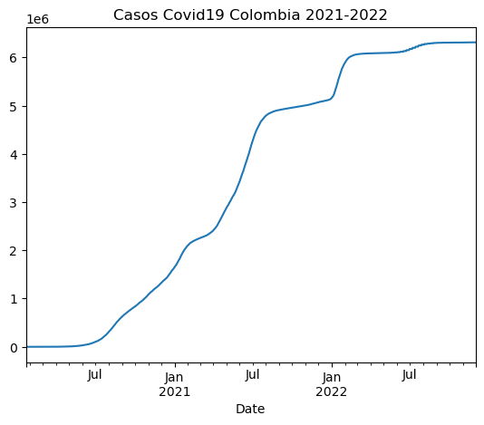
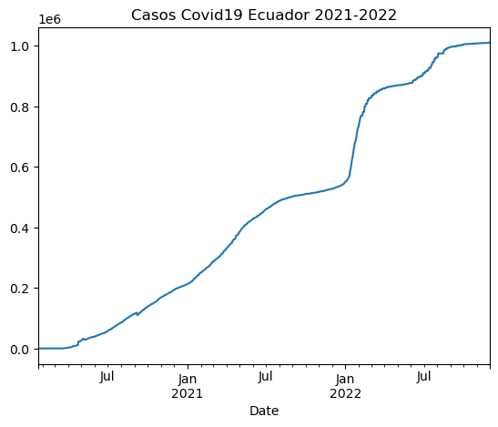

# Uso De la API del Covid-19 con Pandas

Aquí [IPython Notebook](docs/ad4.ipynb)

A continuación trabajaremos con los datos facilitados por la página api.covid19api, cuyo fin es recopilar información se los contagias de Covid19 en todo el planeta. 

En este ejercicio implementaremos la función **Pandas**,  librería externa de Phyton, con la trabajáremos los datos del Covid para aprender a crear gráficas de líneas 

La URL: https://api.covid19api.com/countries

## Instalación de librerias:

Para la instalación las librerías con la que trabajaremos se utiliza `!pip`. Como se está ejecutando **bash** pip debe ser acompañado por un símbolo de exclamación.


```python
!pip install pandas
```

    Requirement already satisfied: pandas in c:\users\gcastro\anaconda3\lib\site-packages (1.4.4)
    Requirement already satisfied: numpy>=1.18.5 in c:\users\gcastro\anaconda3\lib\site-packages (from pandas) (1.21.5)
    Requirement already satisfied: python-dateutil>=2.8.1 in c:\users\gcastro\anaconda3\lib\site-packages (from pandas) (2.8.2)
    Requirement already satisfied: pytz>=2020.1 in c:\users\gcastro\anaconda3\lib\site-packages (from pandas) (2022.1)
    Requirement already satisfied: six>=1.5 in c:\users\gcastro\anaconda3\lib\site-packages (from python-dateutil>=2.8.1->pandas) (1.16.0)
    

## Configuración de Pandas 

al instlar el pandas este se importa como `pd`


```python
import pandas as pd
```

## Mi url

Luego creamos la variable `miurl` para designar la dirección de la página deseada que incluiremos en la fórmula dentro de comillas simples.


```python
miurl = "https://api.covid19api.com/countries"
```

Para certificar el correcto funcionamiento de la variable creada, escribimos miurl y debería mostrar el link de la página con que trabajaremos. 


```python
miurl
```


    'https://api.covid19api.com/countries'


Si queremos saber qué tipo de variable representa miurl, solo tengo que encerrarlo en paréntesis y entrar en una función type


```python
type(miurl)
```


    str


## Función Panda
#### dataframe

`df` es la abreviación de dataframe. Esta será igual a la función `read_json()`que puede leer el formato `json`.y en el paréntesis de la función ponemos la `url` deseada


```python
df = pd.read_json(miurl)
```


```python
df
```


<div>
<style scoped>
    .dataframe tbody tr th:only-of-type {
        vertical-align: middle;
    }

    .dataframe tbody tr th {
        vertical-align: top;
    }

    .dataframe thead th {
        text-align: right;
    }
</style>
<table border="1" class="dataframe">
  <thead>
    <tr style="text-align: right;">
      <th></th>
      <th>Country</th>
      <th>Slug</th>
      <th>ISO2</th>
    </tr>
  </thead>
  <tbody>
    <tr>
      <th>0</th>
      <td>Nicaragua</td>
      <td>nicaragua</td>
      <td>NI</td>
    </tr>
    <tr>
      <th>1</th>
      <td>Pitcairn</td>
      <td>pitcairn</td>
      <td>PN</td>
    </tr>
    <tr>
      <th>2</th>
      <td>Serbia</td>
      <td>serbia</td>
      <td>RS</td>
    </tr>
    <tr>
      <th>3</th>
      <td>Swaziland</td>
      <td>swaziland</td>
      <td>SZ</td>
    </tr>
    <tr>
      <th>4</th>
      <td>Kiribati</td>
      <td>kiribati</td>
      <td>KI</td>
    </tr>
    <tr>
      <th>...</th>
      <td>...</td>
      <td>...</td>
      <td>...</td>
    </tr>
    <tr>
      <th>243</th>
      <td>Timor-Leste</td>
      <td>timor-leste</td>
      <td>TL</td>
    </tr>
    <tr>
      <th>244</th>
      <td>Namibia</td>
      <td>namibia</td>
      <td>NA</td>
    </tr>
    <tr>
      <th>245</th>
      <td>Rwanda</td>
      <td>rwanda</td>
      <td>RW</td>
    </tr>
    <tr>
      <th>246</th>
      <td>Turkey</td>
      <td>turkey</td>
      <td>TR</td>
    </tr>
    <tr>
      <th>247</th>
      <td>Isle of Man</td>
      <td>isle-of-man</td>
      <td>IM</td>
    </tr>
  </tbody>
</table>
<p>248 rows × 3 columns</p>
</div>


## Exploracion de la tabla

Si queremos visualizar las primeras entradas usamos `df.head()` y dentro de los paréntesis pondremos el número de filas que queremos visualizar, ejemplo 5:


```python
df.head(5)
```


<div>
<style scoped>
    .dataframe tbody tr th:only-of-type {
        vertical-align: middle;
    }

    .dataframe tbody tr th {
        vertical-align: top;
    }

    .dataframe thead th {
        text-align: right;
    }
</style>
<table border="1" class="dataframe">
  <thead>
    <tr style="text-align: right;">
      <th></th>
      <th>Country</th>
      <th>Slug</th>
      <th>ISO2</th>
    </tr>
  </thead>
  <tbody>
    <tr>
      <th>0</th>
      <td>Nicaragua</td>
      <td>nicaragua</td>
      <td>NI</td>
    </tr>
    <tr>
      <th>1</th>
      <td>Pitcairn</td>
      <td>pitcairn</td>
      <td>PN</td>
    </tr>
    <tr>
      <th>2</th>
      <td>Serbia</td>
      <td>serbia</td>
      <td>RS</td>
    </tr>
    <tr>
      <th>3</th>
      <td>Swaziland</td>
      <td>swaziland</td>
      <td>SZ</td>
    </tr>
    <tr>
      <th>4</th>
      <td>Kiribati</td>
      <td>kiribati</td>
      <td>KI</td>
    </tr>
  </tbody>
</table>
</div>


En el cado de querer ver las últimas filas usaremos `df.tail()`


```python
df.tail(6)
```


<div>
<style scoped>
    .dataframe tbody tr th:only-of-type {
        vertical-align: middle;
    }

    .dataframe tbody tr th {
        vertical-align: top;
    }

    .dataframe thead th {
        text-align: right;
    }
</style>
<table border="1" class="dataframe">
  <thead>
    <tr style="text-align: right;">
      <th></th>
      <th>Country</th>
      <th>Slug</th>
      <th>ISO2</th>
    </tr>
  </thead>
  <tbody>
    <tr>
      <th>242</th>
      <td>Equatorial Guinea</td>
      <td>equatorial-guinea</td>
      <td>GQ</td>
    </tr>
    <tr>
      <th>243</th>
      <td>Timor-Leste</td>
      <td>timor-leste</td>
      <td>TL</td>
    </tr>
    <tr>
      <th>244</th>
      <td>Namibia</td>
      <td>namibia</td>
      <td>NA</td>
    </tr>
    <tr>
      <th>245</th>
      <td>Rwanda</td>
      <td>rwanda</td>
      <td>RW</td>
    </tr>
    <tr>
      <th>246</th>
      <td>Turkey</td>
      <td>turkey</td>
      <td>TR</td>
    </tr>
    <tr>
      <th>247</th>
      <td>Isle of Man</td>
      <td>isle-of-man</td>
      <td>IM</td>
    </tr>
  </tbody>
</table>
</div>


Para ver las informaciones que contiene el `df` según la función elegida usaremos `df.info()`


```python
df.info()
```

    <class 'pandas.core.frame.DataFrame'>
    RangeIndex: 248 entries, 0 to 247
    Data columns (total 3 columns):
     #   Column   Non-Null Count  Dtype 
    ---  ------   --------------  ----- 
     0   Country  248 non-null    object
     1   Slug     248 non-null    object
     2   ISO2     248 non-null    object
    dtypes: object(3)
    memory usage: 5.9+ KB
    

Para la visualización de una variable usaremos `df['Country']`. Dentro de los corchetes pondremos la variable deseada. 


```python
df['Country']
```


    0        Nicaragua
    1         Pitcairn
    2           Serbia
    3        Swaziland
    4         Kiribati
              ...     
    243    Timor-Leste
    244        Namibia
    245         Rwanda
    246         Turkey
    247    Isle of Man
    Name: Country, Length: 248, dtype: object


Para un valor puntual de una de las variables:


```python
df['Country'][66]
```


    'Afghanistan'


```python
df['ISO2'].head()
```


    0    NI
    1    PN
    2    RS
    3    SZ
    4    KI
    Name: ISO2, dtype: object


### Colombia

#### Tiempo real

url: https://api.covid19api.com/country/colombia/status/confirmed/live

Con el url correspondiente a Colombia ya añadidos, usamos la abreviatura `col`para identificar la procedencia del dato y lo añadimos a `df`para solo trabajar con este país quedando la fórmula de así `df_col`.


```python
url_col = 'https://api.covid19api.com/country/colombia/status/confirmed/live'
df_col = pd.read_json(url_col)
df_col
```


<div>
<style scoped>
    .dataframe tbody tr th:only-of-type {
        vertical-align: middle;
    }

    .dataframe tbody tr th {
        vertical-align: top;
    }

    .dataframe thead th {
        text-align: right;
    }
</style>
<table border="1" class="dataframe">
  <thead>
    <tr style="text-align: right;">
      <th></th>
      <th>Country</th>
      <th>CountryCode</th>
      <th>Province</th>
      <th>City</th>
      <th>CityCode</th>
      <th>Lat</th>
      <th>Lon</th>
      <th>Cases</th>
      <th>Status</th>
      <th>Date</th>
    </tr>
  </thead>
  <tbody>
    <tr>
      <th>0</th>
      <td>Colombia</td>
      <td>CO</td>
      <td></td>
      <td></td>
      <td></td>
      <td>4.57</td>
      <td>-74.3</td>
      <td>0</td>
      <td>confirmed</td>
      <td>2020-01-22 00:00:00+00:00</td>
    </tr>
    <tr>
      <th>1</th>
      <td>Colombia</td>
      <td>CO</td>
      <td></td>
      <td></td>
      <td></td>
      <td>4.57</td>
      <td>-74.3</td>
      <td>0</td>
      <td>confirmed</td>
      <td>2020-01-23 00:00:00+00:00</td>
    </tr>
    <tr>
      <th>2</th>
      <td>Colombia</td>
      <td>CO</td>
      <td></td>
      <td></td>
      <td></td>
      <td>4.57</td>
      <td>-74.3</td>
      <td>0</td>
      <td>confirmed</td>
      <td>2020-01-24 00:00:00+00:00</td>
    </tr>
    <tr>
      <th>3</th>
      <td>Colombia</td>
      <td>CO</td>
      <td></td>
      <td></td>
      <td></td>
      <td>4.57</td>
      <td>-74.3</td>
      <td>0</td>
      <td>confirmed</td>
      <td>2020-01-25 00:00:00+00:00</td>
    </tr>
    <tr>
      <th>4</th>
      <td>Colombia</td>
      <td>CO</td>
      <td></td>
      <td></td>
      <td></td>
      <td>4.57</td>
      <td>-74.3</td>
      <td>0</td>
      <td>confirmed</td>
      <td>2020-01-26 00:00:00+00:00</td>
    </tr>
    <tr>
      <th>...</th>
      <td>...</td>
      <td>...</td>
      <td>...</td>
      <td>...</td>
      <td>...</td>
      <td>...</td>
      <td>...</td>
      <td>...</td>
      <td>...</td>
      <td>...</td>
    </tr>
    <tr>
      <th>1039</th>
      <td>Colombia</td>
      <td>CO</td>
      <td></td>
      <td></td>
      <td></td>
      <td>4.57</td>
      <td>-74.3</td>
      <td>6312657</td>
      <td>confirmed</td>
      <td>2022-11-26 00:00:00+00:00</td>
    </tr>
    <tr>
      <th>1040</th>
      <td>Colombia</td>
      <td>CO</td>
      <td></td>
      <td></td>
      <td></td>
      <td>4.57</td>
      <td>-74.3</td>
      <td>6312657</td>
      <td>confirmed</td>
      <td>2022-11-27 00:00:00+00:00</td>
    </tr>
    <tr>
      <th>1041</th>
      <td>Colombia</td>
      <td>CO</td>
      <td></td>
      <td></td>
      <td></td>
      <td>4.57</td>
      <td>-74.3</td>
      <td>6312657</td>
      <td>confirmed</td>
      <td>2022-11-28 00:00:00+00:00</td>
    </tr>
    <tr>
      <th>1042</th>
      <td>Colombia</td>
      <td>CO</td>
      <td></td>
      <td></td>
      <td></td>
      <td>4.57</td>
      <td>-74.3</td>
      <td>6312657</td>
      <td>confirmed</td>
      <td>2022-11-29 00:00:00+00:00</td>
    </tr>
    <tr>
      <th>1043</th>
      <td>Colombia</td>
      <td>CO</td>
      <td></td>
      <td></td>
      <td></td>
      <td>4.57</td>
      <td>-74.3</td>
      <td>6312657</td>
      <td>confirmed</td>
      <td>2022-11-30 00:00:00+00:00</td>
    </tr>
  </tbody>
</table>
<p>1044 rows × 10 columns</p>
</div>


## Explorar Datos

Por titulares de las columnas


```python
df_col.columns
```


    Index(['Country', 'CountryCode', 'Province', 'City', 'CityCode', 'Lat', 'Lon',
           'Cases', 'Status', 'Date'],
          dtype='object')


Cabecera


```python
df_col.head(10)
```


<div>
<style scoped>
    .dataframe tbody tr th:only-of-type {
        vertical-align: middle;
    }

    .dataframe tbody tr th {
        vertical-align: top;
    }

    .dataframe thead th {
        text-align: right;
    }
</style>
<table border="1" class="dataframe">
  <thead>
    <tr style="text-align: right;">
      <th></th>
      <th>Country</th>
      <th>CountryCode</th>
      <th>Province</th>
      <th>City</th>
      <th>CityCode</th>
      <th>Lat</th>
      <th>Lon</th>
      <th>Cases</th>
      <th>Status</th>
      <th>Date</th>
    </tr>
  </thead>
  <tbody>
    <tr>
      <th>0</th>
      <td>Colombia</td>
      <td>CO</td>
      <td></td>
      <td></td>
      <td></td>
      <td>4.57</td>
      <td>-74.3</td>
      <td>0</td>
      <td>confirmed</td>
      <td>2020-01-22 00:00:00+00:00</td>
    </tr>
    <tr>
      <th>1</th>
      <td>Colombia</td>
      <td>CO</td>
      <td></td>
      <td></td>
      <td></td>
      <td>4.57</td>
      <td>-74.3</td>
      <td>0</td>
      <td>confirmed</td>
      <td>2020-01-23 00:00:00+00:00</td>
    </tr>
    <tr>
      <th>2</th>
      <td>Colombia</td>
      <td>CO</td>
      <td></td>
      <td></td>
      <td></td>
      <td>4.57</td>
      <td>-74.3</td>
      <td>0</td>
      <td>confirmed</td>
      <td>2020-01-24 00:00:00+00:00</td>
    </tr>
    <tr>
      <th>3</th>
      <td>Colombia</td>
      <td>CO</td>
      <td></td>
      <td></td>
      <td></td>
      <td>4.57</td>
      <td>-74.3</td>
      <td>0</td>
      <td>confirmed</td>
      <td>2020-01-25 00:00:00+00:00</td>
    </tr>
    <tr>
      <th>4</th>
      <td>Colombia</td>
      <td>CO</td>
      <td></td>
      <td></td>
      <td></td>
      <td>4.57</td>
      <td>-74.3</td>
      <td>0</td>
      <td>confirmed</td>
      <td>2020-01-26 00:00:00+00:00</td>
    </tr>
    <tr>
      <th>5</th>
      <td>Colombia</td>
      <td>CO</td>
      <td></td>
      <td></td>
      <td></td>
      <td>4.57</td>
      <td>-74.3</td>
      <td>0</td>
      <td>confirmed</td>
      <td>2020-01-27 00:00:00+00:00</td>
    </tr>
    <tr>
      <th>6</th>
      <td>Colombia</td>
      <td>CO</td>
      <td></td>
      <td></td>
      <td></td>
      <td>4.57</td>
      <td>-74.3</td>
      <td>0</td>
      <td>confirmed</td>
      <td>2020-01-28 00:00:00+00:00</td>
    </tr>
    <tr>
      <th>7</th>
      <td>Colombia</td>
      <td>CO</td>
      <td></td>
      <td></td>
      <td></td>
      <td>4.57</td>
      <td>-74.3</td>
      <td>0</td>
      <td>confirmed</td>
      <td>2020-01-29 00:00:00+00:00</td>
    </tr>
    <tr>
      <th>8</th>
      <td>Colombia</td>
      <td>CO</td>
      <td></td>
      <td></td>
      <td></td>
      <td>4.57</td>
      <td>-74.3</td>
      <td>0</td>
      <td>confirmed</td>
      <td>2020-01-30 00:00:00+00:00</td>
    </tr>
    <tr>
      <th>9</th>
      <td>Colombia</td>
      <td>CO</td>
      <td></td>
      <td></td>
      <td></td>
      <td>4.57</td>
      <td>-74.3</td>
      <td>0</td>
      <td>confirmed</td>
      <td>2020-01-31 00:00:00+00:00</td>
    </tr>
  </tbody>
</table>
</div>


```python
df_col.tail(10)
```


<div>
<style scoped>
    .dataframe tbody tr th:only-of-type {
        vertical-align: middle;
    }

    .dataframe tbody tr th {
        vertical-align: top;
    }

    .dataframe thead th {
        text-align: right;
    }
</style>
<table border="1" class="dataframe">
  <thead>
    <tr style="text-align: right;">
      <th></th>
      <th>Country</th>
      <th>CountryCode</th>
      <th>Province</th>
      <th>City</th>
      <th>CityCode</th>
      <th>Lat</th>
      <th>Lon</th>
      <th>Cases</th>
      <th>Status</th>
      <th>Date</th>
    </tr>
  </thead>
  <tbody>
    <tr>
      <th>1032</th>
      <td>Colombia</td>
      <td>CO</td>
      <td></td>
      <td></td>
      <td></td>
      <td>4.57</td>
      <td>-74.3</td>
      <td>6312657</td>
      <td>confirmed</td>
      <td>2022-11-19 00:00:00+00:00</td>
    </tr>
    <tr>
      <th>1033</th>
      <td>Colombia</td>
      <td>CO</td>
      <td></td>
      <td></td>
      <td></td>
      <td>4.57</td>
      <td>-74.3</td>
      <td>6312657</td>
      <td>confirmed</td>
      <td>2022-11-20 00:00:00+00:00</td>
    </tr>
    <tr>
      <th>1034</th>
      <td>Colombia</td>
      <td>CO</td>
      <td></td>
      <td></td>
      <td></td>
      <td>4.57</td>
      <td>-74.3</td>
      <td>6312657</td>
      <td>confirmed</td>
      <td>2022-11-21 00:00:00+00:00</td>
    </tr>
    <tr>
      <th>1035</th>
      <td>Colombia</td>
      <td>CO</td>
      <td></td>
      <td></td>
      <td></td>
      <td>4.57</td>
      <td>-74.3</td>
      <td>6312657</td>
      <td>confirmed</td>
      <td>2022-11-22 00:00:00+00:00</td>
    </tr>
    <tr>
      <th>1036</th>
      <td>Colombia</td>
      <td>CO</td>
      <td></td>
      <td></td>
      <td></td>
      <td>4.57</td>
      <td>-74.3</td>
      <td>6312657</td>
      <td>confirmed</td>
      <td>2022-11-23 00:00:00+00:00</td>
    </tr>
    <tr>
      <th>1037</th>
      <td>Colombia</td>
      <td>CO</td>
      <td></td>
      <td></td>
      <td></td>
      <td>4.57</td>
      <td>-74.3</td>
      <td>6312657</td>
      <td>confirmed</td>
      <td>2022-11-24 00:00:00+00:00</td>
    </tr>
    <tr>
      <th>1038</th>
      <td>Colombia</td>
      <td>CO</td>
      <td></td>
      <td></td>
      <td></td>
      <td>4.57</td>
      <td>-74.3</td>
      <td>6312657</td>
      <td>confirmed</td>
      <td>2022-11-25 00:00:00+00:00</td>
    </tr>
    <tr>
      <th>1039</th>
      <td>Colombia</td>
      <td>CO</td>
      <td></td>
      <td></td>
      <td></td>
      <td>4.57</td>
      <td>-74.3</td>
      <td>6312657</td>
      <td>confirmed</td>
      <td>2022-11-26 00:00:00+00:00</td>
    </tr>
    <tr>
      <th>1040</th>
      <td>Colombia</td>
      <td>CO</td>
      <td></td>
      <td></td>
      <td></td>
      <td>4.57</td>
      <td>-74.3</td>
      <td>6312657</td>
      <td>confirmed</td>
      <td>2022-11-27 00:00:00+00:00</td>
    </tr>
    <tr>
      <th>1041</th>
      <td>Colombia</td>
      <td>CO</td>
      <td></td>
      <td></td>
      <td></td>
      <td>4.57</td>
      <td>-74.3</td>
      <td>6312657</td>
      <td>confirmed</td>
      <td>2022-11-28 00:00:00+00:00</td>
    </tr>
  </tbody>
</table>
</div>


```python
df_col.info()
```

    <class 'pandas.core.frame.DataFrame'>
    RangeIndex: 1044 entries, 0 to 1043
    Data columns (total 10 columns):
     #   Column       Non-Null Count  Dtype              
    ---  ------       --------------  -----              
     0   Country      1044 non-null   object             
     1   CountryCode  1044 non-null   object             
     2   Province     1044 non-null   object             
     3   City         1044 non-null   object             
     4   CityCode     1044 non-null   object             
     5   Lat          1044 non-null   float64            
     6   Lon          1044 non-null   float64            
     7   Cases        1044 non-null   int64              
     8   Status       1044 non-null   object             
     9   Date         1044 non-null   datetime64[ns, UTC]
    dtypes: datetime64[ns, UTC](1), float64(2), int64(1), object(6)
    memory usage: 81.7+ KB
    

El `df_col.info()` es utilizado para mostrar la información de las variables del df (número total, media, moda, desviación, mínimo, máximo y cuartiles):


```python
df_col.describe()
```


<div>
<style scoped>
    .dataframe tbody tr th:only-of-type {
        vertical-align: middle;
    }

    .dataframe tbody tr th {
        vertical-align: top;
    }

    .dataframe thead th {
        text-align: right;
    }
</style>
<table border="1" class="dataframe">
  <thead>
    <tr style="text-align: right;">
      <th></th>
      <th>Lat</th>
      <th>Lon</th>
      <th>Cases</th>
    </tr>
  </thead>
  <tbody>
    <tr>
      <th>count</th>
      <td>1.044000e+03</td>
      <td>1.044000e+03</td>
      <td>1.044000e+03</td>
    </tr>
    <tr>
      <th>mean</th>
      <td>4.570000e+00</td>
      <td>-7.430000e+01</td>
      <td>3.435768e+06</td>
    </tr>
    <tr>
      <th>std</th>
      <td>1.954929e-14</td>
      <td>1.464420e-12</td>
      <td>2.437449e+06</td>
    </tr>
    <tr>
      <th>min</th>
      <td>4.570000e+00</td>
      <td>-7.430000e+01</td>
      <td>0.000000e+00</td>
    </tr>
    <tr>
      <th>25%</th>
      <td>4.570000e+00</td>
      <td>-7.430000e+01</td>
      <td>8.922698e+05</td>
    </tr>
    <tr>
      <th>50%</th>
      <td>4.570000e+00</td>
      <td>-7.430000e+01</td>
      <td>4.142528e+06</td>
    </tr>
    <tr>
      <th>75%</th>
      <td>4.570000e+00</td>
      <td>-7.430000e+01</td>
      <td>6.077431e+06</td>
    </tr>
    <tr>
      <th>max</th>
      <td>4.570000e+00</td>
      <td>-7.430000e+01</td>
      <td>6.312657e+06</td>
    </tr>
  </tbody>
</table>
</div>


## Gráficos

Para la elaboración del mismo en el eje X (fechas) y Y (Casos).

Vamos a establcer la fecha como índice.


```python
df_col.set_index('Date')
```


<div>
<style scoped>
    .dataframe tbody tr th:only-of-type {
        vertical-align: middle;
    }

    .dataframe tbody tr th {
        vertical-align: top;
    }

    .dataframe thead th {
        text-align: right;
    }
</style>
<table border="1" class="dataframe">
  <thead>
    <tr style="text-align: right;">
      <th></th>
      <th>Country</th>
      <th>CountryCode</th>
      <th>Province</th>
      <th>City</th>
      <th>CityCode</th>
      <th>Lat</th>
      <th>Lon</th>
      <th>Cases</th>
      <th>Status</th>
    </tr>
    <tr>
      <th>Date</th>
      <th></th>
      <th></th>
      <th></th>
      <th></th>
      <th></th>
      <th></th>
      <th></th>
      <th></th>
      <th></th>
    </tr>
  </thead>
  <tbody>
    <tr>
      <th>2020-01-22 00:00:00+00:00</th>
      <td>Colombia</td>
      <td>CO</td>
      <td></td>
      <td></td>
      <td></td>
      <td>4.57</td>
      <td>-74.3</td>
      <td>0</td>
      <td>confirmed</td>
    </tr>
    <tr>
      <th>2020-01-23 00:00:00+00:00</th>
      <td>Colombia</td>
      <td>CO</td>
      <td></td>
      <td></td>
      <td></td>
      <td>4.57</td>
      <td>-74.3</td>
      <td>0</td>
      <td>confirmed</td>
    </tr>
    <tr>
      <th>2020-01-24 00:00:00+00:00</th>
      <td>Colombia</td>
      <td>CO</td>
      <td></td>
      <td></td>
      <td></td>
      <td>4.57</td>
      <td>-74.3</td>
      <td>0</td>
      <td>confirmed</td>
    </tr>
    <tr>
      <th>2020-01-25 00:00:00+00:00</th>
      <td>Colombia</td>
      <td>CO</td>
      <td></td>
      <td></td>
      <td></td>
      <td>4.57</td>
      <td>-74.3</td>
      <td>0</td>
      <td>confirmed</td>
    </tr>
    <tr>
      <th>2020-01-26 00:00:00+00:00</th>
      <td>Colombia</td>
      <td>CO</td>
      <td></td>
      <td></td>
      <td></td>
      <td>4.57</td>
      <td>-74.3</td>
      <td>0</td>
      <td>confirmed</td>
    </tr>
    <tr>
      <th>...</th>
      <td>...</td>
      <td>...</td>
      <td>...</td>
      <td>...</td>
      <td>...</td>
      <td>...</td>
      <td>...</td>
      <td>...</td>
      <td>...</td>
    </tr>
    <tr>
      <th>2022-11-26 00:00:00+00:00</th>
      <td>Colombia</td>
      <td>CO</td>
      <td></td>
      <td></td>
      <td></td>
      <td>4.57</td>
      <td>-74.3</td>
      <td>6312657</td>
      <td>confirmed</td>
    </tr>
    <tr>
      <th>2022-11-27 00:00:00+00:00</th>
      <td>Colombia</td>
      <td>CO</td>
      <td></td>
      <td></td>
      <td></td>
      <td>4.57</td>
      <td>-74.3</td>
      <td>6312657</td>
      <td>confirmed</td>
    </tr>
    <tr>
      <th>2022-11-28 00:00:00+00:00</th>
      <td>Colombia</td>
      <td>CO</td>
      <td></td>
      <td></td>
      <td></td>
      <td>4.57</td>
      <td>-74.3</td>
      <td>6312657</td>
      <td>confirmed</td>
    </tr>
    <tr>
      <th>2022-11-29 00:00:00+00:00</th>
      <td>Colombia</td>
      <td>CO</td>
      <td></td>
      <td></td>
      <td></td>
      <td>4.57</td>
      <td>-74.3</td>
      <td>6312657</td>
      <td>confirmed</td>
    </tr>
    <tr>
      <th>2022-11-30 00:00:00+00:00</th>
      <td>Colombia</td>
      <td>CO</td>
      <td></td>
      <td></td>
      <td></td>
      <td>4.57</td>
      <td>-74.3</td>
      <td>6312657</td>
      <td>confirmed</td>
    </tr>
  </tbody>
</table>
<p>1044 rows × 9 columns</p>
</div>


```python
df_col
```


<div>
<style scoped>
    .dataframe tbody tr th:only-of-type {
        vertical-align: middle;
    }

    .dataframe tbody tr th {
        vertical-align: top;
    }

    .dataframe thead th {
        text-align: right;
    }
</style>
<table border="1" class="dataframe">
  <thead>
    <tr style="text-align: right;">
      <th></th>
      <th>Country</th>
      <th>CountryCode</th>
      <th>Province</th>
      <th>City</th>
      <th>CityCode</th>
      <th>Lat</th>
      <th>Lon</th>
      <th>Cases</th>
      <th>Status</th>
      <th>Date</th>
    </tr>
  </thead>
  <tbody>
    <tr>
      <th>0</th>
      <td>Colombia</td>
      <td>CO</td>
      <td></td>
      <td></td>
      <td></td>
      <td>4.57</td>
      <td>-74.3</td>
      <td>0</td>
      <td>confirmed</td>
      <td>2020-01-22 00:00:00+00:00</td>
    </tr>
    <tr>
      <th>1</th>
      <td>Colombia</td>
      <td>CO</td>
      <td></td>
      <td></td>
      <td></td>
      <td>4.57</td>
      <td>-74.3</td>
      <td>0</td>
      <td>confirmed</td>
      <td>2020-01-23 00:00:00+00:00</td>
    </tr>
    <tr>
      <th>2</th>
      <td>Colombia</td>
      <td>CO</td>
      <td></td>
      <td></td>
      <td></td>
      <td>4.57</td>
      <td>-74.3</td>
      <td>0</td>
      <td>confirmed</td>
      <td>2020-01-24 00:00:00+00:00</td>
    </tr>
    <tr>
      <th>3</th>
      <td>Colombia</td>
      <td>CO</td>
      <td></td>
      <td></td>
      <td></td>
      <td>4.57</td>
      <td>-74.3</td>
      <td>0</td>
      <td>confirmed</td>
      <td>2020-01-25 00:00:00+00:00</td>
    </tr>
    <tr>
      <th>4</th>
      <td>Colombia</td>
      <td>CO</td>
      <td></td>
      <td></td>
      <td></td>
      <td>4.57</td>
      <td>-74.3</td>
      <td>0</td>
      <td>confirmed</td>
      <td>2020-01-26 00:00:00+00:00</td>
    </tr>
    <tr>
      <th>...</th>
      <td>...</td>
      <td>...</td>
      <td>...</td>
      <td>...</td>
      <td>...</td>
      <td>...</td>
      <td>...</td>
      <td>...</td>
      <td>...</td>
      <td>...</td>
    </tr>
    <tr>
      <th>1039</th>
      <td>Colombia</td>
      <td>CO</td>
      <td></td>
      <td></td>
      <td></td>
      <td>4.57</td>
      <td>-74.3</td>
      <td>6312657</td>
      <td>confirmed</td>
      <td>2022-11-26 00:00:00+00:00</td>
    </tr>
    <tr>
      <th>1040</th>
      <td>Colombia</td>
      <td>CO</td>
      <td></td>
      <td></td>
      <td></td>
      <td>4.57</td>
      <td>-74.3</td>
      <td>6312657</td>
      <td>confirmed</td>
      <td>2022-11-27 00:00:00+00:00</td>
    </tr>
    <tr>
      <th>1041</th>
      <td>Colombia</td>
      <td>CO</td>
      <td></td>
      <td></td>
      <td></td>
      <td>4.57</td>
      <td>-74.3</td>
      <td>6312657</td>
      <td>confirmed</td>
      <td>2022-11-28 00:00:00+00:00</td>
    </tr>
    <tr>
      <th>1042</th>
      <td>Colombia</td>
      <td>CO</td>
      <td></td>
      <td></td>
      <td></td>
      <td>4.57</td>
      <td>-74.3</td>
      <td>6312657</td>
      <td>confirmed</td>
      <td>2022-11-29 00:00:00+00:00</td>
    </tr>
    <tr>
      <th>1043</th>
      <td>Colombia</td>
      <td>CO</td>
      <td></td>
      <td></td>
      <td></td>
      <td>4.57</td>
      <td>-74.3</td>
      <td>6312657</td>
      <td>confirmed</td>
      <td>2022-11-30 00:00:00+00:00</td>
    </tr>
  </tbody>
</table>
<p>1044 rows × 10 columns</p>
</div>


Como la tabla debe reflejar tambien los casos, creamos una vista para ver datos por fechas.


```python
df_col.set_index('Date')['Cases']
```


    Date
    2020-01-22 00:00:00+00:00          0
    2020-01-23 00:00:00+00:00          0
    2020-01-24 00:00:00+00:00          0
    2020-01-25 00:00:00+00:00          0
    2020-01-26 00:00:00+00:00          0
                                  ...   
    2022-11-26 00:00:00+00:00    6312657
    2022-11-27 00:00:00+00:00    6312657
    2022-11-28 00:00:00+00:00    6312657
    2022-11-29 00:00:00+00:00    6312657
    2022-11-30 00:00:00+00:00    6312657
    Name: Cases, Length: 1044, dtype: int64


Sobre esta vista creamos el gráfico con la funcion **plot**.


```python
df_col.set_index('Date')['Cases'].plot()
```


    <AxesSubplot:xlabel='Date'>


    

    


Para nombrar el gráfico usamos el atributo title:


```python
df_col.set_index('Date')['Cases'].plot(title= "Casos Covid19 Colombia 2021-2022")
```


    <AxesSubplot:title={'center':'Casos Covid19 Colombia 2021-2022'}, xlabel='Date'>


    

    


Repetimos con los datos de Ecuador y Republica Dominicana

### Ecuador

url: https://api.covid19api.com/country/ecuador/status/confirmed/live

`ec` (abreviatura de Ecuador) `df_ec`.


```python
url_ec = 'https://api.covid19api.com/country/ecuador/status/confirmed/live'
df_ec = pd.read_json(url_ec)
df_ec
```


<div>
<style scoped>
    .dataframe tbody tr th:only-of-type {
        vertical-align: middle;
    }

    .dataframe tbody tr th {
        vertical-align: top;
    }

    .dataframe thead th {
        text-align: right;
    }
</style>
<table border="1" class="dataframe">
  <thead>
    <tr style="text-align: right;">
      <th></th>
      <th>Country</th>
      <th>CountryCode</th>
      <th>Province</th>
      <th>City</th>
      <th>CityCode</th>
      <th>Lat</th>
      <th>Lon</th>
      <th>Cases</th>
      <th>Status</th>
      <th>Date</th>
    </tr>
  </thead>
  <tbody>
    <tr>
      <th>0</th>
      <td>Ecuador</td>
      <td>EC</td>
      <td></td>
      <td></td>
      <td></td>
      <td>-1.83</td>
      <td>-78.18</td>
      <td>0</td>
      <td>confirmed</td>
      <td>2020-01-22 00:00:00+00:00</td>
    </tr>
    <tr>
      <th>1</th>
      <td>Ecuador</td>
      <td>EC</td>
      <td></td>
      <td></td>
      <td></td>
      <td>-1.83</td>
      <td>-78.18</td>
      <td>0</td>
      <td>confirmed</td>
      <td>2020-01-23 00:00:00+00:00</td>
    </tr>
    <tr>
      <th>2</th>
      <td>Ecuador</td>
      <td>EC</td>
      <td></td>
      <td></td>
      <td></td>
      <td>-1.83</td>
      <td>-78.18</td>
      <td>0</td>
      <td>confirmed</td>
      <td>2020-01-24 00:00:00+00:00</td>
    </tr>
    <tr>
      <th>3</th>
      <td>Ecuador</td>
      <td>EC</td>
      <td></td>
      <td></td>
      <td></td>
      <td>-1.83</td>
      <td>-78.18</td>
      <td>0</td>
      <td>confirmed</td>
      <td>2020-01-25 00:00:00+00:00</td>
    </tr>
    <tr>
      <th>4</th>
      <td>Ecuador</td>
      <td>EC</td>
      <td></td>
      <td></td>
      <td></td>
      <td>-1.83</td>
      <td>-78.18</td>
      <td>0</td>
      <td>confirmed</td>
      <td>2020-01-26 00:00:00+00:00</td>
    </tr>
    <tr>
      <th>...</th>
      <td>...</td>
      <td>...</td>
      <td>...</td>
      <td>...</td>
      <td>...</td>
      <td>...</td>
      <td>...</td>
      <td>...</td>
      <td>...</td>
      <td>...</td>
    </tr>
    <tr>
      <th>1039</th>
      <td>Ecuador</td>
      <td>EC</td>
      <td></td>
      <td></td>
      <td></td>
      <td>-1.83</td>
      <td>-78.18</td>
      <td>1009958</td>
      <td>confirmed</td>
      <td>2022-11-26 00:00:00+00:00</td>
    </tr>
    <tr>
      <th>1040</th>
      <td>Ecuador</td>
      <td>EC</td>
      <td></td>
      <td></td>
      <td></td>
      <td>-1.83</td>
      <td>-78.18</td>
      <td>1009958</td>
      <td>confirmed</td>
      <td>2022-11-27 00:00:00+00:00</td>
    </tr>
    <tr>
      <th>1041</th>
      <td>Ecuador</td>
      <td>EC</td>
      <td></td>
      <td></td>
      <td></td>
      <td>-1.83</td>
      <td>-78.18</td>
      <td>1011132</td>
      <td>confirmed</td>
      <td>2022-11-28 00:00:00+00:00</td>
    </tr>
    <tr>
      <th>1042</th>
      <td>Ecuador</td>
      <td>EC</td>
      <td></td>
      <td></td>
      <td></td>
      <td>-1.83</td>
      <td>-78.18</td>
      <td>1011132</td>
      <td>confirmed</td>
      <td>2022-11-29 00:00:00+00:00</td>
    </tr>
    <tr>
      <th>1043</th>
      <td>Ecuador</td>
      <td>EC</td>
      <td></td>
      <td></td>
      <td></td>
      <td>-1.83</td>
      <td>-78.18</td>
      <td>1011132</td>
      <td>confirmed</td>
      <td>2022-11-30 00:00:00+00:00</td>
    </tr>
  </tbody>
</table>
<p>1044 rows × 10 columns</p>
</div>


```python
df_ec.set_index('Date')['Cases'].plot(title= "Casos Covid19 Ecuador 2021-2022")
```


    <AxesSubplot:title={'center':'Casos Covid19 Ecuador 2021-2022'}, xlabel='Date'>


    

    


### República Dominicana

url: https://api.covid19api.com/country/Dominican%20Republic/status/confirmed/live

`do` (abreviatura de Dominican Republic) `df_do`.


```python
url_do = 'https://api.covid19api.com/country/Dominican%20Republic/status/confirmed/live'
df_do = pd.read_json(url_do)
df_do
```


<div>
<style scoped>
    .dataframe tbody tr th:only-of-type {
        vertical-align: middle;
    }

    .dataframe tbody tr th {
        vertical-align: top;
    }

    .dataframe thead th {
        text-align: right;
    }
</style>
<table border="1" class="dataframe">
  <thead>
    <tr style="text-align: right;">
      <th></th>
      <th>Country</th>
      <th>CountryCode</th>
      <th>Province</th>
      <th>City</th>
      <th>CityCode</th>
      <th>Lat</th>
      <th>Lon</th>
      <th>Cases</th>
      <th>Status</th>
      <th>Date</th>
    </tr>
  </thead>
  <tbody>
    <tr>
      <th>0</th>
      <td>Dominican Republic</td>
      <td>DO</td>
      <td></td>
      <td></td>
      <td></td>
      <td>18.74</td>
      <td>-70.16</td>
      <td>0</td>
      <td>confirmed</td>
      <td>2020-01-22 00:00:00+00:00</td>
    </tr>
    <tr>
      <th>1</th>
      <td>Dominican Republic</td>
      <td>DO</td>
      <td></td>
      <td></td>
      <td></td>
      <td>18.74</td>
      <td>-70.16</td>
      <td>0</td>
      <td>confirmed</td>
      <td>2020-01-23 00:00:00+00:00</td>
    </tr>
    <tr>
      <th>2</th>
      <td>Dominican Republic</td>
      <td>DO</td>
      <td></td>
      <td></td>
      <td></td>
      <td>18.74</td>
      <td>-70.16</td>
      <td>0</td>
      <td>confirmed</td>
      <td>2020-01-24 00:00:00+00:00</td>
    </tr>
    <tr>
      <th>3</th>
      <td>Dominican Republic</td>
      <td>DO</td>
      <td></td>
      <td></td>
      <td></td>
      <td>18.74</td>
      <td>-70.16</td>
      <td>0</td>
      <td>confirmed</td>
      <td>2020-01-25 00:00:00+00:00</td>
    </tr>
    <tr>
      <th>4</th>
      <td>Dominican Republic</td>
      <td>DO</td>
      <td></td>
      <td></td>
      <td></td>
      <td>18.74</td>
      <td>-70.16</td>
      <td>0</td>
      <td>confirmed</td>
      <td>2020-01-26 00:00:00+00:00</td>
    </tr>
    <tr>
      <th>...</th>
      <td>...</td>
      <td>...</td>
      <td>...</td>
      <td>...</td>
      <td>...</td>
      <td>...</td>
      <td>...</td>
      <td>...</td>
      <td>...</td>
      <td>...</td>
    </tr>
    <tr>
      <th>1039</th>
      <td>Dominican Republic</td>
      <td>DO</td>
      <td></td>
      <td></td>
      <td></td>
      <td>18.74</td>
      <td>-70.16</td>
      <td>649150</td>
      <td>confirmed</td>
      <td>2022-11-26 00:00:00+00:00</td>
    </tr>
    <tr>
      <th>1040</th>
      <td>Dominican Republic</td>
      <td>DO</td>
      <td></td>
      <td></td>
      <td></td>
      <td>18.74</td>
      <td>-70.16</td>
      <td>649834</td>
      <td>confirmed</td>
      <td>2022-11-27 00:00:00+00:00</td>
    </tr>
    <tr>
      <th>1041</th>
      <td>Dominican Republic</td>
      <td>DO</td>
      <td></td>
      <td></td>
      <td></td>
      <td>18.74</td>
      <td>-70.16</td>
      <td>649834</td>
      <td>confirmed</td>
      <td>2022-11-28 00:00:00+00:00</td>
    </tr>
    <tr>
      <th>1042</th>
      <td>Dominican Republic</td>
      <td>DO</td>
      <td></td>
      <td></td>
      <td></td>
      <td>18.74</td>
      <td>-70.16</td>
      <td>650381</td>
      <td>confirmed</td>
      <td>2022-11-29 00:00:00+00:00</td>
    </tr>
    <tr>
      <th>1043</th>
      <td>Dominican Republic</td>
      <td>DO</td>
      <td></td>
      <td></td>
      <td></td>
      <td>18.74</td>
      <td>-70.16</td>
      <td>650381</td>
      <td>confirmed</td>
      <td>2022-11-30 00:00:00+00:00</td>
    </tr>
  </tbody>
</table>
<p>1044 rows × 10 columns</p>
</div>


```python
df_do.set_index('Date')['Cases'].plot(title= "Casos Covid19 República Dominicana 2021-2022")
```


    <AxesSubplot:title={'center':'Casos Covid19 República Dominicana 2021-2022'}, xlabel='Date'>


    

    


```python

```
