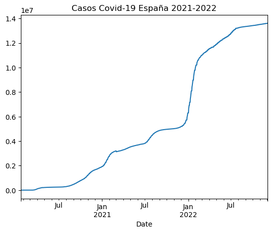

# Uso De la API del Covid-19 con Pandas

A continuación trabajaremos con los datos facilitados por la página [la API de datos del COVID-19](https://covid19api.com/), cuyo fin es recopilar información se los contagias de covid-19 en todo el planeta. 

En este ejercicio implementaremos la función **Pandas**, librería externa de Python, con la trabajaremos los datos del Covid-19 para aprender a crear gráficas de líneas 

La url: https://api.covid19api.com/countries

## Instalación de librerias:

Para la instalación las librerías con la que trabajaremos se utiliza **pip**.

`pip` es un manejador de paquetes para Python


```python
pip install pandas
```

    Requirement already satisfied: pandas in c:\users\gabri\anaconda3\lib\site-packages (1.4.4)
    Requirement already satisfied: pytz>=2020.1 in c:\users\gabri\anaconda3\lib\site-packages (from pandas) (2022.1)
    Requirement already satisfied: python-dateutil>=2.8.1 in c:\users\gabri\anaconda3\lib\site-packages (from pandas) (2.8.2)
    Requirement already satisfied: numpy>=1.18.5 in c:\users\gabri\anaconda3\lib\site-packages (from pandas) (1.21.5)
    Requirement already satisfied: six>=1.5 in c:\users\gabri\anaconda3\lib\site-packages (from python-dateutil>=2.8.1->pandas) (1.16.0)
    Note: you may need to restart the kernel to use updated packages.
    

### Configuración de Pandas 

Al instalar el Pandas este se importa como **pd**


```python
import pandas as pd
```

[Pandas](https://pypi.org/project/pandas/): de acuerdo con pypi.org esta es una herramienta de análisis de datos de código, de lectura rápida en el lenguaje de programación de Python.

Para que **Python** carga todas las bibliotecas. Se tiene que usar el enunciado `import` en nuestro código para usar las funciones de la biblioteca. E importar la biblioteca **Pandas** empleando su abreviatura `pd`.

### Mi url

Luego creamos la variable `miurl` para designar la dirección de la página deseada que incluiremos en la fórmula dentro de comillas simples.


```python
miurl = "https://api.covid19api.com/countries"
```

Para certificar el correcto funcionamiento de la variable creada, escribimos miurl y debería mostrar el link de la página con que trabajaremos. 


```python
miurl
```


    'https://api.covid19api.com/countries'


Si queremos saber qué tipo de variable representa miurl, solo tengo que encerrarlo en paréntesis y entrar en una función type


```python
type(miurl)
```


    str


`str` según [w3schools](https://www.w3schools.com/python/ref_func_str.asp#:~:text=The%20str()%20function%20converts%20the%20specified%20value%20into%20a%20string.) Str en Python es una función
 convierte el valor especificado en una cadena.

## Ejecutamos función Pandas
#### dataframe

Según [pandas.pydata.org](https://pandas.pydata.org/docs/reference/api/pandas.DataFrame.html) dataframe puede contener series, matrices, constantes, clases de datos u objetos similares a listas. Si los datos son un dictado, el orden de las columnas sigue el orden de inserción. Si un dict contiene Series que tienen un índice definido, se alinea por su índice.

La abreviatura de dataframe es **df**. Con función **read_json()** que lee el formato **json**. dentro del parentecer ponemos lo que queremos leer. Ejemplo, un miurl. 


```python
df = pd.read_json(miurl)
```

Para visualizar los datos llamamos el objeto y Pandas identifica una de las entradas del dataframe. Y Observamos una tabla de Pandas que identifica las entradas del dataframe.


```python
df
```


<div>
<style scoped>
    .dataframe tbody tr th:only-of-type {
        vertical-align: middle;
    }

    .dataframe tbody tr th {
        vertical-align: top;
    }

    .dataframe thead th {
        text-align: right;
    }
</style>
<table border="1" class="dataframe">
  <thead>
    <tr style="text-align: right;">
      <th></th>
      <th>Country</th>
      <th>Slug</th>
      <th>ISO2</th>
    </tr>
  </thead>
  <tbody>
    <tr>
      <th>0</th>
      <td>Maldives</td>
      <td>maldives</td>
      <td>MV</td>
    </tr>
    <tr>
      <th>1</th>
      <td>Slovakia</td>
      <td>slovakia</td>
      <td>SK</td>
    </tr>
    <tr>
      <th>2</th>
      <td>Christmas Island</td>
      <td>christmas-island</td>
      <td>CX</td>
    </tr>
    <tr>
      <th>3</th>
      <td>Djibouti</td>
      <td>djibouti</td>
      <td>DJ</td>
    </tr>
    <tr>
      <th>4</th>
      <td>Macedonia, Republic of</td>
      <td>macedonia</td>
      <td>MK</td>
    </tr>
    <tr>
      <th>...</th>
      <td>...</td>
      <td>...</td>
      <td>...</td>
    </tr>
    <tr>
      <th>243</th>
      <td>Bulgaria</td>
      <td>bulgaria</td>
      <td>BG</td>
    </tr>
    <tr>
      <th>244</th>
      <td>Greenland</td>
      <td>greenland</td>
      <td>GL</td>
    </tr>
    <tr>
      <th>245</th>
      <td>Sweden</td>
      <td>sweden</td>
      <td>SE</td>
    </tr>
    <tr>
      <th>246</th>
      <td>Georgia</td>
      <td>georgia</td>
      <td>GE</td>
    </tr>
    <tr>
      <th>247</th>
      <td>Uruguay</td>
      <td>uruguay</td>
      <td>UY</td>
    </tr>
  </tbody>
</table>
<p>248 rows × 3 columns</p>
</div>


## Exploracion de la tabla

Para ver las primeras entradas de la tabla utilizaremos la siguiente función: 


```python
df.head(6)
```


<div>
<style scoped>
    .dataframe tbody tr th:only-of-type {
        vertical-align: middle;
    }

    .dataframe tbody tr th {
        vertical-align: top;
    }

    .dataframe thead th {
        text-align: right;
    }
</style>
<table border="1" class="dataframe">
  <thead>
    <tr style="text-align: right;">
      <th></th>
      <th>Country</th>
      <th>Slug</th>
      <th>ISO2</th>
    </tr>
  </thead>
  <tbody>
    <tr>
      <th>0</th>
      <td>Maldives</td>
      <td>maldives</td>
      <td>MV</td>
    </tr>
    <tr>
      <th>1</th>
      <td>Slovakia</td>
      <td>slovakia</td>
      <td>SK</td>
    </tr>
    <tr>
      <th>2</th>
      <td>Christmas Island</td>
      <td>christmas-island</td>
      <td>CX</td>
    </tr>
    <tr>
      <th>3</th>
      <td>Djibouti</td>
      <td>djibouti</td>
      <td>DJ</td>
    </tr>
    <tr>
      <th>4</th>
      <td>Macedonia, Republic of</td>
      <td>macedonia</td>
      <td>MK</td>
    </tr>
    <tr>
      <th>5</th>
      <td>Singapore</td>
      <td>singapore</td>
      <td>SG</td>
    </tr>
  </tbody>
</table>
</div>


Con **df.tail()** Vemos las ultimas


```python
df.tail(6)
```


<div>
<style scoped>
    .dataframe tbody tr th:only-of-type {
        vertical-align: middle;
    }

    .dataframe tbody tr th {
        vertical-align: top;
    }

    .dataframe thead th {
        text-align: right;
    }
</style>
<table border="1" class="dataframe">
  <thead>
    <tr style="text-align: right;">
      <th></th>
      <th>Country</th>
      <th>Slug</th>
      <th>ISO2</th>
    </tr>
  </thead>
  <tbody>
    <tr>
      <th>242</th>
      <td>Northern Mariana Islands</td>
      <td>northern-mariana-islands</td>
      <td>MP</td>
    </tr>
    <tr>
      <th>243</th>
      <td>Bulgaria</td>
      <td>bulgaria</td>
      <td>BG</td>
    </tr>
    <tr>
      <th>244</th>
      <td>Greenland</td>
      <td>greenland</td>
      <td>GL</td>
    </tr>
    <tr>
      <th>245</th>
      <td>Sweden</td>
      <td>sweden</td>
      <td>SE</td>
    </tr>
    <tr>
      <th>246</th>
      <td>Georgia</td>
      <td>georgia</td>
      <td>GE</td>
    </tr>
    <tr>
      <th>247</th>
      <td>Uruguay</td>
      <td>uruguay</td>
      <td>UY</td>
    </tr>
  </tbody>
</table>
</div>


Para ver las informaciones sobre las variables que contiene el df usamos la siguiente función:


```python
df.info()
```

    <class 'pandas.core.frame.DataFrame'>
    RangeIndex: 248 entries, 0 to 247
    Data columns (total 3 columns):
     #   Column   Non-Null Count  Dtype 
    ---  ------   --------------  ----- 
     0   Country  248 non-null    object
     1   Slug     248 non-null    object
     2   ISO2     248 non-null    object
    dtypes: object(3)
    memory usage: 5.9+ KB
    

Para ver un valor concreto de una de las varibles:


```python
df['Country'][66]
```


    'Ireland'


```python
df['ISO2'].head()
```


    0    MV
    1    SK
    2    CX
    3    DJ
    4    MK
    Name: ISO2, dtype: object


## Tiempo real

### Colombia

La url que utilizamos ahora es la siguiente: https://api.covid19api.com/country/colombia/status/confirmed/live

Guardamos los datos, pero ahora añadiendo **col** (abreviatura de colombia) para identificar y solo trabajar con este país **df_col**.


```python
url_col = 'https://api.covid19api.com/country/colombia/status/confirmed/live'
df_col = pd.read_json(url_col)
df_col
```


<div>
<style scoped>
    .dataframe tbody tr th:only-of-type {
        vertical-align: middle;
    }

    .dataframe tbody tr th {
        vertical-align: top;
    }

    .dataframe thead th {
        text-align: right;
    }
</style>
<table border="1" class="dataframe">
  <thead>
    <tr style="text-align: right;">
      <th></th>
      <th>Country</th>
      <th>CountryCode</th>
      <th>Province</th>
      <th>City</th>
      <th>CityCode</th>
      <th>Lat</th>
      <th>Lon</th>
      <th>Cases</th>
      <th>Status</th>
      <th>Date</th>
    </tr>
  </thead>
  <tbody>
    <tr>
      <th>0</th>
      <td>Colombia</td>
      <td>CO</td>
      <td></td>
      <td></td>
      <td></td>
      <td>4.57</td>
      <td>-74.3</td>
      <td>0</td>
      <td>confirmed</td>
      <td>2020-01-22 00:00:00+00:00</td>
    </tr>
    <tr>
      <th>1</th>
      <td>Colombia</td>
      <td>CO</td>
      <td></td>
      <td></td>
      <td></td>
      <td>4.57</td>
      <td>-74.3</td>
      <td>0</td>
      <td>confirmed</td>
      <td>2020-01-23 00:00:00+00:00</td>
    </tr>
    <tr>
      <th>2</th>
      <td>Colombia</td>
      <td>CO</td>
      <td></td>
      <td></td>
      <td></td>
      <td>4.57</td>
      <td>-74.3</td>
      <td>0</td>
      <td>confirmed</td>
      <td>2020-01-24 00:00:00+00:00</td>
    </tr>
    <tr>
      <th>3</th>
      <td>Colombia</td>
      <td>CO</td>
      <td></td>
      <td></td>
      <td></td>
      <td>4.57</td>
      <td>-74.3</td>
      <td>0</td>
      <td>confirmed</td>
      <td>2020-01-25 00:00:00+00:00</td>
    </tr>
    <tr>
      <th>4</th>
      <td>Colombia</td>
      <td>CO</td>
      <td></td>
      <td></td>
      <td></td>
      <td>4.57</td>
      <td>-74.3</td>
      <td>0</td>
      <td>confirmed</td>
      <td>2020-01-26 00:00:00+00:00</td>
    </tr>
    <tr>
      <th>...</th>
      <td>...</td>
      <td>...</td>
      <td>...</td>
      <td>...</td>
      <td>...</td>
      <td>...</td>
      <td>...</td>
      <td>...</td>
      <td>...</td>
      <td>...</td>
    </tr>
    <tr>
      <th>1042</th>
      <td>Colombia</td>
      <td>CO</td>
      <td></td>
      <td></td>
      <td></td>
      <td>4.57</td>
      <td>-74.3</td>
      <td>6312657</td>
      <td>confirmed</td>
      <td>2022-11-29 00:00:00+00:00</td>
    </tr>
    <tr>
      <th>1043</th>
      <td>Colombia</td>
      <td>CO</td>
      <td></td>
      <td></td>
      <td></td>
      <td>4.57</td>
      <td>-74.3</td>
      <td>6312657</td>
      <td>confirmed</td>
      <td>2022-11-30 00:00:00+00:00</td>
    </tr>
    <tr>
      <th>1044</th>
      <td>Colombia</td>
      <td>CO</td>
      <td></td>
      <td></td>
      <td></td>
      <td>4.57</td>
      <td>-74.3</td>
      <td>6312657</td>
      <td>confirmed</td>
      <td>2022-12-01 00:00:00+00:00</td>
    </tr>
    <tr>
      <th>1045</th>
      <td>Colombia</td>
      <td>CO</td>
      <td></td>
      <td></td>
      <td></td>
      <td>4.57</td>
      <td>-74.3</td>
      <td>6314107</td>
      <td>confirmed</td>
      <td>2022-12-02 00:00:00+00:00</td>
    </tr>
    <tr>
      <th>1046</th>
      <td>Colombia</td>
      <td>CO</td>
      <td></td>
      <td></td>
      <td></td>
      <td>4.57</td>
      <td>-74.3</td>
      <td>6314107</td>
      <td>confirmed</td>
      <td>2022-12-03 00:00:00+00:00</td>
    </tr>
  </tbody>
</table>
<p>1047 rows × 10 columns</p>
</div>


## Explorar Datos

Para saber el nombre de las sesiones de como se están en que se están dividiendo las columnas 


```python
df_col.columns
```


    Index(['Country', 'CountryCode', 'Province', 'City', 'CityCode', 'Lat', 'Lon',
           'Cases', 'Status', 'Date'],
          dtype='object')


Para ver las entradas que encabezan nuestra tabla usamos el siguiente código 


```python
df_col.head(10)
```


<div>
<style scoped>
    .dataframe tbody tr th:only-of-type {
        vertical-align: middle;
    }

    .dataframe tbody tr th {
        vertical-align: top;
    }

    .dataframe thead th {
        text-align: right;
    }
</style>
<table border="1" class="dataframe">
  <thead>
    <tr style="text-align: right;">
      <th></th>
      <th>Country</th>
      <th>CountryCode</th>
      <th>Province</th>
      <th>City</th>
      <th>CityCode</th>
      <th>Lat</th>
      <th>Lon</th>
      <th>Cases</th>
      <th>Status</th>
      <th>Date</th>
    </tr>
  </thead>
  <tbody>
    <tr>
      <th>0</th>
      <td>Colombia</td>
      <td>CO</td>
      <td></td>
      <td></td>
      <td></td>
      <td>4.57</td>
      <td>-74.3</td>
      <td>0</td>
      <td>confirmed</td>
      <td>2020-01-22 00:00:00+00:00</td>
    </tr>
    <tr>
      <th>1</th>
      <td>Colombia</td>
      <td>CO</td>
      <td></td>
      <td></td>
      <td></td>
      <td>4.57</td>
      <td>-74.3</td>
      <td>0</td>
      <td>confirmed</td>
      <td>2020-01-23 00:00:00+00:00</td>
    </tr>
    <tr>
      <th>2</th>
      <td>Colombia</td>
      <td>CO</td>
      <td></td>
      <td></td>
      <td></td>
      <td>4.57</td>
      <td>-74.3</td>
      <td>0</td>
      <td>confirmed</td>
      <td>2020-01-24 00:00:00+00:00</td>
    </tr>
    <tr>
      <th>3</th>
      <td>Colombia</td>
      <td>CO</td>
      <td></td>
      <td></td>
      <td></td>
      <td>4.57</td>
      <td>-74.3</td>
      <td>0</td>
      <td>confirmed</td>
      <td>2020-01-25 00:00:00+00:00</td>
    </tr>
    <tr>
      <th>4</th>
      <td>Colombia</td>
      <td>CO</td>
      <td></td>
      <td></td>
      <td></td>
      <td>4.57</td>
      <td>-74.3</td>
      <td>0</td>
      <td>confirmed</td>
      <td>2020-01-26 00:00:00+00:00</td>
    </tr>
    <tr>
      <th>5</th>
      <td>Colombia</td>
      <td>CO</td>
      <td></td>
      <td></td>
      <td></td>
      <td>4.57</td>
      <td>-74.3</td>
      <td>0</td>
      <td>confirmed</td>
      <td>2020-01-27 00:00:00+00:00</td>
    </tr>
    <tr>
      <th>6</th>
      <td>Colombia</td>
      <td>CO</td>
      <td></td>
      <td></td>
      <td></td>
      <td>4.57</td>
      <td>-74.3</td>
      <td>0</td>
      <td>confirmed</td>
      <td>2020-01-28 00:00:00+00:00</td>
    </tr>
    <tr>
      <th>7</th>
      <td>Colombia</td>
      <td>CO</td>
      <td></td>
      <td></td>
      <td></td>
      <td>4.57</td>
      <td>-74.3</td>
      <td>0</td>
      <td>confirmed</td>
      <td>2020-01-29 00:00:00+00:00</td>
    </tr>
    <tr>
      <th>8</th>
      <td>Colombia</td>
      <td>CO</td>
      <td></td>
      <td></td>
      <td></td>
      <td>4.57</td>
      <td>-74.3</td>
      <td>0</td>
      <td>confirmed</td>
      <td>2020-01-30 00:00:00+00:00</td>
    </tr>
    <tr>
      <th>9</th>
      <td>Colombia</td>
      <td>CO</td>
      <td></td>
      <td></td>
      <td></td>
      <td>4.57</td>
      <td>-74.3</td>
      <td>0</td>
      <td>confirmed</td>
      <td>2020-01-31 00:00:00+00:00</td>
    </tr>
  </tbody>
</table>
</div>


Para ver las entradas que finalizan nuestra tabla usamos el siguiente código 


```python
df_col.tail(10)
```


<div>
<style scoped>
    .dataframe tbody tr th:only-of-type {
        vertical-align: middle;
    }

    .dataframe tbody tr th {
        vertical-align: top;
    }

    .dataframe thead th {
        text-align: right;
    }
</style>
<table border="1" class="dataframe">
  <thead>
    <tr style="text-align: right;">
      <th></th>
      <th>Country</th>
      <th>CountryCode</th>
      <th>Province</th>
      <th>City</th>
      <th>CityCode</th>
      <th>Lat</th>
      <th>Lon</th>
      <th>Cases</th>
      <th>Status</th>
      <th>Date</th>
    </tr>
  </thead>
  <tbody>
    <tr>
      <th>1037</th>
      <td>Colombia</td>
      <td>CO</td>
      <td></td>
      <td></td>
      <td></td>
      <td>4.57</td>
      <td>-74.3</td>
      <td>6312657</td>
      <td>confirmed</td>
      <td>2022-11-24 00:00:00+00:00</td>
    </tr>
    <tr>
      <th>1038</th>
      <td>Colombia</td>
      <td>CO</td>
      <td></td>
      <td></td>
      <td></td>
      <td>4.57</td>
      <td>-74.3</td>
      <td>6312657</td>
      <td>confirmed</td>
      <td>2022-11-25 00:00:00+00:00</td>
    </tr>
    <tr>
      <th>1039</th>
      <td>Colombia</td>
      <td>CO</td>
      <td></td>
      <td></td>
      <td></td>
      <td>4.57</td>
      <td>-74.3</td>
      <td>6312657</td>
      <td>confirmed</td>
      <td>2022-11-26 00:00:00+00:00</td>
    </tr>
    <tr>
      <th>1040</th>
      <td>Colombia</td>
      <td>CO</td>
      <td></td>
      <td></td>
      <td></td>
      <td>4.57</td>
      <td>-74.3</td>
      <td>6312657</td>
      <td>confirmed</td>
      <td>2022-11-27 00:00:00+00:00</td>
    </tr>
    <tr>
      <th>1041</th>
      <td>Colombia</td>
      <td>CO</td>
      <td></td>
      <td></td>
      <td></td>
      <td>4.57</td>
      <td>-74.3</td>
      <td>6312657</td>
      <td>confirmed</td>
      <td>2022-11-28 00:00:00+00:00</td>
    </tr>
    <tr>
      <th>1042</th>
      <td>Colombia</td>
      <td>CO</td>
      <td></td>
      <td></td>
      <td></td>
      <td>4.57</td>
      <td>-74.3</td>
      <td>6312657</td>
      <td>confirmed</td>
      <td>2022-11-29 00:00:00+00:00</td>
    </tr>
    <tr>
      <th>1043</th>
      <td>Colombia</td>
      <td>CO</td>
      <td></td>
      <td></td>
      <td></td>
      <td>4.57</td>
      <td>-74.3</td>
      <td>6312657</td>
      <td>confirmed</td>
      <td>2022-11-30 00:00:00+00:00</td>
    </tr>
    <tr>
      <th>1044</th>
      <td>Colombia</td>
      <td>CO</td>
      <td></td>
      <td></td>
      <td></td>
      <td>4.57</td>
      <td>-74.3</td>
      <td>6312657</td>
      <td>confirmed</td>
      <td>2022-12-01 00:00:00+00:00</td>
    </tr>
    <tr>
      <th>1045</th>
      <td>Colombia</td>
      <td>CO</td>
      <td></td>
      <td></td>
      <td></td>
      <td>4.57</td>
      <td>-74.3</td>
      <td>6314107</td>
      <td>confirmed</td>
      <td>2022-12-02 00:00:00+00:00</td>
    </tr>
    <tr>
      <th>1046</th>
      <td>Colombia</td>
      <td>CO</td>
      <td></td>
      <td></td>
      <td></td>
      <td>4.57</td>
      <td>-74.3</td>
      <td>6314107</td>
      <td>confirmed</td>
      <td>2022-12-03 00:00:00+00:00</td>
    </tr>
  </tbody>
</table>
</div>


```python
df_col.info()
```

    <class 'pandas.core.frame.DataFrame'>
    RangeIndex: 1047 entries, 0 to 1046
    Data columns (total 10 columns):
     #   Column       Non-Null Count  Dtype              
    ---  ------       --------------  -----              
     0   Country      1047 non-null   object             
     1   CountryCode  1047 non-null   object             
     2   Province     1047 non-null   object             
     3   City         1047 non-null   object             
     4   CityCode     1047 non-null   object             
     5   Lat          1047 non-null   float64            
     6   Lon          1047 non-null   float64            
     7   Cases        1047 non-null   int64              
     8   Status       1047 non-null   object             
     9   Date         1047 non-null   datetime64[ns, UTC]
    dtypes: datetime64[ns, UTC](1), float64(2), int64(1), object(6)
    memory usage: 81.9+ KB
    

Para Obtener una descripción estadística de las variables del df (numero total, media, moda, desviación, mínimo, máximo y cuartiles):


```python
df_col.describe()
```


<div>
<style scoped>
    .dataframe tbody tr th:only-of-type {
        vertical-align: middle;
    }

    .dataframe tbody tr th {
        vertical-align: top;
    }

    .dataframe thead th {
        text-align: right;
    }
</style>
<table border="1" class="dataframe">
  <thead>
    <tr style="text-align: right;">
      <th></th>
      <th>Lat</th>
      <th>Lon</th>
      <th>Cases</th>
    </tr>
  </thead>
  <tbody>
    <tr>
      <th>count</th>
      <td>1.047000e+03</td>
      <td>1.047000e+03</td>
      <td>1.047000e+03</td>
    </tr>
    <tr>
      <th>mean</th>
      <td>4.570000e+00</td>
      <td>-7.430000e+01</td>
      <td>3.444014e+06</td>
    </tr>
    <tr>
      <th>std</th>
      <td>1.866066e-14</td>
      <td>1.464418e-12</td>
      <td>2.438811e+06</td>
    </tr>
    <tr>
      <th>min</th>
      <td>4.570000e+00</td>
      <td>-7.430000e+01</td>
      <td>0.000000e+00</td>
    </tr>
    <tr>
      <th>25%</th>
      <td>4.570000e+00</td>
      <td>-7.430000e+01</td>
      <td>8.985235e+05</td>
    </tr>
    <tr>
      <th>50%</th>
      <td>4.570000e+00</td>
      <td>-7.430000e+01</td>
      <td>4.187194e+06</td>
    </tr>
    <tr>
      <th>75%</th>
      <td>4.570000e+00</td>
      <td>-7.430000e+01</td>
      <td>6.078859e+06</td>
    </tr>
    <tr>
      <th>max</th>
      <td>4.570000e+00</td>
      <td>-7.430000e+01</td>
      <td>6.314107e+06</td>
    </tr>
  </tbody>
</table>
</div>


## Gráficos

Para la elaboración del mismo en el eje X (fechas) y Y (Casos).

Vamos a establcer la fecha como índice.


```python
df_col.set_index('Date')
```


<div>
<style scoped>
    .dataframe tbody tr th:only-of-type {
        vertical-align: middle;
    }

    .dataframe tbody tr th {
        vertical-align: top;
    }

    .dataframe thead th {
        text-align: right;
    }
</style>
<table border="1" class="dataframe">
  <thead>
    <tr style="text-align: right;">
      <th></th>
      <th>Country</th>
      <th>CountryCode</th>
      <th>Province</th>
      <th>City</th>
      <th>CityCode</th>
      <th>Lat</th>
      <th>Lon</th>
      <th>Cases</th>
      <th>Status</th>
    </tr>
    <tr>
      <th>Date</th>
      <th></th>
      <th></th>
      <th></th>
      <th></th>
      <th></th>
      <th></th>
      <th></th>
      <th></th>
      <th></th>
    </tr>
  </thead>
  <tbody>
    <tr>
      <th>2020-01-22 00:00:00+00:00</th>
      <td>Colombia</td>
      <td>CO</td>
      <td></td>
      <td></td>
      <td></td>
      <td>4.57</td>
      <td>-74.3</td>
      <td>0</td>
      <td>confirmed</td>
    </tr>
    <tr>
      <th>2020-01-23 00:00:00+00:00</th>
      <td>Colombia</td>
      <td>CO</td>
      <td></td>
      <td></td>
      <td></td>
      <td>4.57</td>
      <td>-74.3</td>
      <td>0</td>
      <td>confirmed</td>
    </tr>
    <tr>
      <th>2020-01-24 00:00:00+00:00</th>
      <td>Colombia</td>
      <td>CO</td>
      <td></td>
      <td></td>
      <td></td>
      <td>4.57</td>
      <td>-74.3</td>
      <td>0</td>
      <td>confirmed</td>
    </tr>
    <tr>
      <th>2020-01-25 00:00:00+00:00</th>
      <td>Colombia</td>
      <td>CO</td>
      <td></td>
      <td></td>
      <td></td>
      <td>4.57</td>
      <td>-74.3</td>
      <td>0</td>
      <td>confirmed</td>
    </tr>
    <tr>
      <th>2020-01-26 00:00:00+00:00</th>
      <td>Colombia</td>
      <td>CO</td>
      <td></td>
      <td></td>
      <td></td>
      <td>4.57</td>
      <td>-74.3</td>
      <td>0</td>
      <td>confirmed</td>
    </tr>
    <tr>
      <th>...</th>
      <td>...</td>
      <td>...</td>
      <td>...</td>
      <td>...</td>
      <td>...</td>
      <td>...</td>
      <td>...</td>
      <td>...</td>
      <td>...</td>
    </tr>
    <tr>
      <th>2022-11-29 00:00:00+00:00</th>
      <td>Colombia</td>
      <td>CO</td>
      <td></td>
      <td></td>
      <td></td>
      <td>4.57</td>
      <td>-74.3</td>
      <td>6312657</td>
      <td>confirmed</td>
    </tr>
    <tr>
      <th>2022-11-30 00:00:00+00:00</th>
      <td>Colombia</td>
      <td>CO</td>
      <td></td>
      <td></td>
      <td></td>
      <td>4.57</td>
      <td>-74.3</td>
      <td>6312657</td>
      <td>confirmed</td>
    </tr>
    <tr>
      <th>2022-12-01 00:00:00+00:00</th>
      <td>Colombia</td>
      <td>CO</td>
      <td></td>
      <td></td>
      <td></td>
      <td>4.57</td>
      <td>-74.3</td>
      <td>6312657</td>
      <td>confirmed</td>
    </tr>
    <tr>
      <th>2022-12-02 00:00:00+00:00</th>
      <td>Colombia</td>
      <td>CO</td>
      <td></td>
      <td></td>
      <td></td>
      <td>4.57</td>
      <td>-74.3</td>
      <td>6314107</td>
      <td>confirmed</td>
    </tr>
    <tr>
      <th>2022-12-03 00:00:00+00:00</th>
      <td>Colombia</td>
      <td>CO</td>
      <td></td>
      <td></td>
      <td></td>
      <td>4.57</td>
      <td>-74.3</td>
      <td>6314107</td>
      <td>confirmed</td>
    </tr>
  </tbody>
</table>
<p>1047 rows × 9 columns</p>
</div>


```python
df_col
```


<div>
<style scoped>
    .dataframe tbody tr th:only-of-type {
        vertical-align: middle;
    }

    .dataframe tbody tr th {
        vertical-align: top;
    }

    .dataframe thead th {
        text-align: right;
    }
</style>
<table border="1" class="dataframe">
  <thead>
    <tr style="text-align: right;">
      <th></th>
      <th>Country</th>
      <th>CountryCode</th>
      <th>Province</th>
      <th>City</th>
      <th>CityCode</th>
      <th>Lat</th>
      <th>Lon</th>
      <th>Cases</th>
      <th>Status</th>
      <th>Date</th>
    </tr>
  </thead>
  <tbody>
    <tr>
      <th>0</th>
      <td>Colombia</td>
      <td>CO</td>
      <td></td>
      <td></td>
      <td></td>
      <td>4.57</td>
      <td>-74.3</td>
      <td>0</td>
      <td>confirmed</td>
      <td>2020-01-22 00:00:00+00:00</td>
    </tr>
    <tr>
      <th>1</th>
      <td>Colombia</td>
      <td>CO</td>
      <td></td>
      <td></td>
      <td></td>
      <td>4.57</td>
      <td>-74.3</td>
      <td>0</td>
      <td>confirmed</td>
      <td>2020-01-23 00:00:00+00:00</td>
    </tr>
    <tr>
      <th>2</th>
      <td>Colombia</td>
      <td>CO</td>
      <td></td>
      <td></td>
      <td></td>
      <td>4.57</td>
      <td>-74.3</td>
      <td>0</td>
      <td>confirmed</td>
      <td>2020-01-24 00:00:00+00:00</td>
    </tr>
    <tr>
      <th>3</th>
      <td>Colombia</td>
      <td>CO</td>
      <td></td>
      <td></td>
      <td></td>
      <td>4.57</td>
      <td>-74.3</td>
      <td>0</td>
      <td>confirmed</td>
      <td>2020-01-25 00:00:00+00:00</td>
    </tr>
    <tr>
      <th>4</th>
      <td>Colombia</td>
      <td>CO</td>
      <td></td>
      <td></td>
      <td></td>
      <td>4.57</td>
      <td>-74.3</td>
      <td>0</td>
      <td>confirmed</td>
      <td>2020-01-26 00:00:00+00:00</td>
    </tr>
    <tr>
      <th>...</th>
      <td>...</td>
      <td>...</td>
      <td>...</td>
      <td>...</td>
      <td>...</td>
      <td>...</td>
      <td>...</td>
      <td>...</td>
      <td>...</td>
      <td>...</td>
    </tr>
    <tr>
      <th>1042</th>
      <td>Colombia</td>
      <td>CO</td>
      <td></td>
      <td></td>
      <td></td>
      <td>4.57</td>
      <td>-74.3</td>
      <td>6312657</td>
      <td>confirmed</td>
      <td>2022-11-29 00:00:00+00:00</td>
    </tr>
    <tr>
      <th>1043</th>
      <td>Colombia</td>
      <td>CO</td>
      <td></td>
      <td></td>
      <td></td>
      <td>4.57</td>
      <td>-74.3</td>
      <td>6312657</td>
      <td>confirmed</td>
      <td>2022-11-30 00:00:00+00:00</td>
    </tr>
    <tr>
      <th>1044</th>
      <td>Colombia</td>
      <td>CO</td>
      <td></td>
      <td></td>
      <td></td>
      <td>4.57</td>
      <td>-74.3</td>
      <td>6312657</td>
      <td>confirmed</td>
      <td>2022-12-01 00:00:00+00:00</td>
    </tr>
    <tr>
      <th>1045</th>
      <td>Colombia</td>
      <td>CO</td>
      <td></td>
      <td></td>
      <td></td>
      <td>4.57</td>
      <td>-74.3</td>
      <td>6314107</td>
      <td>confirmed</td>
      <td>2022-12-02 00:00:00+00:00</td>
    </tr>
    <tr>
      <th>1046</th>
      <td>Colombia</td>
      <td>CO</td>
      <td></td>
      <td></td>
      <td></td>
      <td>4.57</td>
      <td>-74.3</td>
      <td>6314107</td>
      <td>confirmed</td>
      <td>2022-12-03 00:00:00+00:00</td>
    </tr>
  </tbody>
</table>
<p>1047 rows × 10 columns</p>
</div>


Como la tabla debe reflejar también los casos, creamos una tabla para ver datos por fechas con el código siguiente:


```python
df_col.set_index('Date')['Cases']
```


    Date
    2020-01-22 00:00:00+00:00          0
    2020-01-23 00:00:00+00:00          0
    2020-01-24 00:00:00+00:00          0
    2020-01-25 00:00:00+00:00          0
    2020-01-26 00:00:00+00:00          0
                                  ...   
    2022-11-29 00:00:00+00:00    6312657
    2022-11-30 00:00:00+00:00    6312657
    2022-12-01 00:00:00+00:00    6312657
    2022-12-02 00:00:00+00:00    6314107
    2022-12-03 00:00:00+00:00    6314107
    Name: Cases, Length: 1047, dtype: int64


Sobre esta vista creamos el gráfico con la funcion **plot**.


```python
df_col.set_index('Date')['Cases'].plot()
```


    <AxesSubplot:xlabel='Date'>


    

    


La variable `title` que significa en español título. Esta variable se encuentra dentro de paréntesis en del siguiente código `df_col.set_index('Date')['Cases'].plot(title= "")`.  Dentro de estas comillas pondremos el enunciado que servirá de título para nuestra gráfica 


```python
df_col.set_index('Date')['Cases'].plot(title= "Casos Covid-19 Colombia 2021-2022")
```


    <AxesSubplot:title={'center':'Casos Covid-19 Colombia 2021-2022'}, xlabel='Date'>


    

    


Repetimos con los datos de España, Ecuador y República Dominicana:

### España

La url que utilizamos ahora es la siguiente: https://api.covid19api.com/country/spain/status/confirmed/live

Guardamos los datos, pero ahora añadiendo **es** (abreviatura de España) para identificar y solo trabajar con este país **df_es**.


```python
url_es = 'https://api.covid19api.com/country/spain/status/confirmed/live'
df_es = pd.read_json(url_es)
df_es    
```


<div>
<style scoped>
    .dataframe tbody tr th:only-of-type {
        vertical-align: middle;
    }

    .dataframe tbody tr th {
        vertical-align: top;
    }

    .dataframe thead th {
        text-align: right;
    }
</style>
<table border="1" class="dataframe">
  <thead>
    <tr style="text-align: right;">
      <th></th>
      <th>Country</th>
      <th>CountryCode</th>
      <th>Province</th>
      <th>City</th>
      <th>CityCode</th>
      <th>Lat</th>
      <th>Lon</th>
      <th>Cases</th>
      <th>Status</th>
      <th>Date</th>
    </tr>
  </thead>
  <tbody>
    <tr>
      <th>0</th>
      <td>Spain</td>
      <td>ES</td>
      <td></td>
      <td></td>
      <td></td>
      <td>40.46</td>
      <td>-3.75</td>
      <td>0</td>
      <td>confirmed</td>
      <td>2020-01-22 00:00:00+00:00</td>
    </tr>
    <tr>
      <th>1</th>
      <td>Spain</td>
      <td>ES</td>
      <td></td>
      <td></td>
      <td></td>
      <td>40.46</td>
      <td>-3.75</td>
      <td>0</td>
      <td>confirmed</td>
      <td>2020-01-23 00:00:00+00:00</td>
    </tr>
    <tr>
      <th>2</th>
      <td>Spain</td>
      <td>ES</td>
      <td></td>
      <td></td>
      <td></td>
      <td>40.46</td>
      <td>-3.75</td>
      <td>0</td>
      <td>confirmed</td>
      <td>2020-01-24 00:00:00+00:00</td>
    </tr>
    <tr>
      <th>3</th>
      <td>Spain</td>
      <td>ES</td>
      <td></td>
      <td></td>
      <td></td>
      <td>40.46</td>
      <td>-3.75</td>
      <td>0</td>
      <td>confirmed</td>
      <td>2020-01-25 00:00:00+00:00</td>
    </tr>
    <tr>
      <th>4</th>
      <td>Spain</td>
      <td>ES</td>
      <td></td>
      <td></td>
      <td></td>
      <td>40.46</td>
      <td>-3.75</td>
      <td>0</td>
      <td>confirmed</td>
      <td>2020-01-26 00:00:00+00:00</td>
    </tr>
    <tr>
      <th>...</th>
      <td>...</td>
      <td>...</td>
      <td>...</td>
      <td>...</td>
      <td>...</td>
      <td>...</td>
      <td>...</td>
      <td>...</td>
      <td>...</td>
      <td>...</td>
    </tr>
    <tr>
      <th>1042</th>
      <td>Spain</td>
      <td>ES</td>
      <td></td>
      <td></td>
      <td></td>
      <td>40.46</td>
      <td>-3.75</td>
      <td>13595504</td>
      <td>confirmed</td>
      <td>2022-11-29 00:00:00+00:00</td>
    </tr>
    <tr>
      <th>1043</th>
      <td>Spain</td>
      <td>ES</td>
      <td></td>
      <td></td>
      <td></td>
      <td>40.46</td>
      <td>-3.75</td>
      <td>13595504</td>
      <td>confirmed</td>
      <td>2022-11-30 00:00:00+00:00</td>
    </tr>
    <tr>
      <th>1044</th>
      <td>Spain</td>
      <td>ES</td>
      <td></td>
      <td></td>
      <td></td>
      <td>40.46</td>
      <td>-3.75</td>
      <td>13595504</td>
      <td>confirmed</td>
      <td>2022-12-01 00:00:00+00:00</td>
    </tr>
    <tr>
      <th>1045</th>
      <td>Spain</td>
      <td>ES</td>
      <td></td>
      <td></td>
      <td></td>
      <td>40.46</td>
      <td>-3.75</td>
      <td>13614807</td>
      <td>confirmed</td>
      <td>2022-12-02 00:00:00+00:00</td>
    </tr>
    <tr>
      <th>1046</th>
      <td>Spain</td>
      <td>ES</td>
      <td></td>
      <td></td>
      <td></td>
      <td>40.46</td>
      <td>-3.75</td>
      <td>13614807</td>
      <td>confirmed</td>
      <td>2022-12-03 00:00:00+00:00</td>
    </tr>
  </tbody>
</table>
<p>1047 rows × 10 columns</p>
</div>


```python
df_es.set_index('Date')['Cases'].plot(title= "Casos Covid-19 España 2021-2022")
```


    <AxesSubplot:title={'center':'Casos Covid-19 España 2021-2022'}, xlabel='Date'>


    

    


### Ecuador

La url que utilizamos ahora es la siguiente: https://api.covid19api.com/country/ecuador/status/confirmed/live

Guardamos los datos, pero ahora añadiendo **ec** (abreviatura de Ecuador) para identificar y solo trabajar con este país **df_ec**.


```python
url_ec = 'https://api.covid19api.com/country/ecuador/status/confirmed/live'
df_ec = pd.read_json(url_ec)
df_ec
```


<div>
<style scoped>
    .dataframe tbody tr th:only-of-type {
        vertical-align: middle;
    }

    .dataframe tbody tr th {
        vertical-align: top;
    }

    .dataframe thead th {
        text-align: right;
    }
</style>
<table border="1" class="dataframe">
  <thead>
    <tr style="text-align: right;">
      <th></th>
      <th>Country</th>
      <th>CountryCode</th>
      <th>Province</th>
      <th>City</th>
      <th>CityCode</th>
      <th>Lat</th>
      <th>Lon</th>
      <th>Cases</th>
      <th>Status</th>
      <th>Date</th>
    </tr>
  </thead>
  <tbody>
    <tr>
      <th>0</th>
      <td>Ecuador</td>
      <td>EC</td>
      <td></td>
      <td></td>
      <td></td>
      <td>-1.83</td>
      <td>-78.18</td>
      <td>0</td>
      <td>confirmed</td>
      <td>2020-01-22 00:00:00+00:00</td>
    </tr>
    <tr>
      <th>1</th>
      <td>Ecuador</td>
      <td>EC</td>
      <td></td>
      <td></td>
      <td></td>
      <td>-1.83</td>
      <td>-78.18</td>
      <td>0</td>
      <td>confirmed</td>
      <td>2020-01-23 00:00:00+00:00</td>
    </tr>
    <tr>
      <th>2</th>
      <td>Ecuador</td>
      <td>EC</td>
      <td></td>
      <td></td>
      <td></td>
      <td>-1.83</td>
      <td>-78.18</td>
      <td>0</td>
      <td>confirmed</td>
      <td>2020-01-24 00:00:00+00:00</td>
    </tr>
    <tr>
      <th>3</th>
      <td>Ecuador</td>
      <td>EC</td>
      <td></td>
      <td></td>
      <td></td>
      <td>-1.83</td>
      <td>-78.18</td>
      <td>0</td>
      <td>confirmed</td>
      <td>2020-01-25 00:00:00+00:00</td>
    </tr>
    <tr>
      <th>4</th>
      <td>Ecuador</td>
      <td>EC</td>
      <td></td>
      <td></td>
      <td></td>
      <td>-1.83</td>
      <td>-78.18</td>
      <td>0</td>
      <td>confirmed</td>
      <td>2020-01-26 00:00:00+00:00</td>
    </tr>
    <tr>
      <th>...</th>
      <td>...</td>
      <td>...</td>
      <td>...</td>
      <td>...</td>
      <td>...</td>
      <td>...</td>
      <td>...</td>
      <td>...</td>
      <td>...</td>
      <td>...</td>
    </tr>
    <tr>
      <th>1042</th>
      <td>Ecuador</td>
      <td>EC</td>
      <td></td>
      <td></td>
      <td></td>
      <td>-1.83</td>
      <td>-78.18</td>
      <td>1011132</td>
      <td>confirmed</td>
      <td>2022-11-29 00:00:00+00:00</td>
    </tr>
    <tr>
      <th>1043</th>
      <td>Ecuador</td>
      <td>EC</td>
      <td></td>
      <td></td>
      <td></td>
      <td>-1.83</td>
      <td>-78.18</td>
      <td>1011132</td>
      <td>confirmed</td>
      <td>2022-11-30 00:00:00+00:00</td>
    </tr>
    <tr>
      <th>1044</th>
      <td>Ecuador</td>
      <td>EC</td>
      <td></td>
      <td></td>
      <td></td>
      <td>-1.83</td>
      <td>-78.18</td>
      <td>1011132</td>
      <td>confirmed</td>
      <td>2022-12-01 00:00:00+00:00</td>
    </tr>
    <tr>
      <th>1045</th>
      <td>Ecuador</td>
      <td>EC</td>
      <td></td>
      <td></td>
      <td></td>
      <td>-1.83</td>
      <td>-78.18</td>
      <td>1011132</td>
      <td>confirmed</td>
      <td>2022-12-02 00:00:00+00:00</td>
    </tr>
    <tr>
      <th>1046</th>
      <td>Ecuador</td>
      <td>EC</td>
      <td></td>
      <td></td>
      <td></td>
      <td>-1.83</td>
      <td>-78.18</td>
      <td>1011132</td>
      <td>confirmed</td>
      <td>2022-12-03 00:00:00+00:00</td>
    </tr>
  </tbody>
</table>
<p>1047 rows × 10 columns</p>
</div>


```python
df_ec.set_index('Date')['Cases'].plot(title= "Casos Covid-19 Ecuador 2021-2022")
```


    <AxesSubplot:title={'center':'Casos Covid-19 Ecuador 2021-2022'}, xlabel='Date'>


    

    


### República Dominicana

La url que utilizamos ahora es la siguiente: https://api.covid19api.com/country/Dominican%20Republic/status/confirmed/live

Guardamos los datos, pero ahora añadiendo **do** (abreviatura de Dominican Republic) para identificar y solo trabajar con este país **df_do**.


```python
url_do = 'https://api.covid19api.com/country/Dominican%20Republic/status/confirmed/live'
df_do = pd.read_json(url_do)
df_do
```


```python
df_do.set_index('Date')['Cases'].plot(title= "Casos Covid-19 República Dominicana 2021-2022")
```

## Conclusión 

Es impresionante poder trabajaron una herramienta tan fácil y práctica como Python acompañado de la función Pandas, con la cual en minutos pudimos procesar los datos facilitados por api.covid19api y crear visualizaciones en segundos. 
