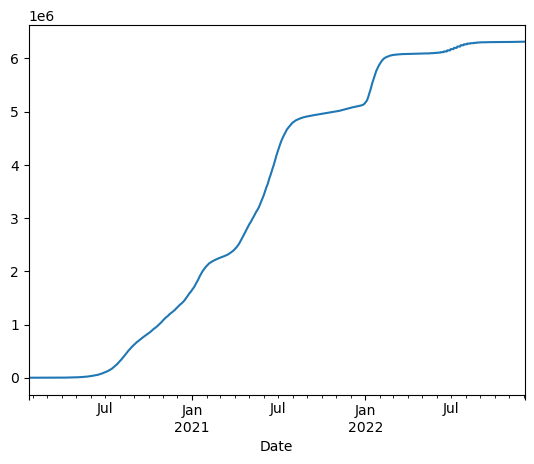
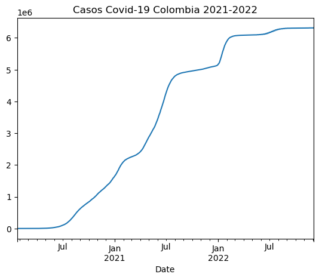
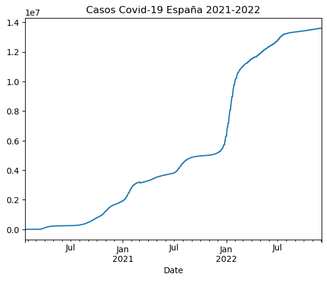
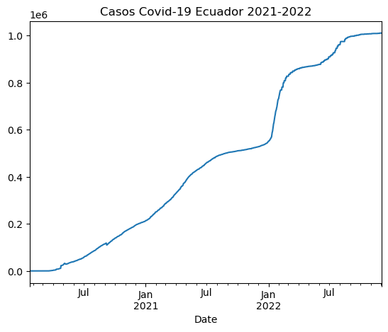
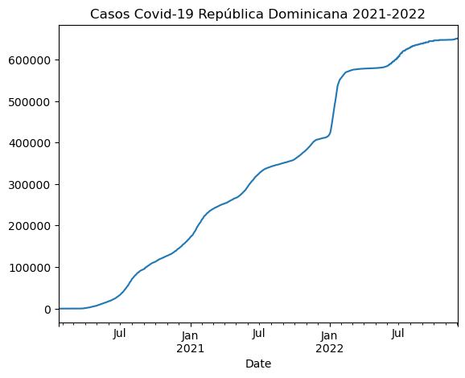

# Metodologia

La construcción de este sitio web fue solo posible gracias a las herramientas y plataformas de programación facilitadas por el profesor durante las clases de **Periodismo de Datos II: Herramientas Digitales para la Visualización y Presentación de Datos**. En donde nos familiarizamos con los lenguajes de programación **Python** y **Markdown**, lenguajes los que está baso la estructura de los ejércitos y las diferentes secciones de nuestra página.

Para llevar a cabo este proyecto de crear una página que presente todos nuestros trabajos, usamos con plataforma **GitHub**, la cual es una plataforma online para el desarrollo colaborativo, en donde se pueden alojar proyectos y crear códigos, fuentes.

Dentro de esta plataforma creamos una cuenta con nuestro mail estudiantil y nos unimos al grupo de nebrija manejado por el profesor para conectar nuestros proyectos con la cuenta del profesor y este pueda visualizar la parte interna de nuestra página. 

Luego de ello generamos un **repositorio** público. En el cual automáticamente se genera la carpeta **README** la cual cumple con la función de página Home. 

En la Entrada **README**, guiados por el profesor y utilizando el lenguaje Markdown, escribimos el título que tendría nuestra visualización y el diferente entradas enlazadas al proyecto.  

A partir de esto, empezamos a trabajar con cada una de las actividades asignadas por el profesor, las cuales al terminarlas subíamos a esta plataforma y enlazamos con los títulos ya escritos en el repositorio.  

***

- [Actividad dirigida 1](ad1.md)
- [Actividad dirigida 2](ad2.md)
- [Actividad dirigida 3](ad3.md)
- [Actividad dirigida 4](ad4.md)

***

## [Actividad 1](ad1.md)

La primera actividad consisto en **analizar y escribir un comentario crítico, a partir de un reportaje de datos**, en donde se muestren visualización de datos, infografía o tablas con una extensión de 300 y 500 palabras. Con el motivo de no es solo analizar los datos y los soportes de la nota. Es redactar esta opinión usando los atributos del lenguaje `Markdown` en la plataforma `Riseup Pad`.

**Riseup Pad**

Es una aplicación digital de para escribir textos de forma colaborativa en tiempo real 

**Markdown**

Un lenguaje basado en **texto plano**.
Según la página [markdown.es](https://markdown.es/) esta herramienta es perfecta para publicar constantemente en internet (blogs, páginas web, Trello o foros) donde el lenguaje HTML está más que presente: WordPress, Squarespace, Jekyll. 

De acuerdo con [John Gruber](http://daringfireball.net/projects/markdown/) parte del grupo de creadores de la herramienta, es una herramienta de software que convierte el lenguaje en HTML válido.

Por lo que pude entender investigando en estas fuentes, Markdown es una herramienta de texto base que tienen como misión base **mejorar la lectura web y facilitar la publicación** de documento que poseen código HTML, para los que crean contenido web de forma constante.  

Para esta tarea tome como tema [Las otras Asturias en Europa: una de cada tres provincias ha sufrido más la segunda ola.](https://www.elconfidencial.com/mundo/2020-12-20/exceso-mortalidad-regiones-europa_2878936/), del periódico digital **El Confidencial**.  

La segunda parte de esta actividad fue subir nuestra opinión a la plataforma **GitHub**:

**GitHub**

Es una plataforma online para el desarrollo colaborativo, en donde se pueden alojar proyectos y crear códigos fuentes.

En esta creamos nuestro `repositorio` llamado README en formato `.md`y las diferentes entradas de nuestro proyecto.

`Repositorio`Espacios donde se almacena la información digital de nuestra página. 

Para finalizar creamos la primera actividad, la [AD1](ad1.md) la cual se encuentra enlazado con la página de presentación del proyecto. 

## [Actividad 2](ad2.md)

La **actividad 2** que consistía en realizar un comentario de 500-700 palabras de un artículo o reportaje de periodismo y visualización de datos, escrito en **Markdown**. Nos sirvió de práctica para dominar mejor el lenguaje Markdown y relacionarnos con la plataforma de **GitHub**.

En esta tarea decidir escribir mi opinión sobre el artículo de investigación ["Del cuerno de rinoceronte al guacamayo: Así opera en España el mercado negro de animales protegidos que sobrevive a la pandemia"](https://www.elmundo.es/ciencia-y-salud/medio-ambiente/2021/12/30/61bcd569fc6c83a2308b459a.html) del medio digital El Mundo. 

En el cual se podían visualizar un sin número de gráficas que abordan de diferentes formas la problemática desde diferentes enfoques.

## [Actividad 3](ad3.md)

En esta actividad redactamos un archivo con lenguaje estilo Python en una nueva plataforma, Jupyter. Esta sirve para desarrollo de software.

En esta trabajamos desde plataforma **Jupyter** que se pare desde **Anaconda**. Con el código fuente facilitado por el profesor.  

**Python**

Segun la pagina web [luca-d3](https://web.archive.org/web/20200224120525/https://luca-d3.com/es/data-speaks/diccionario-tecnologico/python-lenguaje) **Python** es un lenguaje de programación interpretado, para semantica dinamica y objetos de alto nivel. **Su sintaxis hace énfasis en la legibilidad del código**, lo que facilita su depuración y, por tanto, favorece la productividad. Ofrece la potencia y la flexibilidad de los lenguajes compilados con una curva de aprendizaje suave. 

Por lo que entiendo que este es un lenguaje de alto nivel de programación interpretado, cuyo fin es la legibilidad de los códigos.

**Anaconda**

Según Christine Doig en *Developer Blog* de la página [Continuum Analytics](https://web.archive.org/web/20160305122948/https://www.continuum.io/blog/developer-blog/anaconda-r-users-sparkr-and-rbokeh) en el 2016, Anaconda es una distribución libre de los lenguajes Python. La cual es utilizada en ciencia de datos, y aprendizaje automático.

Dentro de Anaconda encontramos un gran numero de launch, descritos por la plataforma de la siguente forma:
- **DataSpell**: es un IDE para el análisis exploratorio de datos y la creación de prototipos de modelos de aprendizaje automático.
- **CMD.exe Prompt**: Ejecute un terminal cmd.exe con su entorno actual desde las actividades de navegación.
- [JupyterLab](http://jupyter.org/): upyterLab es el último entorno de desarrollo interactivo basado en web para portátiles, código y datos. Su interfaz flexible permite a los usuarios configurar y organizar flujos de trabajo en ciencia de datos, computación científica, periodismo computacional y aprendizaje automático. Un diseño modular invita a las extensiones para ampliar y enriquecer la funcionalidad.
- [Jupyter](http://jupyter.org/): Jupyter Notebook es la aplicación web original para crear y compartir documentos computacionales. Ofrece una experiencia simple, optimizada y centrada en documentos.
- **Powershell Prompt**: ejecute un terminal Powershell con su entorno actual desde Navigator activado.
- **Qt Console**:PyQt Gui que admite figuras en línea, edición multilínea adecuada con resaltado de sintaxis, sugerencias gráficas de llamadas y más.
- **Spyder**: entorno de desarrollo científico de PYthon. Potente IDE de Python con funciones avanzadas de edición, pruebas interactivas, depuración e introspección.
- **Datalore**: con esta herramienta se puede poner en marcha sus proyectos de ciencia de datos en segundos en un entorno preconfigurado.
- **Deepnote**: is a notebook built for collaboration.
- **IBM Watson Studio Cloud**:le proporciona las herramientas para analizar y visualizar datos, para limpiar y dar forma a los datos, para crear y entrenar modelos de aprendizaje automático.
- **Oracle Data Scince Service**: una plataforma de aprendizaje automático para crear, entrenar, administrar e implementar sus modelos de aprendizaje automático en la nube con sus herramientas de código abierto favoritas.
- **Glueviz**: visualización de datos multidimensionales a través de archivos.
- **Orange 3**: Marco de minería de datos basado en componentes. Visualización y análisis de datos para principiantes y expertos.
- **PyCharm Professional**:un IDE completo de JetBrains para el desarrollo de Python científico y web.
- **RStudio**:un conjunto de herramientas integradas diseñadas para ayudarlo a ser más productivo con R. Incluye R essentials y notebook

La actividad se basaba en desglosar punto tras punto el código fuente para poder aprender cada una de las funciones y variables que pueden existir en el lenguaje Python.

A continuación pongo el código fuente.

```
import requests
import time
import csv
import re
from bs4 import BeautifulSoup
import os
import pandas as pd
from termcolor import colored
 
resultados = []
 
req = requests.get("https://resultados.elpais.com")
# Si el estatus code no es 200 no se puede leer la página
if (req.status_code != 200):
 raise Exception("No se puede hacer Web Scraping en"+ URL)
soup = BeautifulSoup(req.text, 'html.parser')
 
tags = soup.findAll("h2")
 
for h2 in tags:
    print(h2.text)
    resultados.append(h2.text)
 
req2 = requests.get("https://elpais.com/internacional")
# Si el estatus code no es 200 no se puede leer la página
if (req.status_code != 200):
 raise Exception("No se puede hacer Web Scraping en"+ URL)
soup2 = BeautifulSoup(req2.text, 'html.parser')
 
tags = soup2.findAll("h2")
 
for h2 in tags:
    print(h2.text)
    resultados.append(h2.text)
 
req3 = requests.get("https://elpais.com/opinion")
# Si el estatus code no es 200 no se puede leer la página
if (req.status_code != 200):
 raise Exception("No se puede hacer Web Scraping en"+ URL)
soup3 = BeautifulSoup(req3.text, 'html.parser')
 
tags = soup3.findAll("h2")
 
for h2 in tags:
    print(h2.text)
    resultados.append(h2.text)
 
req4 = requests.get("https://elpais.com/espana/")
# Si el estatus code no es 200 no se puede leer la página
if (req.status_code != 200):
 raise Exception("No se puede hacer Web Scraping en"+ URL)
soup4 = BeautifulSoup(req4.text, 'html.parser')
 
tags = soup4.findAll("h2")
 
for h2 in tags:
    print(h2.text)
    resultados.append(h2.text)
 
req5 = requests.get("https://elpais.com/economia/")
# Si el estatus code no es 200 no se puede leer la página
if (req.status_code != 200):
 raise Exception("No se puede hacer Web Scraping en"+ URL)
soup5 = BeautifulSoup(req5.text, 'html.parser')
 
tags = soup5.findAll("h2")
 
for h2 in tags:
    print(h2.text)
    resultados.append(h2.text)
 
req6 = requests.get("https://elpais.com/sociedad/")
# Si el estatus code no es 200 no se puede leer la página
if (req.status_code != 200):
 raise Exception("No se puede hacer Web Scraping en"+ URL)
soup6 = BeautifulSoup(req6.text, 'html.parser')
 
tags = soup6.findAll("h2")
 
for h2 in tags:
    print(h2.text)
    resultados.append(h2.text)
 
req7 = requests.get("https://elpais.com/educacion/")
# Si el estatus code no es 200 no se puede leer la página
if (req.status_code != 200):
 raise Exception("No se puede hacer Web Scraping en"+ URL)
soup7 = BeautifulSoup(req7.text, 'html.parser')
 
tags = soup7.findAll("h2")
 
for h2 in tags:
    print(h2.text)
    resultados.append(h2.text)
 
req8 = requests.get("https://elpais.com/clima-y-medio-ambiente/")
# Si el estatus code no es 200 no se puede leer la página
if (req.status_code != 200):
 raise Exception("No se puede hacer Web Scraping en"+ URL)
soup8 = BeautifulSoup(req8.text, 'html.parser')
 
tags = soup8.findAll("h2")
 
for h2 in tags:
    print(h2.text)
    resultados.append(h2.text)
 
req9 = requests.get("https://elpais.com/ciencia/")
# Si el estatus code no es 200 no se puede leer la página
if (req.status_code != 200):
 raise Exception("No se puede hacer Web Scraping en"+ URL)
soup9 = BeautifulSoup(req9.text, 'html.parser')
 
tags = soup9.findAll("h2")
 
for h2 in tags:
    print(h2.text)
    resultados.append(h2.text)
 
req10 = requests.get("https://elpais.com/cultura/")
# Si el estatus code no es 200 no se puede leer la página
if (req.status_code != 200):
 raise Exception("No se puede hacer Web Scraping en"+ URL)
soup10 = BeautifulSoup(req10.text, 'html.parser')
 
tags = soup10.findAll("h2")
 
for h2 in tags:
    print(h2.text)
    resultados.append(h2.text)
 
req11 = requests.get("https://elpais.com/babelia/")
# Si el estatus code no es 200 no se puede leer la página
if (req.status_code != 200):
 raise Exception("No se puede hacer Web Scraping en"+ URL)
soup11 = BeautifulSoup(req11.text, 'html.parser')
 
tags = soup11.findAll("h2")
 
for h2 in tags:
    print(h2.text)
    resultados.append(h2.text)
 
req12 = requests.get("https://elpais.com/deportes/")
# Si el estatus code no es 200 no se puede leer la página
if (req.status_code != 200):
 raise Exception("No se puede hacer Web Scraping en"+ URL)
soup12 = BeautifulSoup(req12.text, 'html.parser')
 
tags = soup12.findAll("h2")
 
for h2 in tags:
    print(h2.text)
    resultados.append(h2.text)
 
req13 = requests.get("https://elpais.com/tecnologia/")
# Si el estatus code no es 200 no se puede leer la página
if (req.status_code != 200):
 raise Exception("No se puede hacer Web Scraping en"+ URL)
soup13 = BeautifulSoup(req13.text, 'html.parser')
 
tags = soup13.findAll("h2")
 
for h2 in tags:
    print(h2.text)
    resultados.append(h2.text)
 
req14 = requests.get("https://elpais.com/tecnologia/")
# Si el estatus code no es 200 no se puede leer la página
if (req.status_code != 200):
 raise Exception("No se puede hacer Web Scraping en"+ URL)
soup14 = BeautifulSoup(req14.text, 'html.parser')
 
tags = soup14.findAll("h2")
 
for h2 in tags:
    print(h2.text)
    resultados.append(h2.text)
 
req15 = requests.get("https://elpais.com/gente/")
# Si el estatus code no es 200 no se puede leer la página
if (req.status_code != 200):
 raise Exception("No se puede hacer Web Scraping en"+ URL)
soup15 = BeautifulSoup(req15.text, 'html.parser')
 
tags = soup15.findAll("h2")
 
for h2 in tags:
    print(h2.text)
    resultados.append(h2.text)
 
req16 = requests.get("https://elpais.com/television/")
# Si el estatus code no es 200 no se puede leer la página
if (req.status_code != 200):
 raise Exception("No se puede hacer Web Scraping en"+ URL)
soup16 = BeautifulSoup(req16.text, 'html.parser')
 
tags = soup16.findAll("h2")
 
for h2 in tags:
    print(h2.text)
    resultados.append(h2.text)
 
req17 = requests.get("https://elpais.com/eps/")
# Si el estatus code no es 200 no se puede leer la página
if (req.status_code != 200):
 raise Exception("No se puede hacer Web Scraping en"+ URL)
soup17 = BeautifulSoup(req17.text, 'html.parser')
 
tags = soup17.findAll("h2")
 
for h2 in tags:
    print(h2.text)
    resultados.append(h2.text)
 
 
os.system("clear")
 
print(colored("A continuación se muestran los titulares de las páginas principales del diario El País que contienen las siguientes palabras:", 'blue', attrs=['bold']))
print(colored("Feminismo", 'green', attrs=['bold']))
 
str_match = [s for s in resultados if "feminismo" in s]
print("\n".join(str_match))
 
print(colored("Igualdad", 'green', attrs=['bold']))
 
str_match = [s for s in resultados if "igualdad" in s]
print("\n".join(str_match))
 
print(colored("Mujeres", 'green', attrs=['bold']))
 
str_match = [s for s in resultados if "mujeres" in s]
print("\n".join(str_match))
 
print(colored("Mujer", 'green', attrs=['bold']))
 
str_match = [s for s in resultados if "mujer" in s]
print("\n".join(str_match))
 
print(colored("Brecha salarial", 'green', attrs=['bold']))
 
str_match = [s for s in resultados if "brecha salarial" in s]
print("\n".join(str_match))
 
print(colored("Machismo", 'green', attrs=['bold']))
 
str_match = [s for s in resultados if "machismo" in s]
print("\n".join(str_match))
 
print(colored("Violencia", 'green', attrs=['bold']))
 
str_match = [s for s in resultados if "violencia" in s]
print("\n".join(str_match))
 
print(colored("Maltrato", 'green', attrs=['bold']))
 
str_match = [s for s in resultados if "maltrato" in s]
print("\n".join(str_match))
 
print(colored("Homicidio", 'green', attrs=['bold']))
 
str_match = [s for s in resultados if "homicidio" in s]
print("\n".join(str_match))
 
print(colored("Género", 'green', attrs=['bold']))
 
str_match = [s for s in resultados if "género" in s]
print("\n".join(str_match))
 
print(colored("Asesinato", 'green', attrs=['bold']))
 
str_match = [s for s in resultados if "asesinato" in s]
print("\n".join(str_match))
 
print(colored("Sexo", 'green', attrs=['bold']))
 
str_match = [s for s in resultados if "sexo" in s]
print("\n".join(str_match))
```

### Programación Literaria

Las librerías son un conjunto de funciones que permite llevar a cabo nuevas tareas 

#### Librerías

##### Librerías internas

- [csv](https://docs.python.org/3/library/csv.html):según la página docs.python.org de *comma separated values* o Valores Separados por Comas es el formato muy habitual importación y exportación de hojas de cálculo y bases de datos.
- [re](https://docs.python.org/3/library/re.html): desacuerdo a docs.python.org este módulo proporciona operaciones de coincidencia de expresiones regulares similares a las encontradas en Perl.
- [time](https://docs.python.org/es/3/library/time.html):conforme a la web docs.python.org este módulo proporciona varias funciones relacionadas con el tiempo. Para la funcionalidad relacionada, consulte también los módulos datetime y calendar.
- [os](https://docs.python.org/3/library/os.html):guiándonos de docs.python.org Este módulo provee una manera versátil de usar funcionalidades dependientes del sistema operativo.

##### Librerías externas 

- [requests](https://cosasdedevs.com/posts/web-scraping-con-requests-y-beautifulsoup-en-python/): a partir de lo plantado por la página cosasdedevs  podemos decir que es usada para hacer solicitudes y peticiones a la página de la que extraeremos datos.
- [bs4](https://es.acervolima.com/python-beautifulsoup-encontrar-todas-las-clases/): según la página acervolima Beautiful Soup (bs4) es una biblioteca de la cual podemos obtener datos en formato HTML y XML.
- [Pandas](https://pypi.org/project/pandas/): de acuerdo con pypi.org esta es una herramienta de análisis de datos de código, de lectura rápida en el lenguaje de programación de Python.
- [termcolor](https://pypi.org/project/termcolor/): conforme a pypi.org termcolor es una biblioteca que sirve para imprimir mensajes de colores en el terminal.

Todas estas librerías son instaladas a través de la función`pip install requests bs4 pandas termcolor`


```python
pip install requests bs4 pandas termcolor
```

    Requirement already satisfied: requests in c:\users\gabri\anaconda3\lib\site-packages (2.28.1)
    Requirement already satisfied: bs4 in c:\users\gabri\anaconda3\lib\site-packages (0.0.1)
    Requirement already satisfied: pandas in c:\users\gabri\anaconda3\lib\site-packages (1.4.4)
    Requirement already satisfied: termcolor in c:\users\gabri\anaconda3\lib\site-packages (2.1.1)
    Requirement already satisfied: certifi>=2017.4.17 in c:\users\gabri\anaconda3\lib\site-packages (from requests) (2022.9.14)
    Requirement already satisfied: idna<4,>=2.5 in c:\users\gabri\anaconda3\lib\site-packages (from requests) (3.3)
    Requirement already satisfied: urllib3<1.27,>=1.21.1 in c:\users\gabri\anaconda3\lib\site-packages (from requests) (1.26.11)
    Requirement already satisfied: charset-normalizer<3,>=2 in c:\users\gabri\anaconda3\lib\site-packages (from requests) (2.0.4)
    Requirement already satisfied: beautifulsoup4 in c:\users\gabri\anaconda3\lib\site-packages (from bs4) (4.11.1)
    Requirement already satisfied: python-dateutil>=2.8.1 in c:\users\gabri\anaconda3\lib\site-packages (from pandas) (2.8.2)
    Requirement already satisfied: pytz>=2020.1 in c:\users\gabri\anaconda3\lib\site-packages (from pandas) (2022.1)
    Requirement already satisfied: numpy>=1.18.5 in c:\users\gabri\anaconda3\lib\site-packages (from pandas) (1.21.5)
    Requirement already satisfied: six>=1.5 in c:\users\gabri\anaconda3\lib\site-packages (from python-dateutil>=2.8.1->pandas) (1.16.0)
    Requirement already satisfied: soupsieve>1.2 in c:\users\gabri\anaconda3\lib\site-packages (from beautifulsoup4->bs4) (2.3.1)
    Note: you may need to restart the kernel to use updated packages.
    

Con esto le estamos pidiendo mediante el lenguaje Python que importe la librería de bs4, Pandas y termcolor

El primer paso que se debe aplicar para la ejecución de este código es importar la librería necesaria para el guion. Las mostramos a continuación:


```python
import requests
import time
import csv
import re
from bs4 import BeautifulSoup
import os
import pandas as pd
from termcolor import colored 
```

Luego se debe colocar la variable llamada resultado, la cual es un objeto de tipo lista


```python
resultados = []
```

El paso siguiente es solicitar los datos de los titulares del **El PAÍS**

### Interpretación de resultados

Se realiza una petición `HTTP GET` a la url de la web. Esta petición devuelve la variable `req`.

`req`Es la abreviación de requests.get.
`requests` es peticiones
`get`es obtener
por lo que la variable significa dame la página de El País 


```python
req = requests.get("https://resultados.elpais.com")
```

`req` es una variable de tipo `requests.models.Response`

Luego se utiliza el atributo `status_code` para comprobar la petición. Si el valor es igual a 200, la petición se ha realizado con éxito


```python
if (req.status_code != 200):
    raise Exception("No se puede hacer Web Scraping en"+ URL)
```

Se interpreta todo el texto HTML de la página web con ayuda de una de las funciones de la librería bs4: `BeautifulSoup.` Este paso se realiza cuando secomprueba que la petición ha sido exitosa.


```python
soup = BeautifulSoup(req.text, 'html.parser')
```

Es necesario el texto de las etiquetas, para eso se utiliza una de las funciones de soup llamada `findAll.` Con esta función solo se almacenan en la variable tags el texto de los titulares de la web.


```python
tags = soup.findAll("h2")
```

En la variable tags se almacena todos los titulares obtenidos.

Se recorren con una sentencia for y se añaden al final en cada iteración.


```python
for h2 in tags:
    print(h2.text)
    resultados.append(h2.text)
```

    El Mundial, en vivo
    Universo Mundial
    El calendario a seguir desde América
    ¿Quién va a ganar? Simulador y pronóstico de cada selección 
    La ‘newsletter’
    La paradoja de los Carabineros en Chile: crece la sensación de inseguridad, mejora su apoyo social
    Lula da a su esposa Rosangela Silva protagonismo en la transición en Brasil
    Covid cero: la grieta del descontento se agranda en China
    El régimen de excepción de Nayib Bukele asfixia a las pandillas: “Policías y soldados tienen poder absoluto” 
    Una esperanza bajo tierra: tras el último rastro de los migrantes desaparecidos rumbo a Estados Unidos
    Un derrumbe en una vía de Colombia deja una niña muerta y 31 personas atrapadas
    La reinvención de la extrema derecha en América Latina
    Las mareas subterráneas de la ola rosa latinoamericana
    Inglaterra supera con comodidad a Senegal y se clasifica a cuartos (3-0)
    Un colosal Mbappé impulsa a Francia a la siguiente fase
    Messi lleva a hombros a Argentina ante Australia (2-1)
    En peligro de objetividad
    Tuteladas, discriminadas: así vive la mujer de Qatar
    El inagotable debate sobre la cancelación
    Una nueva generación de escritores latinoamericanos restablece los puentes entre América y España
    Un libro en las manos para no sentirse solo
    Las nuevas voces que se abren paso en la FIL de Guadalajara
    El Metro de Bogotá pone la primera piedra tras mil proyectos, cero estaciones y una discusión eterna
    Muere Rafael Cauduro, el muralista mexicano que pintaba “mentiras comprensibles”
    La misoginia dispara los ataques contra las periodistas en México
    Un discurso de Allende para las nuevas generaciones
    Cuáles son las opciones para una negociación entre Rusia y Ucrania
    Irán apunta a una abolición de la policía de la moral tras más de dos meses de protestas
    Muere el escritor Dominique Lapierre, autor de los superventas ‘La ciudad de la alegría’, ‘¿Arde París?’ y ‘Oh, Jerusalén’
    Las mentiras que dinamitaron la carrera de The Doors
    Ideas de regalos para el jardinero
    Guía de regalos para el ‘foodie’
    “Jugamos al rugby para transformar vidas”: el deporte que desarticuló 11 bandas delictivas de Venezuela
    La supervivencia de la sabana brasileña se decide en los despachos de Bruselas
    El ‘palacio’ de la familia Orbán se erige como símbolo de la corrupción en Hungría
    Los libaneses ‘roban’ su propio dinero en los bancos a punta de pistola y con bidones de gasolina
    Los barrios de Bogotá que quieren robarle espacio a los carros 
    Marcela Ángel: “Tenemos que cerrar la brecha entre academia y territorio”
    El exitoso colegio chileno que forma “agentes frente al cambio climático”
    José Antonio Marina: “Que se haya puesto de moda la felicidad es catastrófico”
    El Padre, El Hijo y El Espíritu Santo de ella
    El trágico final de Gérard Philipe, el ‘príncipe de actores’ al que la Nouvelle Vague ninguneó
    Las vidas largas
    Historia de un robo: así se recuperó un manuscrito firmado por Hernán Cortés hace casi 500 años
    ¿Selfie sí o selfie no en Art Basel?
    De las galerías a las calles: así se hizo importante Miami para el arte del mundo
    Cómo el pacto de dos amigas logró que Fleetwood Mac sobreviviera al caos, el sexismo y la cocaína
    La vida bajo los focos de Sadie Sink: una infancia en Broadway y una adolescencia en ‘Stranger Things’
    Todos quieren a Dwayne Johnson
    Shakira niega una relación sentimental con su instructor de surf: “No tengo ninguna pareja”
    El ‘conseguidor’ español que sedujo a las constructoras en América
    Las islas del Caribe colombiano que desaparecen por el cambio climático
    La tragedia en la frontera de Melilla: el papel de Marruecos y España en las muertes del 24-J
    Un tatuaje y un bebé en el nombre de Mircea Cărtărescu
    Qatar 2022, el único Mundial donde es posible ver dos partidos en un mismo día
    ¿Qué estrella tuvo el mejor debut en el Mundial? El ‘tier list’ de Jesús Gallego, Bruno Alemany y Aritz Gabilondo
    Enredados en el Mundial | Los jugadores iraníes vuelven a cantar el himno y ha nacido una estrella en EE UU
    El negocio de la nostalgia del fútbol en Colombia
    ‘Tu opinión es una mierda’: la campaña que alerta sobre los peligros de la polarización
    Venezuela tiene escasez de sacerdotes
    Why Russia-Ukraine peace talks won’t be happening anytime soon  
    The toll of El Salvador’s gang crackdown: ‘Police and soldiers have absolute power’
    Following the FTX bankruptcy, an expert liquidator has been searching for all the missing money 
    How Nazi propaganda dehumanized Jews to facilitate the Holocaust
    Joseph Henrich, evolutionary anthropologist: ‘The best antidote to white supremacy is more science’   
    Americanas: Reportajes y noticias sobre feminismo e historias con enfoque de género de la región
    Toda la actualidad científica en el boletín de Materia
    Letras Americanas: la actualidad literaria de un continente vista por el escritor Emiliano Monge
    Ideas: reportajes y entrevistas para entender el mundo
    China relaja las medidas anticovid en Guangzhou para frenar nuevas protestas
    Hungría evita la confrontación con Bruselas y confía en desbloquear los fondos europeos en 2023 
    Muere el expresidente de China Jiang Zemin
    López Obrador da su aprobación para que ‘el rey del cobre’ Germán Larrea compre Banamex
    Los desafíos al proceso de transición ecológica
    Estos picos han enamorado al chef José Andrés y están hasta en las mesas de Corea del Sur
    Para acabar con la violencia de género, necesitamos más mujeres en posiciones de poder 
    Mirian Galán, una de las mejores profesoras del mundo: “El niño no falla. Si suspende, ha suspendido el docente” 
    ¿Adiós a los anuncios con coches para niños y cocinas para niñas? Los jugueteros pactan desterrar los estereotipos sexistas en la publicidad
    La respuesta a la guerra en Ucrania también es literaria
    Lo más escuchado en Spotify en 2022: solo Rosalía se coloca en España en una lista dominada por hombres latinos
    Muere Christine McVie, cantante y teclista de la legendaria banda Fleetwood Mac, a los 79 años
    Bill Hansson, experto en olfato: “No compres feromonas para intentar conseguir sexo, no funciona. Mejor trabaja en tu personalidad”
    Javier de Felipe, neurocientífico: “Me encantaría ser un perro durante un par de minutos” 
    Un proyecto enseña a los robots a crear nuevas herramientas, como los primeros humanos
    Gidey choca contra el muro del maratón en su debut en Valencia
    Sebastián Mora, el corredor que triunfa en el ciclismo del futuro y sufre las penurias del antiguo
    Haliburton alumbra Indiana
    Los dragones que viven entre los granos de arena
    El pueblo de Barcelona donde los vecinos ahorran 50 euros en la factura de la luz gracias a placas solares en edificios municipales
    El medio ambiente tensiona a los socios del Gobierno valenciano 
    Ciencia a toda velocidad: los años increíbles en los que hubo más coches eléctricos que de gasolina
    Oriol Vinyals: “Nuestra generación verá una inteligencia artificial que iguale o supere a la del ser humano”
    “Ser malos”, Sam Va Lentín y el hilo de Bartual: los tuits que merecen pasar a la historia de internet
    La historia de cómo terminó sin acusados el ‘caso Cursach’, la mayor causa judicial de Baleares 
    El equilibrio difícil de Grande- Marlaska: ni incomodar a Marruecos ni a la Guardia Civil 
    La Guardia Civil investiga un triple crimen en un pueblo de Granada
    ‘Fácil’: buscar la libertad sin tener independencia
    ‘Masterchef’ contra el teletrabajo’, por Sergio del Molino
    ‘MasterChef’ cocina con la polémica como ingrediente estrella
    Shakira y Piqué sellan su acuerdo de separación en Barcelona ante el juez
    Los actores de ‘Love Actually’ se reencuentran: ¿qué ha sido de ellos 19 años después?
    Acuerdo de divorcio entre Kim Kardashian y Kanye West: custodia compartida y 200.000 dólares de pensión
    Eviatar Matania: “Los gigantes tecnológicos se están convirtiendo en actores políticos y los veremos en la sala de mando”
    ‘Hombres de mi edad’, por Ignacio Peyró
    La polarización es como las drogas: engancha
    Descansar está mal visto: el arte perdido del reposo
    Madrid, la nueva Miami: así se han hecho con la capital los ricos latinoamericanos
    Si no tiene ahorros, esta es una de las pocas alternativas para comprar casa
    Roe Ethridge, el fructífero intercambio entre el arte y el comercio
    ‘La última vez’, de Guillermo Martínez: un laberinto con final milagrosamente imprevisible
     “En Somalia, cuando aún estamos tratando de reponernos de un golpe, enseguida nos viene el siguiente”
    Una agricultura climáticamente inteligente para resistir a las turbulencias económicas y sociales  
    Oyambre, Son Bou y otras nueve playas españolas para un baño de historia
    Cómo actuar ante el caos de los aeropuertos: qué hacer frente a retrasos y cancelaciones de un vuelo
    El lamentable caso de Anne Hathaway o por qué se odia a algunas famosas sin justificación ninguna
    Samantha Hudson: “Me va bien económicamante, pero no soy Paula Echevarría”
    “Tobogán de piojos”, “genocida de oxígeno”... Por qué cada Mundial recuerda el poderío del español como idioma para insultar
    Alejandro Jato, el actor que será Camilo Sesto: “Da pena la imagen que los jóvenes tienen de él, con lo grande que fue”
    Menú semanal de El Comidista (5 a 11 de diciembre)
    Té para todos: 13 tiendas especializadas donde comprarlo en España
    Inversión verde: pros y contras de una estrategia en revisión
    Iturralde González explica el segundo gol de Japón: “Las imágenes que salen son muy tramposas”
    Gómez de Celis frena hasta tres veces a Carlos Herrera tras hacer esta afirmación sobre el paro
    Cristiano pide a la Juve 20 millones de euros
    El SMS cumple 30 años. El medio era el mensaje
    Las mejores películas de la Historia del Cine según la mítica revista del BFI
    


```python
Ejemplo:
```


      File "C:\Users\gabri\AppData\Local\Temp\ipykernel_1164\194049251.py", line 1
        Ejemplo:
                ^
    SyntaxError: invalid syntax
    


```python
req2 = requests.get("https://elpais.com/internacional")
# Si el estatus code no es 200 no se puede leer la página
if (req.status_code != 200):
 raise Exception("No se puede hacer Web Scraping en"+ URL)
soup2 = BeautifulSoup(req2.text, 'html.parser')

tags = soup2.findAll("h2")

for h2 in tags:
    print(h2.text)
    resultados.append(h2.text)

req3 = requests.get("https://elpais.com/opinion")
# Si el estatus code no es 200 no se puede leer la página
if (req.status_code != 200):
 raise Exception("No se puede hacer Web Scraping en"+ URL)
soup3 = BeautifulSoup(req3.text, 'html.parser')

tags = soup3.findAll("h2")

for h2 in tags:
    print(h2.text)
    resultados.append(h2.text)

req4 = requests.get("https://elpais.com/espana/")
# Si el estatus code no es 200 no se puede leer la página
if (req.status_code != 200):
 raise Exception("No se puede hacer Web Scraping en"+ URL)
soup4 = BeautifulSoup(req4.text, 'html.parser')

tags = soup4.findAll("h2")

for h2 in tags:
    print(h2.text)
    resultados.append(h2.text)

req5 = requests.get("https://elpais.com/economia/")
# Si el estatus code no es 200 no se puede leer la página
if (req.status_code != 200):
 raise Exception("No se puede hacer Web Scraping en"+ URL)
soup5 = BeautifulSoup(req5.text, 'html.parser')

tags = soup5.findAll("h2")

for h2 in tags:
    print(h2.text)
    resultados.append(h2.text)

req6 = requests.get("https://elpais.com/sociedad/")
# Si el estatus code no es 200 no se puede leer la página
if (req.status_code != 200):
 raise Exception("No se puede hacer Web Scraping en"+ URL)
soup6 = BeautifulSoup(req6.text, 'html.parser')

tags = soup6.findAll("h2")

for h2 in tags:
    print(h2.text)
    resultados.append(h2.text)

req7 = requests.get("https://elpais.com/educacion/")
# Si el estatus code no es 200 no se puede leer la página
if (req.status_code != 200):
 raise Exception("No se puede hacer Web Scraping en"+ URL)
soup7 = BeautifulSoup(req7.text, 'html.parser')

tags = soup7.findAll("h2")

for h2 in tags:
    print(h2.text)
    resultados.append(h2.text)

req8 = requests.get("https://elpais.com/clima-y-medio-ambiente/")
# Si el estatus code no es 200 no se puede leer la página
if (req.status_code != 200):
 raise Exception("No se puede hacer Web Scraping en"+ URL)
soup8 = BeautifulSoup(req8.text, 'html.parser')

tags = soup8.findAll("h2")

for h2 in tags:
    print(h2.text)
    resultados.append(h2.text)

req9 = requests.get("https://elpais.com/ciencia/")
# Si el estatus code no es 200 no se puede leer la página
if (req.status_code != 200):
 raise Exception("No se puede hacer Web Scraping en"+ URL)
soup9 = BeautifulSoup(req9.text, 'html.parser')

tags = soup9.findAll("h2")

for h2 in tags:
    print(h2.text)
    resultados.append(h2.text)

req10 = requests.get("https://elpais.com/cultura/")
# Si el estatus code no es 200 no se puede leer la página
if (req.status_code != 200):
 raise Exception("No se puede hacer Web Scraping en"+ URL)
soup10 = BeautifulSoup(req10.text, 'html.parser')

tags = soup10.findAll("h2")

for h2 in tags:
    print(h2.text)
    resultados.append(h2.text)

req11 = requests.get("https://elpais.com/babelia/")
# Si el estatus code no es 200 no se puede leer la página
if (req.status_code != 200):
 raise Exception("No se puede hacer Web Scraping en"+ URL)
soup11 = BeautifulSoup(req11.text, 'html.parser')

tags = soup11.findAll("h2")

for h2 in tags:
    print(h2.text)
    resultados.append(h2.text)

req12 = requests.get("https://elpais.com/deportes/")
# Si el estatus code no es 200 no se puede leer la página
if (req.status_code != 200):
 raise Exception("No se puede hacer Web Scraping en"+ URL)
soup12 = BeautifulSoup(req12.text, 'html.parser')

tags = soup12.findAll("h2")

for h2 in tags:
    print(h2.text)
    resultados.append(h2.text)

req13 = requests.get("https://elpais.com/tecnologia/")
# Si el estatus code no es 200 no se puede leer la página
if (req.status_code != 200):
 raise Exception("No se puede hacer Web Scraping en"+ URL)
soup13 = BeautifulSoup(req13.text, 'html.parser')

tags = soup13.findAll("h2")

for h2 in tags:
    print(h2.text)
    resultados.append(h2.text)

req14 = requests.get("https://elpais.com/tecnologia/")
# Si el estatus code no es 200 no se puede leer la página
if (req.status_code != 200):
 raise Exception("No se puede hacer Web Scraping en"+ URL)
soup14 = BeautifulSoup(req14.text, 'html.parser')

tags = soup14.findAll("h2")

for h2 in tags:
    print(h2.text)
    resultados.append(h2.text)

req15 = requests.get("https://elpais.com/gente/")
# Si el estatus code no es 200 no se puede leer la página
if (req.status_code != 200):
 raise Exception("No se puede hacer Web Scraping en"+ URL)
soup15 = BeautifulSoup(req15.text, 'html.parser')

tags = soup15.findAll("h2")

for h2 in tags:
    print(h2.text)
    resultados.append(h2.text)

req16 = requests.get("https://elpais.com/television/")
# Si el estatus code no es 200 no se puede leer la página
if (req.status_code != 200):
 raise Exception("No se puede hacer Web Scraping en"+ URL)
soup16 = BeautifulSoup(req16.text, 'html.parser')

tags = soup16.findAll("h2")

for h2 in tags:
    print(h2.text)
    resultados.append(h2.text)

req17 = requests.get("https://elpais.com/eps/")
# Si el estatus code no es 200 no se puede leer la página
if (req.status_code != 200):
 raise Exception("No se puede hacer Web Scraping en"+ URL)
soup17 = BeautifulSoup(req17.text, 'html.parser')

tags = soup17.findAll("h2")

for h2 in tags:
    print(h2.text)
    resultados.append(h2.text)
```

    Radiografía del descontento chino
    La caravana de la muerte de Kurilivka: una superviviente relata la matanza de 26 civiles que huían de la guerra en Ucrania
    Los libaneses ‘roban’ su propio dinero en los bancos a punta de pistola y con bidones de gasolina
    ¿‘Nuestros’ principios o los de todos?
    China hierve contra la covid cero
    Una globalización centrada en los seres humanos
    Autocracia en crisis
    “¿De qué color es el hambre, mamá?”
    Lula da a su esposa Rosangela Silva protagonismo en la transición en Brasil
    El fiscal general de Irán apunta a la abolición de la policía de la moral tras más de dos meses de protestas 
    El ‘palacio’ de la familia Orbán se erige como símbolo de la corrupción en Hungría
    El régimen de excepción de Nayib Bukele asfixia a las pandillas: “Policías y soldados tienen poder absoluto” 
    Por qué la negociación para la paz en Ucrania queda lejos
    La UE acuerda imponer un tope de 60 dólares al petróleo ruso para golpear las finanzas del Kremlin
    Más de 400 rusos buscan protección en España: “No quiero formar parte de este crimen contra Ucrania”
    El tope al petróleo ruso: un golpe más para Moscú, pero lejos de ser letal
    Zelenski pide prohibir en Ucrania la Iglesia ortodoxa apadrinada por Rusia
    Rusia apunta en su primera lista negra a las organizaciones LGTBI e incluirá a los críticos con el alistamiento militar 
    El boyante negocio de vender equipación militar en Ucrania: “Lo que más compran es ropa térmica; ya hace frío”
    Nueva York, el gran supermercado legal de la marihuana
    Cuba, el precipicio y el cambio pendiente
    Lula negocia con el Congreso de Brasil cómo pagar su gran promesa electoral
    Reaparece el fantasma del control de precios en Venezuela con el repunte de la inflación
    El feminicidio de García Belsunce sigue impune: la justicia argentina absuelve al imputado
    China se mueve 
    El malestar de los médicos
    Naufragios de la ciencia española
    El castigo a Ucrania
    ‘A compás’
    La ciudad cambia o caduca
    Feijóo: luna decreciente
    ¿‘Nuestros’ principios o los de todos?
    Newman, Marías, la posteridad
    ¡Al suelo!
    Saquen a la cultura del lodazal
    Hungría: democracia o multa
    Repatriación urgente de las familias de yihadistas
    En el espejo del cine
    El sexo (todavía) importa (demasiado)
    El Roto
    Flavita Banana
    Riki Blanco
    Peridis
    Sciammarella
    Envía tu carta
    Desesperación en el sistema sanitario
    El insulto debe ser desterrado del Parlamento
    Protestas en China e Irán
    Noticias positivas en tiempos caóticos
    Bomba nuclear en Barcelona
    Una maldita lista en tiempos airados
    El defensor del lector contesta
    Final de año de alto riesgo
    El equilibrio difícil de Grande- Marlaska: ni incomodar a Marruecos ni a la Guardia Civil 
    El sueño de Anwar terminó a las puertas de Melilla 
    Alberto Núñez Feijóo, nacionalista
    La caverna
    Aunque nos tiemble la barbilla
    Orfandad representativa
    Otra forma de violencia política
    El Congreso y las palabras de destrucción masiva
    El Poder Judicial vegeta tras cuatro años de bloqueo
    Cena de Navidad en medio de una batalla por liderar Ciudadanos, un partido herido
    El Gobierno retoma las exhumaciones de republicanos en el Valle de Cuelgamuros, paralizadas por el PP y grupos ultras
    La historia de cómo terminó sin acusados el ‘caso Cursach’, la mayor causa judicial de Baleares 
    El nombramiento del exministro Campo que el PP denuncia ante Bruselas es común en Francia, Alemania, Italia y Bélgica
    Edmundo Bal: “El futuro de Cs pasa por que Arrimadas dé un paso al lado y no se presente a las primarias”
    Las discrepancias en seis artículos ralentizan el tramo final de la reforma de la ‘ley mordaza’
    Edmundo Bal se presenta a las primarias para liderar Ciudadanos tras la ruptura con Inés Arrimadas
    Felipe González, sobre la ‘ley del solo sí es sí’: “Está mal hecha; se debe rectificar inmediatamente”
    El juez impide a la familia Franco retirar 564 bienes del Pazo de Meirás hasta que termine el pleito por su propiedad
    Los hermanos que impulsaron una revolución tecnológica desde Valencia
    Hay casi 4.000 cervezas artesanas españolas. ¿Cómo probarlas todas?
    Von der Leyen advierte a Biden de “una respuesta adecuada” por los subsidios americanos a coches y baterías eléctricas
    La OPEP y Moscú mantienen sin cambios su producción tras el tope occidental al petróleo ruso
    España sortea la catástrofe
    Los nuevos amos del mundo: cómo los petrodólares de los fondos soberanos lo compran (casi) todo
    La brecha de empleo con Europa  
    Democratizar la innovación  
    Aterrizaje suave o recesión
    El crédito corporativo aún resiste
    El ministro Escrivá entra en la segunda fase
    El polémico resurgir de los pisos turísticos reaviva el debate sobre su regulación
    Pisos turísticos: de la contención en París y Berlín a la jungla de leyes italiana
    Navantia entrega la tercera corbeta construida en los astilleros de San Fernando a la Marina de Arabia Saudí
    Tras la pista de los empleados corruptos
    Los dueños de La Tagliatella sufren tras poner un pie fuera de Rusia
    “No quiero que la crisis energética se convierta en una crisis financiera”
    Los datos de paro, más vigilados que nunca
    Furor por los pisos que se pueden alquilar por meses (y tienen servicios hoteleros) 
    El turismo no pierde fuelle y afronta con optimismo el ‘macropuente’ de la Constitución
    El faraón del vino español: de vender barricas en La Rioja a coleccionar puntos Parker
    El paro se reduce en noviembre en 33.512 personas y cae al nivel más bajo en este mes desde 2007
    Los nuevos amos del mundo: cómo los petrodólares de los fondos soberanos lo compran (casi) todo
    El faraón del vino español: de vender barricas en La Rioja a coleccionar puntos Parker
    Furor por los pisos que se pueden alquilar por meses (y tienen servicios hoteleros) 
    Así perdió China la guerra contra la covid
    Los dueños de La Tagliatella sufren tras poner un pie fuera de Rusia
    Fracasa la venta de la antigua CLH en pleno frenazo de las transacciones
    Digi y MásMóvil ganan en la portabilidad de noviembre con un rebote de Orange en el fijo
    Los madrileños son de los que más IBI pagan pese a tener uno de los tipos más bajos
    El teletrabajo cala en las empresas, menos en las españolas
    Por primera vez un juez declara nulo un contrato de alquiler por aplicación de la perspectiva de género
    Visitas a centros de acogida y muchas horas de estudio: así se forman los jueces en materia de género
    La justicia obliga a Iberia a controlar el peso de las maletas para que los azafatos no se lesionen
    ‘Phishing’, ‘malware’ o ‘ransomware’: el reto de formar en ciberseguridad tras la pandemia
    La difícil tarea de recuperar el talento investigador que un día hizo las maletas
    Descubre las formaciones de marketing ‘online’ más buscadas de 2023
    Logística de ida y vuelta, cuando la solución está en reciclar menos y reutilizar más
    Logística y digitalización, el manual de supervivencia para pymes
    Empleados satisfechos, empresas de éxito
    Diez claves del bienestar corporativo para empresas de éxito
    Las aventuras de un par de calcetines que dan empleo a todo un pueblo
    Cultura financiera como punto de partida para volver a empezar
    Cómo aplicar el ‘design thinking’ a cualquier negocio
    Las soluciones digitales que necesita mi negocio 
    Alexia Putellas, un Balón de Oro a base de “esfuerzo, constancia, disciplina y saber reinventarse”
    El método Muñoz para triunfar en cada reto que se propone
    ¿Por qué muchos inversores están volviendo a confiar en Japón?
    ¿Por qué se está enfriando la economía china?
    No una, sino cinco ‘startups’ para la esperanza
    Si tú lo imaginas, yo te lo imprimo
    Cómo garantizar la seguridad en un mundo de amenazas híbridas
    ¿Cuáles son los dilemas éticos del uso de la inteligencia artificial?
    Cantera de formación de líderes con talento innovador para la transformación social
    Dos presas de arena mitigan el drama del agua en Kenia
    Compromiso, formación y transparencia, claves en la apuesta pionera de Aragón por la RSC
    Cómo conseguir ayudas a la digitalización para autónomos y pymes con Kit Digital
    Un brindis con vino español por la sostenibilidad, la economía y el empleo
    Los médicos dicen basta: “No quiero que me aplaudan, pero tampoco sentirme como una mierda”
    Llegar a los 100 años y contarlo
    Los dragones que viven entre los granos de arena
    Qué es la cultura de la violación de la que habla Irene Montero
    La caja de resonancia de la angustia vital
    Para acabar con la violencia de género, necesitamos más mujeres en posiciones de poder 
    Los secretos atronadores del secretario general
    Abierta la convocatoria de la 40ª edición de los Premios Ortega y Gasset de Periodismo
    La viruela del mono se hace endémica fuera de África y se convierte en una nueva enfermedad global
    La unidad policial que integra todos los servicios para auxiliar a las víctimas de violencia machista
    Albalat dels Tarongers condena los “mensajes de odio, homófobos y xenófobos” del cura del pueblo
    La nueva selectividad se retrasa un año, y la prueba de madurez valdrá menos
    Sanidad propone una jubilación activa de los médicos de Atención Primaria para incorporar más profesionales al sistema
    Las peligrosas guardias maratonianas de los médicos españoles: “En dos segundos, pasas de dormir profundamente a estar con un bisturí”
    José Manuel Cabrera: “Muchas veces el profesorado enseña como le enseñaron a él y tenemos que cambiar”
    Niños que viven sin verdura, dentista o calefacción: “Comemos todos los días lo mismo, no puedo permitirme otra cosa”
    Solo el 44% de los adolescentes con conductas suicidas ha recibido tratamiento psicológico en los últimos tres años
    100 euros por un caballo viejo para hacerlo filetes: la Guardia Civil desarticula una red que producía carne equina no apta para consumo
    Unas gafas que cambian la forma de ver el mundo
    Cambia tu relación con los papeles de la cocina
    Social, clínica y en primera persona. Tres visiones del VIH 
    Enfermería, los profesionales de las ‘curas invisibles’ en las personas con VIH
    Sostenibilidad y... ¡acción! 
    La huella de carbono, el rastro que marca el futuro del planeta
    Psoriasis, en las profundidades de la piel
    Contar para sanar
    Qué hacer con tres millones de colchones
    La nueva revolución agrícola 
    Un paso más en la batalla contra el dolor crónico 
    Lo lejos que se puede llegar con otra metodología educativa 
    A solas con la obesidad
    Freno y marcha atrás en la obesidad infantil
    “La ópera, como la naturaleza, está viva, y debe evolucionar para ser eterna” 
    ¿Hasta dónde puede llegar el ser humano? El viaje a la oscuridad más absoluta
    El futuro de la alimentación se encuentra en el agua
    Acuicultura: la importancia de comer ‘azul’ para vivir en verde
    El futuro de la aviación verde
    En busca de la eficiencia energética en los aeropuertos
    Un día en el servicio de ayuda a domicilio
    Trabajadores esenciales. Los que nunca paran
    Añadir comida húmeda a la dieta de perros y gatos: beneficios palpables
    Consejos para alimentar correctamente a los animales de compañía
    Combatir el desperdicio alimentario desde la cesta de la compra
    Kilómetro cero para llenar la despensa
    Acompañamiento, el modelo alternativo de acogida de refugiados
    El metro como refugio. De los andenes de Madrid en 1936 a los de Kiev en 2022
    Yogures con menos azúcar, paso firme hacia la alimentación infantil del futuro
    Invisible, pero vital: el ciclo de las aguas subterráneas
    La bomba de calor, el sistema de climatización más sostenible y eficiente
    La nueva selectividad se retrasa un año, y la prueba de madurez valdrá menos
    José Manuel Cabrera: “Muchas veces el profesorado enseña como le enseñaron a él y tenemos que cambiar”
    Cataluña inyecta 6,5 millones a los institutos para pagar la factura energética
    La Fundación Bofill: “Una política educativa tendrá éxito si se tiene en cuenta al profesorado”
    El retraso en resolver contratos predoctorales deja en el limbo a cientos de jóvenes: “Es la desesperación” 
    El estrés académico lastra el aprendizaje de los niños de nivel socioeconómico bajo
    ‘Phishing’, ‘malware’ o ‘ransomware’: el reto de formar en ciberseguridad tras la pandemia
    La escuela concertada matricula a la mitad del alumnado desfavorecido que le correspondería
    El Gobierno dará un subsidio de 400 euros anuales a los alumnos con necesidades especiales
    La expulsión de una clase en un colegio de Palma tras colocar una bandera de España deriva en graves amenazas a una profesora 
    Pobreza en el Olimpo académico de EE UU: la huelga en la Universidad de California es ya una de las más grandes del país
    Evaluar competencias
    La Selectividad a los 50: ¿cirugía mayor o estiramiento facial?
    La libertad de elección de centro educativo y los cheques escolares en Madrid
    Selectividad: Desatar el nudo gordiano
    El nuevo sistema para evaluar los conocimientos digitales de los profesores valdrá en toda España
    Ofrecer comedor gratis en todos los colegios públicos es “alcanzable y urgente”: costaría 1.664 millones al año, según la ONG Educo  
    Una fórmula para que la escuela pública compita mejor con la concertada
    La pérdida de alumnos por el descenso de la natalidad está afectando con más fuerza a la escuela pública que a la concertada
    La disparidad de resultados entre autonomías en la EVAU se origina en la escuela, no en el examen 
    Las autonomías del PP critican la nueva Selectividad porque no prevé un examen único para todo el Estado
    La escalada vertiginosa de notas en Bachillerato: los sobresalientes de los que llegan a Selectividad se doblan en seis años
    El caso de Georgia, en EE UU: becar sin importar la renta agranda la desigualdad
    El techo de cristal del grado medio de FP: candidatos demasiado preparados se quedan con los puestos
    César Rendueles: “Hay universidades privadas que son como academias de conducir con pretensiones”
    La fuga de miles de médicos agrava el déficit de especialistas en España
    Jóvenes tutelados en la Universidad: “Tu pasado no tiene por qué condicionar tu futuro”
    Si tu familia está desahogada estudiarás Medicina y dobles grados, si no, Óptica o Educación 
    La historia de una niña que soñó con ser pianista
    Pon nombre a lo que te pasa para sentirte mejor
    Volver a empezar
    Los dragones que viven entre los granos de arena
    100 euros por un caballo viejo para hacerlo filetes: la Guardia Civil desarticula una red que producía carne equina no apta para consumo
    El pueblo de Barcelona donde los vecinos ahorran 50 euros en la factura de la luz gracias a placas solares en edificios municipales
    Un plan de choque de 356 millones para intentar salvar Doñana de su creciente declive 
    La deforestación de la Amazonia cae un 11% en el último balance anual de la era Bolsonaro
    Llega el invierno meteorológico: ¿qué tiempo va a hacer en España?
    Portugal, el secreto de un país sin bicicletas que se convirtió en el mayor fabricante europeo
    Bruselas quiere que todos los embalajes de la UE sean reciclables para 2030
    La misteriosa llegada del pájaro parecido a un pingüino que preocupa en las costas mediterráneas
    Alex Rafalowicz, abogado: “Los combustibles fósiles son una amenaza existencial como las armas nucleares”
    El problema con los suelos: un mundo vivo, desconocido y muy desprotegido
    El cambio climático perjudica su salud
    Por qué comer animales puede ayudar a luchar contra el cambio climático
    Por qué hay que dejar de comer animales para luchar contra el cambio climático
    Bombas de carbono 
    Crisis de los insectos: esto no es un armagedón sino una debacle provocada por los humanos
    El quebrantahuesos reconquista los cielos 
    Un año de crisis climática sin fin
    Ríos imposibles: las 171.000 barreras que rompen el curso de agua en España
    La historia de una niña que soñó con ser pianista
    Pon nombre a lo que te pasa para sentirte mejor
    Volver a empezar
    ‘Magia alucinógena’: cómo una combinación de fármacos psicodélicos y terapia puede ayudar a tratar enfermedades mentales crónicas
    Bill Hansson, experto en olfato: “No compres feromonas para intentar conseguir sexo, no funciona. Mejor trabaja en tu personalidad”
    Un proyecto enseña a los robots a crear nuevas herramientas, como los primeros humanos
    Javier de Felipe, neurocientífico: “Me encantaría ser un perro durante un par de minutos” 
    Un algoritmo aprende a jugar al Stratego como un humano experto
    Árboles y caminos
    75 años de la muerte de G.H. Hardy, un matemático excéntrico y brillante
    La ceguera facial y la memoria que cala los huesos
    Elon Musk asegura que en seis meses se implantará el primer chip en un cerebro humano con Neuralink
    El desafío de envejecer con VIH: “Las personas de largo recorrido sufrimos depresión, ansiedad y deterioro cognitivo”
    Un meteorito provoca un fuerte estruendo sentido en toda Gran Canaria
    Hallan en Transilvania una nueva especie de dinosaurio enano herbívoro que vivió hace 70 millones de años
    La primera simulación cuántica de un agujero de gusano abre una nueva puerta para entender el universo
    Un fármaco experimental contra el alzhéimer confirma efectos positivos, pero puede estar detrás de la muerte de dos pacientes 
    Escrito en las estrellas, ¿qué hemos aprendido de ellas?
    El problema con los suelos: un mundo vivo, desconocido y muy desprotegido
    Escrito en las estrellas, ¿qué hemos aprendido de ellas?
    75 años de la muerte de G.H. Hardy, un matemático excéntrico y brillante
    Hilda Hudson, la primera conferenciante en el gran congreso internacional de matemáticas
    Por qué el entrelazamiento cuántico revoluciona nuestro entendimiento de la naturaleza
    La órbita del telescopio ‘James Webb’ y el problema de los tres cuerpos
    Palabras y árboles
    Sangaku
    El tamiz de Apolonio
    La ceguera facial y la memoria que cala los huesos
    El aroma de la inspiración y la piedra de la locura
    ‘Los hijos de Hansen’ y la marginación social provocada por la lepra
    Los fractales y su estructura narrativa como parte del relato
    El amanecer de todo y el dinosaurio como animal modernista
    ¿Por qué son rocosos los satélites de los planetas gaseosos?
    ¿Es nueva la producción de alimentos en macrogranjas? 
    ¿Cómo se ve el cielo nocturno desde el ecuador?
    ¿Por qué las olas van siempre hacia la playa?
    Listeria: el patógeno que trae de cabeza a la industria alimentaria
    Ciencia para derrumbar el mito de que la soja es mala para prevenir el cáncer de mama
    Cuidado con las conservas caseras: es importante hacerlas bien
    Una propuesta alternativa, barata y saludable a la nueva cesta de la compra
    Aditivos, propiedades saludables y fechas de caducidad: guía para entender las etiquetas alimentarias
    Una nueva generación de escritores latinoamericanos restablece los puentes entre América y España
    Muere el escritor Dominique Lapierre, autor de los superventas ‘La ciudad de la alegría’, ‘¿Arde París?’ y ‘Oh, Jerusalén’
    Las mentiras que dinamitaron la carrera de The Doors
    Raúl Guerra Garrido, un magisterio literario y cívico
    Cuando la izquierda conquistó el paladar
    Las candidaturas a los Goya han sido previsibles y pacatas
    ¿Cómo empezó?
    El secreto de Gallimard, la editorial de los 44 escritores Nobel
    Todos quieren a Dwayne Johnson
    Raúl Guerra Garrido, un intelectual comprometido
    José Antonio Marina: “Que se haya puesto de moda la felicidad es catastrófico”
    Michel Peissel y el goce de explorar lo remoto y prohibido
    El Barrio: “Odio la Navidad, a mi lado, el Grinch es Bambi”
    Cuando Pablo Ruiz Picasso no conocía a “las señoritas de Avignon”
    Las vidas largas
    David Rubín, el dibujante que arrasa con todo
    El fenómeno Zoo, la banda de Gandia que triunfa en Madrid y Barcelona con su rap en valenciano 
    Raúl Guerra Garrido, un magisterio literario y cívico
    Faust, Widmann, Queyras y Aimard encumbran la eternidad de Messiaen
    ¿Tienes entre 38 y 80 años? Este es el Indiana Jones que Harrison Ford hizo a tu edad
    Cómo perderse en Sos del Rey Católico (y conseguirlo de verdad)
    Santo Estevo, el monasterio al que todos le tienen fe
    La novela negra del siglo XXI no existe (sin Michael Connelly)
    Asiste a la premier de 'El peor vecino del mundo'
    Disfruta de 'El viaje a París de la Señora Harris'
    Te invitamos al preestreno de 'Al descubierto'
    ¿Quieres saber cómo es por dentro el Teatro Real?
    La temida voltereta de la abolición de los toros en el sur de Francia quedó en un susto
    Las obras de mejora de la plaza de toros de Las Ventas comienzan en diciembre
    Actos a favor y en contra de los toros en Francia antes de que se debata su prohibición
    Luis Miguel Leiro, picador premiado y desencantado: “Amo y respeto a los animales, pero el toro ha nacido para la lidia”
    Autoficción, de la nada al Nobel de Literatura
    Una historia de secuestro y abusos, las peripecias de una judía clandestina y otros libros de la semana
    Lo nuevo de Weyes Blood, Dorantes, Neil Young y otros discos destacados
    ‘Diarios’, la sobrecogedora caza del humo de Rafael Chirbes
    Cómo está el servicio: 35 empleadas del hogar entran en el museo
    La artista va, el comisario vuelve
    El negocio de la Ley de Dependencia se sube al escenario
    En busca de la catarsis teatral
    ¿Hay fórmulas para crear una buena coreografía?
    Trampantojo: ¡¿Pero esto qué es?!
    Francesc Cambó y Jordi Pujol ante el espejo
    El “extraño destino” de una novela (y de nuestro planeta)
    Lo que jode es la respuesta: la diferencia entre crítica, cancelación y censura
    ¿Cómo se descoloniza un museo?
    La basura se lee con anteojos
    Las cartas sobre el deseo y el fango de Néstor Perlongher
    Abel Azcona: un hijo suelta la mano de su padre
    ‘Piensa claro’: sentido común para desentrañar la jungla de los datos
    ‘Poco hombre’, de la mordaza al altavoz
    Daniela Tarazona: “De cerca nadie es normal”
    Nona Fernández: “En Chile intentan que conciliemos el sueño otra vez”
    Cristina Lucas: “Todo lo que se publicita está sobrevalorado”
    Enrique Gracián: “Hay infinitos más grandes que otros”
    Àlex Brendemühl: “La serie sobre el rey emérito no te deja indiferente”
    El calendario
    Universo Mundial
    La galería del día
    Las predicciones
    La ‘newsletter’
    Un colosal Mbappé lleva a Francia a los cuartos del Mundial
    Mbappé: “Me obsesiona ganar el Mundial”
    Inglaterra tiene música y ya está en los cuartos de final de Qatar
    Cuando el portero juega con el pie…
    El VAR, Inglaterra y la ‘Schadenfreude’
    El primer Mundial de mi hijo, el último de Messi
    Luis Enrique y usted tienen razón
    Kane se estrena en un festival de coros y danzas senegaleses
    En peligro de objetividad
    Tuteladas, discriminadas: así vive la mujer de Qatar
    La felicidad de Marruecos en el corazón de Doha
    Mundial de Qatar 2022, últimas noticias en directo | Neymar, preparado para jugar los octavos contra Corea del Sur
    Messi lleva a hombros a Argentina ante Australia
    Messi supera a Maradona en goles mundialistas 
    Gidey choca contra el muro del maratón en su debut en Valencia
    Sebastián Mora, el corredor que triunfa en el ciclismo del futuro y sufre las penurias del antiguo
    Certera emboscada de Países Bajos, que ya está en cuartos
    Haliburton alumbra Indiana
    Calendario del Mundial de Qatar: Cuándo se juegan los octavos, quién se cruza y qué equipos son favoritos
    Calendario del Mundial de Qatar: Cuándo se juegan los octavos, quién se cruza y qué equipos son favoritos
    Última hora del Mundial de Qatar: vídeo en directo | Carrusel Mundial
    Última hora del Mundial de Qatar: vídeo en directo | Qatar en Juego
    Mundial de Qatar 2022 en vídeo | Día 13
    La moneda que cambió para siempre el destino de España en los Mundiales
    El ecuatoguineano que sí disputa el Mundial y una pionera del gol cantado
    Las promesas del baloncesto español piden consejo a Sergio Scariolo
    A toda mecha hacia el mundial de la consagración
    Así visibiliza e integra el fútbol a las personas con discapacidad
    Cuando el portero juega con el pie…
    El VAR, Inglaterra y la ‘Schadenfreude’
    El primer Mundial de mi hijo, el último de Messi
    ¿Quién va a ganar el Mundial de Qatar? Simulador y pronóstico actualizado de cada selección 
    Así le hemos contado la victoria de Argentina sobre Australia en los octavos de final del Mundial de Qatar
    Messi supera a Maradona en goles mundialistas 
    Al estilo argentino
    La jornada 14 del Mundial de Qatar, en imágenes
    Oriol Vinyals: “Nuestra generación verá una inteligencia artificial que iguale o supere a la del ser humano”
    “Ser malos”, Sam Va Lentín y el hilo de Bartual: los tuits que merecen pasar a la historia de internet
    Los mejores trucos para exprimir al máximo el GPS de viaje
    Un proyecto enseña a los robots a crear nuevas herramientas, como los primeros humanos
    Un algoritmo aprende a jugar al Stratego como un humano experto
    Elon Musk asegura que en seis meses se implantará el primer chip en un cerebro humano con Neuralink
    Del referéndum de Cataluña a #Cuéntalo: los archiveros guardan tuits que han hecho historia
    La primera simulación cuántica de un agujero de gusano abre una nueva puerta para entender el universo
    La Policía de San Francisco contará con robots con capacidad de matar
    Ronna, ronto, quetta y quecto, los nuevos prefijos para magnitudes extraordinarias
    El problema de la cultura ‘brogrammer’: “Se está excluyendo la mirada femenina de las soluciones tecnológicas que van a modelar el futuro”
    Los ciberdelincuentes aprovechan el caos en Twitter para lanzar campañas de ‘phishing’
    Damian Burns, director de Twitch Europa: “No me importaría que mi hija fuera ‘streamer’”
    Adrian Hon, diseñador de videojuegos: “Las empresas y gobiernos usan juegos para controlarnos”
    Mastodon: qué es y cómo funciona la red social en la que los usuarios deciden qué está permitido
    La banca confía en tumbar en los tribunales el nuevo impuesto al sector
    Sistemas de calefacción que abaratan la factura energética
    Ocho mil millones de cursis
    Guía de viaje a la nube: una aventura con escalas
    Árboles tuiteros contra la ceguera botánica
    De Baudelaire a Midjourney: los nuevos “enemigos mortales del arte”
    Oriol Vinyals: “Nuestra generación verá una inteligencia artificial que iguale o supere a la del ser humano”
    “Ser malos”, Sam Va Lentín y el hilo de Bartual: los tuits que merecen pasar a la historia de internet
    Los mejores trucos para exprimir al máximo el GPS de viaje
    Un proyecto enseña a los robots a crear nuevas herramientas, como los primeros humanos
    Un algoritmo aprende a jugar al Stratego como un humano experto
    Elon Musk asegura que en seis meses se implantará el primer chip en un cerebro humano con Neuralink
    Del referéndum de Cataluña a #Cuéntalo: los archiveros guardan tuits que han hecho historia
    La primera simulación cuántica de un agujero de gusano abre una nueva puerta para entender el universo
    La Policía de San Francisco contará con robots con capacidad de matar
    Ronna, ronto, quetta y quecto, los nuevos prefijos para magnitudes extraordinarias
    El problema de la cultura ‘brogrammer’: “Se está excluyendo la mirada femenina de las soluciones tecnológicas que van a modelar el futuro”
    Los ciberdelincuentes aprovechan el caos en Twitter para lanzar campañas de ‘phishing’
    Damian Burns, director de Twitch Europa: “No me importaría que mi hija fuera ‘streamer’”
    Adrian Hon, diseñador de videojuegos: “Las empresas y gobiernos usan juegos para controlarnos”
    Mastodon: qué es y cómo funciona la red social en la que los usuarios deciden qué está permitido
    La banca confía en tumbar en los tribunales el nuevo impuesto al sector
    Sistemas de calefacción que abaratan la factura energética
    Ocho mil millones de cursis
    Guía de viaje a la nube: una aventura con escalas
    Árboles tuiteros contra la ceguera botánica
    De Baudelaire a Midjourney: los nuevos “enemigos mortales del arte”
    Agur, Zuberoa: la última comida en el restaurante donde las verdaderas estrellas son los platos
    La vida bajo los focos de Sadie Sink: una infancia en Broadway y una adolescencia en ‘Stranger Things’
    Los placeres y pecados de Vanesa Martín: “Estoy orgullosa de enamorarme de quien me da la gana”
    Shakira niega una relación sentimental con su instructor de surf: “No tengo ninguna pareja”
    Kate Middleton con un vestido de alquiler y la gargantilla de Lady Di: los premios Earthshot 2022, en imágenes
    Goles y fiestas
    Y en invierno ¿cuánto y cómo se riega? Así se mantienen las plantas del jardín y la terraza cuando llega el frío y la lluvia  
    Amalia, heredera de los Países Bajos, soldado por un día a bordo de tanques, cazas y submarinos
    Twitter suspende a Kanye West por “incitación a la violencia”: “Hay muchas cosas que me gustan de Hitler”
    Pantone elige ‘Viva Magenta’ como color de 2023. Así decide (e impone) esta empresa el tono del año
    Los Biden reciben a los Macron rodeados de famosos en la primera cena de Estado de su presidencia 
    Francesco Martucci, el mejor pizzero del mundo: “La pizza puede llevar todo lo que el chef crea”
    Primeras imágenes del documental de Enrique de Inglaterra y Meghan Markle en Netflix: “Tenía que proteger a mi familia”
    Antonio Alvarado, el museo como pasarela: su restrospectiva, en fotos
    Prima de riesgo por imbécil
    Susan Cianciolo, figura fundamental de la escena creativa de Nueva York : “Soy de una generación que creció reutilizando las cosas que encontraba”
    Una selección imprescindible de productos con descuento: comprar en Black Friday nunca fue tan fácil
    Achilles Ion Gabriel, el surrealista de Camper: “No hago zapatos para museos, sino para la gente” 
    Restaurante El Señor Martín, el paraíso marinero también está en Madrid
    ¿A qué sabe un vino de 160 años? Apuntes de una cata histórica en Marqués de Riscal
    En los secaderos ancestrales del pimentón de la Vera, el oro rojo de Cáceres
    Las abuelas que han viralizado el arte de elaborar la pasta italiana 
    El robot de cocina más famoso del mundo ha conquistado ya tres millones de hogares españoles
    ‘Fácil’: buscar la libertad sin tener independencia
    ‘MasterChef’ cocina con la polémica como ingrediente estrella
    ‘Podcasts’ recomendados para diciembre: confesiones sobre la ansiedad, la tragedia de ‘Viven’ y la cara C de la cultura
    ‘Masterchef’ contra el teletrabajo
    Desmontando el mito de la gestión ejemplar de la pandemia en China
    Que nadie se ría de la ‘traumedia’: Neal Brennan y otros humoristas que hablan de la depresión
    Omar Montes y el experimento del gorila
    Belén Barenys, protagonista de ‘Autodefensa’: “Ninguna de mis amigas tiene una relación normal con el sexo o con los hombres”
    ‘Candy’, inquietante retrato de una ‘American psycho’ de suburbio
    RTVE convoca oposiciones con 767 puestos de trabajo fijos de acceso libre
    Series de diciembre de 2022: ‘Alice in Borderland’ en Netflix, ‘Fácil’ en Movistar Plus+ y otros estrenos
    Patricia Conde acusa a MasterChef de manipulación y denuncia el consumo de drogas de dos compañeros
    La SER se consolida como la radio más escuchada con 4.161.000 oyentes
    Lorena Castell, ganadora de ‘MasterChef Celebrity’: “Me gusta trabajar bajo presión, me pone las pilas”
    Borja Cobeaga: “Tardé más en sacarme el carné que en hacer esta serie”
    Lorena Castell, ganadora de ‘MasterChef Celebrity 7’
    ‘The Peripheral’, realidad, ficción y un futuro ciberpunk con los creadores de ‘Westworld’
    ¿Qué ver hoy en TV? Domingo 4 de diciembre de 2022
    Las series de agosto de 2022: ‘La casa del dragón’ en HBO Max; ‘Sandman’ en Netflix y otras
    Nueve capítulos para recordar ‘The Wire’ en su 20º aniversario
    Harry Palmer: el tercer vértice del mágico triángulo de espías británicos
    Las series de junio de 2022: ‘The Boys’ en Amazon Prime Video; ‘Peaky Blinders’ en Netflix y otras
    Málaga, en boca de todos
    La historia de los ocho artesanos que ayudaron a crear la colección más española de Dior
    Becky G: cómo alcanzar el sueño americano cantando en español
    Un viaje por el Maine de Stephen King
    Eviatar Matania: “Los gigantes tecnológicos se están convirtiendo en actores políticos y los veremos en la sala de mando”
    Escenas de un matrimonio dividido por el fútbol
    Materia oscura
    Felix Klieser: un virtuoso de la trompa (sin brazos)
    Anna Lluch, experta en cáncer de mama: “El sistema público de salud se decide en las urnas”
    ¿A qué sabe un vino de 160 años? Apuntes de una cata histórica en Marqués de Riscal
    Las abuelas que han viralizado el arte de elaborar la pasta italiana 
    El lugar en el que convergen moda, arte y arquitectura
    Muchos hombres, una sola mujer
    Como surgió MG y por qué ahora triunfa con sus coches eléctricos chinos
    La palabra cholula
    Hombres de mi edad
    La vida secreta de los libros
    La bióloga que se propuso repoblar los bosques de Brasil
    Un parche para conseguir que las vacunas sean más baratas y accesibles
    Cerdo pío negro, el inesperado rival del ibérico
    Ishida, los ‘dioses’ de la cocina japonesa: “Tenemos que dejar de desear tantas cosas, y hay que hacerlo ya”  
    El secreto del maíz gigante mexicano que bajó del volcán
    ‘Mis primeros recuerdos’, por Daniel Barenboim
    El indómito espíritu creativo de Picasso
    Medio siglo sin Picasso
    Paloma Picasso se confiesa con Nuccio Ordine
    El amigo de Picasso sin el que no estaría en España el ‘Guernica’
    Tommy Hilfiger: “Muchos de nuestros clientes van a vivir en el metaverso. De hecho, ya lo hacen”
    Storm Pablo: el estilista que convirtió a Bad Bunny en icono también de la moda
    El hombre que cultiva las flores más caras para los perfumes más especiales
    Una casa junto al lago Como que es pura diversión 
    Desayuno a la mexicana entre hípsters de mañaneo y polis con más apetito que buena fama
    El misterio Picasso
    Isabel II: el reinado de la imagen
    Un día en la vida de un país: San Sebastián-Cádiz en 16 horas
    Luces y sombras de Robert Mapplethorpe
    

Este procedimiento se repite el número de veces

Es importante mencionar que se utiliza el comando clear antes de mostrar los resultados por la termial para que la pantalla quede limpia y se vean bien los titulares extraídos con el código Python.


```python
os.system("clear")
```


    1


Las categorías por las que se van a clasificar los titulares extraídos se muestran


```python
print(colored("A continuación se muestran los titulares de las páginas principales del diario El País que contienen las siguientes palabras:", 'blue', attrs=['bold']))

```

    A continuación se muestran los titulares de las páginas principales del diario El País que contienen las siguientes palabras:
    

### Titulares extraídos por categorías

Se muestra el título de la categoría en la consola.

El bucle for se utiliza para filtrar los titulares por categoría. Este en ccomprueba si el titular contiene la palabra clave y queda guardado el titular en la variable `str_match`.


```python
str_match = [s for s in resultados if "feminismo" in s]
```


```python
print("\n".join(str_match))
```

    Americanas: Reportajes y noticias sobre feminismo e historias con enfoque de género de la región
    

Este último bloque de código se repite tantas veces como categorías se definan.


```python
print(colored("Igualdad", 'green', attrs=['bold']))

str_match = [s for s in resultados if "igualdad" in s]
print("\n".join(str_match))

print(colored("Mujeres", 'green', attrs=['bold']))

str_match = [s for s in resultados if "mujeres" in s]
print("\n".join(str_match))

print(colored("Mujer", 'green', attrs=['bold']))

str_match = [s for s in resultados if "mujer" in s]
print("\n".join(str_match))

print(colored("Brecha salarial", 'green', attrs=['bold']))

str_match = [s for s in resultados if "brecha salarial" in s]
print("\n".join(str_match))

print(colored("Machismo", 'green', attrs=['bold']))

str_match = [s for s in resultados if "machismo" in s]
print("\n".join(str_match))

print(colored("Violencia", 'green', attrs=['bold']))

str_match = [s for s in resultados if "violencia" in s]
print("\n".join(str_match))

print(colored("Maltrato", 'green', attrs=['bold']))

str_match = [s for s in resultados if "maltrato" in s]
print("\n".join(str_match))

print(colored("Homicidio", 'green', attrs=['bold']))

str_match = [s for s in resultados if "homicidio" in s]
print("\n".join(str_match))

print(colored("Género", 'green', attrs=['bold']))

str_match = [s for s in resultados if "género" in s]
print("\n".join(str_match))

print(colored("Asesinato", 'green', attrs=['bold']))

str_match = [s for s in resultados if "asesinato" in s]
print("\n".join(str_match))

print(colored("Sexo", 'green', attrs=['bold']))

str_match = [s for s in resultados if "sexo" in s]
print("\n".join(str_match))
```

    Igualdad
    El caso de Georgia, en EE UU: becar sin importar la renta agranda la desigualdad
    Mujeres
    Para acabar con la violencia de género, necesitamos más mujeres en posiciones de poder 
    Para acabar con la violencia de género, necesitamos más mujeres en posiciones de poder 
    Mujer
    Tuteladas, discriminadas: así vive la mujer de Qatar
    Para acabar con la violencia de género, necesitamos más mujeres en posiciones de poder 
    Para acabar con la violencia de género, necesitamos más mujeres en posiciones de poder 
    Tuteladas, discriminadas: así vive la mujer de Qatar
    Muchos hombres, una sola mujer
    Brecha salarial
    
    Machismo
    
    Violencia
    Para acabar con la violencia de género, necesitamos más mujeres en posiciones de poder 
    Otra forma de violencia política
    Para acabar con la violencia de género, necesitamos más mujeres en posiciones de poder 
    La unidad policial que integra todos los servicios para auxiliar a las víctimas de violencia machista
    Twitter suspende a Kanye West por “incitación a la violencia”: “Hay muchas cosas que me gustan de Hitler”
    Maltrato
    
    Homicidio
    
    Género
    Americanas: Reportajes y noticias sobre feminismo e historias con enfoque de género de la región
    Para acabar con la violencia de género, necesitamos más mujeres en posiciones de poder 
    Por primera vez un juez declara nulo un contrato de alquiler por aplicación de la perspectiva de género
    Visitas a centros de acogida y muchas horas de estudio: así se forman los jueces en materia de género
    Para acabar con la violencia de género, necesitamos más mujeres en posiciones de poder 
    Asesinato
    
    Sexo
    Bill Hansson, experto en olfato: “No compres feromonas para intentar conseguir sexo, no funciona. Mejor trabaja en tu personalidad”
    El sexo (todavía) importa (demasiado)
    Bill Hansson, experto en olfato: “No compres feromonas para intentar conseguir sexo, no funciona. Mejor trabaja en tu personalidad”
    Belén Barenys, protagonista de ‘Autodefensa’: “Ninguna de mis amigas tiene una relación normal con el sexo o con los hombres”
    

## [Actividad 4](ad4.md)

Para la actividad final de la materia trabajamos explorando datos, creando tablas y gráficas de los datos de [la API de datos del COVID-19](https://covid19api.com/)

Con estos datos pudimos enfocarlos datos y crear visualizaciones de lineales de los aumentos de covid en **Colombia, Ecuador y República Dominicana**. 

En este ejercicio implementaremos la función **Pandas**, librería externa de Python, con la trabajaremos los datos del Covid-19 para aprender a crear gráficas de líneas 

La url: https://covid19api.com/

### Instalación de librerias:

Para la instalación las librerías con la que trabajaremos se utiliza **pip**.

`pip` es un manejador de paquetes para Python


```python
pip install pandas
```

    Requirement already satisfied: pandas in c:\users\gabri\anaconda3\lib\site-packages (1.4.4)
    Requirement already satisfied: numpy>=1.18.5 in c:\users\gabri\anaconda3\lib\site-packages (from pandas) (1.21.5)
    Requirement already satisfied: pytz>=2020.1 in c:\users\gabri\anaconda3\lib\site-packages (from pandas) (2022.1)
    Requirement already satisfied: python-dateutil>=2.8.1 in c:\users\gabri\anaconda3\lib\site-packages (from pandas) (2.8.2)
    Requirement already satisfied: six>=1.5 in c:\users\gabri\anaconda3\lib\site-packages (from python-dateutil>=2.8.1->pandas) (1.16.0)
    Note: you may need to restart the kernel to use updated packages.
    

#### Configuración de Pandas 

Al instalar el Pandas este se importa como **pd**


```python
import pandas as pd
```

[Pandas](https://pypi.org/project/pandas/): de acuerdo con pypi.org esta es una herramienta de análisis de datos de código, de lectura rápida en el lenguaje de programación de Python.

Para que **Python** carga todas las bibliotecas. Se tiene que usar el enunciado `import` en nuestro código para usar las funciones de la biblioteca. E importar la biblioteca **Pandas** empleando su abreviatura `pd`.

#### Mi url

Luego creamos la variable `miurl` para designar la dirección de la página deseada que incluiremos en la fórmula dentro de comillas simples.


```python
miurl = "https://api.covid19api.com/countries"
```

Para certificar el correcto funcionamiento de la variable creada, escribimos miurl y debería mostrar el link de la página con que trabajaremos. 


```python
miurl
```


    'https://api.covid19api.com/countries'


Si queremos saber qué tipo de variable representa miurl, solo tengo que encerrarlo en paréntesis y entrar en una función type


```python
type(miurl)
```


    str


`str` según [w3schools](https://www.w3schools.com/python/ref_func_str.asp#:~:text=The%20str()%20function%20converts%20the%20specified%20value%20into%20a%20string.) Str en Python es una función
 convierte el valor especificado en una cadena.

### Ejecutamos función Pandas
##### dataframe

Según [pandas.pydata.org](https://pandas.pydata.org/docs/reference/api/pandas.DataFrame.html) dataframe puede contener series, matrices, constantes, clases de datos u objetos similares a listas. Si los datos son un dictado, el orden de las columnas sigue el orden de inserción. Si un dict contiene Series que tienen un índice definido, se alinea por su índice.

La abreviatura de dataframe es **df**. Con función **read_json()** que lee el formato **json**. dentro del parentecer ponemos lo que queremos leer. Ejemplo, un miurl. 


```python
df = pd.read_json(miurl)
```

Para visualizar los datos llamamos el objeto y Pandas identifica una de las entradas del dataframe. Y Observamos una tabla de Pandas que identifica las entradas del dataframe.


```python
df
```


<div>
<style scoped>
    .dataframe tbody tr th:only-of-type {
        vertical-align: middle;
    }

    .dataframe tbody tr th {
        vertical-align: top;
    }

    .dataframe thead th {
        text-align: right;
    }
</style>
<table border="1" class="dataframe">
  <thead>
    <tr style="text-align: right;">
      <th></th>
      <th>Country</th>
      <th>Slug</th>
      <th>ISO2</th>
    </tr>
  </thead>
  <tbody>
    <tr>
      <th>0</th>
      <td>Ecuador</td>
      <td>ecuador</td>
      <td>EC</td>
    </tr>
    <tr>
      <th>1</th>
      <td>French Polynesia</td>
      <td>french-polynesia</td>
      <td>PF</td>
    </tr>
    <tr>
      <th>2</th>
      <td>Greenland</td>
      <td>greenland</td>
      <td>GL</td>
    </tr>
    <tr>
      <th>3</th>
      <td>Honduras</td>
      <td>honduras</td>
      <td>HN</td>
    </tr>
    <tr>
      <th>4</th>
      <td>Martinique</td>
      <td>martinique</td>
      <td>MQ</td>
    </tr>
    <tr>
      <th>...</th>
      <td>...</td>
      <td>...</td>
      <td>...</td>
    </tr>
    <tr>
      <th>243</th>
      <td>Côte d'Ivoire</td>
      <td>cote-divoire</td>
      <td>CI</td>
    </tr>
    <tr>
      <th>244</th>
      <td>Eritrea</td>
      <td>eritrea</td>
      <td>ER</td>
    </tr>
    <tr>
      <th>245</th>
      <td>Faroe Islands</td>
      <td>faroe-islands</td>
      <td>FO</td>
    </tr>
    <tr>
      <th>246</th>
      <td>Niger</td>
      <td>niger</td>
      <td>NE</td>
    </tr>
    <tr>
      <th>247</th>
      <td>Singapore</td>
      <td>singapore</td>
      <td>SG</td>
    </tr>
  </tbody>
</table>
<p>248 rows × 3 columns</p>
</div>


### Exploracion de la tabla

Para ver las primeras entradas de la tabla utilizaremos la siguiente función:


```python
df.head(6)
```


<div>
<style scoped>
    .dataframe tbody tr th:only-of-type {
        vertical-align: middle;
    }

    .dataframe tbody tr th {
        vertical-align: top;
    }

    .dataframe thead th {
        text-align: right;
    }
</style>
<table border="1" class="dataframe">
  <thead>
    <tr style="text-align: right;">
      <th></th>
      <th>Country</th>
      <th>Slug</th>
      <th>ISO2</th>
    </tr>
  </thead>
  <tbody>
    <tr>
      <th>0</th>
      <td>Ecuador</td>
      <td>ecuador</td>
      <td>EC</td>
    </tr>
    <tr>
      <th>1</th>
      <td>French Polynesia</td>
      <td>french-polynesia</td>
      <td>PF</td>
    </tr>
    <tr>
      <th>2</th>
      <td>Greenland</td>
      <td>greenland</td>
      <td>GL</td>
    </tr>
    <tr>
      <th>3</th>
      <td>Honduras</td>
      <td>honduras</td>
      <td>HN</td>
    </tr>
    <tr>
      <th>4</th>
      <td>Martinique</td>
      <td>martinique</td>
      <td>MQ</td>
    </tr>
    <tr>
      <th>5</th>
      <td>Netherlands Antilles</td>
      <td>netherlands-antilles</td>
      <td>AN</td>
    </tr>
  </tbody>
</table>
</div>


Con **df.tail()** Vemos las ultimas


```python
df.tail(6)
```


<div>
<style scoped>
    .dataframe tbody tr th:only-of-type {
        vertical-align: middle;
    }

    .dataframe tbody tr th {
        vertical-align: top;
    }

    .dataframe thead th {
        text-align: right;
    }
</style>
<table border="1" class="dataframe">
  <thead>
    <tr style="text-align: right;">
      <th></th>
      <th>Country</th>
      <th>Slug</th>
      <th>ISO2</th>
    </tr>
  </thead>
  <tbody>
    <tr>
      <th>242</th>
      <td>Angola</td>
      <td>angola</td>
      <td>AO</td>
    </tr>
    <tr>
      <th>243</th>
      <td>Côte d'Ivoire</td>
      <td>cote-divoire</td>
      <td>CI</td>
    </tr>
    <tr>
      <th>244</th>
      <td>Eritrea</td>
      <td>eritrea</td>
      <td>ER</td>
    </tr>
    <tr>
      <th>245</th>
      <td>Faroe Islands</td>
      <td>faroe-islands</td>
      <td>FO</td>
    </tr>
    <tr>
      <th>246</th>
      <td>Niger</td>
      <td>niger</td>
      <td>NE</td>
    </tr>
    <tr>
      <th>247</th>
      <td>Singapore</td>
      <td>singapore</td>
      <td>SG</td>
    </tr>
  </tbody>
</table>
</div>


Para ver las informaciones sobre las variables que contiene el df usamos la siguiente función:


```python
df.info()
```

    <class 'pandas.core.frame.DataFrame'>
    RangeIndex: 248 entries, 0 to 247
    Data columns (total 3 columns):
     #   Column   Non-Null Count  Dtype 
    ---  ------   --------------  ----- 
     0   Country  248 non-null    object
     1   Slug     248 non-null    object
     2   ISO2     248 non-null    object
    dtypes: object(3)
    memory usage: 5.9+ KB
    

Para ver un valor concreto de una de las varibles:


```python
df['Country']
```


    0               Ecuador
    1      French Polynesia
    2             Greenland
    3              Honduras
    4            Martinique
                 ...       
    243       Côte d'Ivoire
    244             Eritrea
    245       Faroe Islands
    246               Niger
    247           Singapore
    Name: Country, Length: 248, dtype: object


```python
df['ISO2'].head()
```


    0    EC
    1    PF
    2    GL
    3    HN
    4    MQ
    Name: ISO2, dtype: object


### Tiempo real

#### Colombia

La url que utilizamos ahora es la siguiente: https://api.covid19api.com/country/colombia/status/confirmed/live

Guardamos los datos, pero ahora añadiendo **col** (abreviatura de colombia) para identificar y solo trabajar con este país **df_col**.


```python
url_col = 'https://api.covid19api.com/country/colombia/status/confirmed/live'
df_col = pd.read_json(url_col)
df_col
```


<div>
<style scoped>
    .dataframe tbody tr th:only-of-type {
        vertical-align: middle;
    }

    .dataframe tbody tr th {
        vertical-align: top;
    }

    .dataframe thead th {
        text-align: right;
    }
</style>
<table border="1" class="dataframe">
  <thead>
    <tr style="text-align: right;">
      <th></th>
      <th>Country</th>
      <th>CountryCode</th>
      <th>Province</th>
      <th>City</th>
      <th>CityCode</th>
      <th>Lat</th>
      <th>Lon</th>
      <th>Cases</th>
      <th>Status</th>
      <th>Date</th>
    </tr>
  </thead>
  <tbody>
    <tr>
      <th>0</th>
      <td>Colombia</td>
      <td>CO</td>
      <td></td>
      <td></td>
      <td></td>
      <td>4.57</td>
      <td>-74.3</td>
      <td>0</td>
      <td>confirmed</td>
      <td>2020-01-22 00:00:00+00:00</td>
    </tr>
    <tr>
      <th>1</th>
      <td>Colombia</td>
      <td>CO</td>
      <td></td>
      <td></td>
      <td></td>
      <td>4.57</td>
      <td>-74.3</td>
      <td>0</td>
      <td>confirmed</td>
      <td>2020-01-23 00:00:00+00:00</td>
    </tr>
    <tr>
      <th>2</th>
      <td>Colombia</td>
      <td>CO</td>
      <td></td>
      <td></td>
      <td></td>
      <td>4.57</td>
      <td>-74.3</td>
      <td>0</td>
      <td>confirmed</td>
      <td>2020-01-24 00:00:00+00:00</td>
    </tr>
    <tr>
      <th>3</th>
      <td>Colombia</td>
      <td>CO</td>
      <td></td>
      <td></td>
      <td></td>
      <td>4.57</td>
      <td>-74.3</td>
      <td>0</td>
      <td>confirmed</td>
      <td>2020-01-25 00:00:00+00:00</td>
    </tr>
    <tr>
      <th>4</th>
      <td>Colombia</td>
      <td>CO</td>
      <td></td>
      <td></td>
      <td></td>
      <td>4.57</td>
      <td>-74.3</td>
      <td>0</td>
      <td>confirmed</td>
      <td>2020-01-26 00:00:00+00:00</td>
    </tr>
    <tr>
      <th>...</th>
      <td>...</td>
      <td>...</td>
      <td>...</td>
      <td>...</td>
      <td>...</td>
      <td>...</td>
      <td>...</td>
      <td>...</td>
      <td>...</td>
      <td>...</td>
    </tr>
    <tr>
      <th>1042</th>
      <td>Colombia</td>
      <td>CO</td>
      <td></td>
      <td></td>
      <td></td>
      <td>4.57</td>
      <td>-74.3</td>
      <td>6312657</td>
      <td>confirmed</td>
      <td>2022-11-29 00:00:00+00:00</td>
    </tr>
    <tr>
      <th>1043</th>
      <td>Colombia</td>
      <td>CO</td>
      <td></td>
      <td></td>
      <td></td>
      <td>4.57</td>
      <td>-74.3</td>
      <td>6312657</td>
      <td>confirmed</td>
      <td>2022-11-30 00:00:00+00:00</td>
    </tr>
    <tr>
      <th>1044</th>
      <td>Colombia</td>
      <td>CO</td>
      <td></td>
      <td></td>
      <td></td>
      <td>4.57</td>
      <td>-74.3</td>
      <td>6312657</td>
      <td>confirmed</td>
      <td>2022-12-01 00:00:00+00:00</td>
    </tr>
    <tr>
      <th>1045</th>
      <td>Colombia</td>
      <td>CO</td>
      <td></td>
      <td></td>
      <td></td>
      <td>4.57</td>
      <td>-74.3</td>
      <td>6314107</td>
      <td>confirmed</td>
      <td>2022-12-02 00:00:00+00:00</td>
    </tr>
    <tr>
      <th>1046</th>
      <td>Colombia</td>
      <td>CO</td>
      <td></td>
      <td></td>
      <td></td>
      <td>4.57</td>
      <td>-74.3</td>
      <td>6314107</td>
      <td>confirmed</td>
      <td>2022-12-03 00:00:00+00:00</td>
    </tr>
  </tbody>
</table>
<p>1047 rows × 10 columns</p>
</div>


### Explorar Datos

Para saber el nombre de las sesiones de como se están en que se están dividiendo las columnas 


```python
df_col.columns
```


    Index(['Country', 'CountryCode', 'Province', 'City', 'CityCode', 'Lat', 'Lon',
           'Cases', 'Status', 'Date'],
          dtype='object')


Para ver las entradas que encabezan nuestra tabla usamos el siguiente código 


```python
df_col.head(10)
```


<div>
<style scoped>
    .dataframe tbody tr th:only-of-type {
        vertical-align: middle;
    }

    .dataframe tbody tr th {
        vertical-align: top;
    }

    .dataframe thead th {
        text-align: right;
    }
</style>
<table border="1" class="dataframe">
  <thead>
    <tr style="text-align: right;">
      <th></th>
      <th>Country</th>
      <th>CountryCode</th>
      <th>Province</th>
      <th>City</th>
      <th>CityCode</th>
      <th>Lat</th>
      <th>Lon</th>
      <th>Cases</th>
      <th>Status</th>
      <th>Date</th>
    </tr>
  </thead>
  <tbody>
    <tr>
      <th>0</th>
      <td>Colombia</td>
      <td>CO</td>
      <td></td>
      <td></td>
      <td></td>
      <td>4.57</td>
      <td>-74.3</td>
      <td>0</td>
      <td>confirmed</td>
      <td>2020-01-22 00:00:00+00:00</td>
    </tr>
    <tr>
      <th>1</th>
      <td>Colombia</td>
      <td>CO</td>
      <td></td>
      <td></td>
      <td></td>
      <td>4.57</td>
      <td>-74.3</td>
      <td>0</td>
      <td>confirmed</td>
      <td>2020-01-23 00:00:00+00:00</td>
    </tr>
    <tr>
      <th>2</th>
      <td>Colombia</td>
      <td>CO</td>
      <td></td>
      <td></td>
      <td></td>
      <td>4.57</td>
      <td>-74.3</td>
      <td>0</td>
      <td>confirmed</td>
      <td>2020-01-24 00:00:00+00:00</td>
    </tr>
    <tr>
      <th>3</th>
      <td>Colombia</td>
      <td>CO</td>
      <td></td>
      <td></td>
      <td></td>
      <td>4.57</td>
      <td>-74.3</td>
      <td>0</td>
      <td>confirmed</td>
      <td>2020-01-25 00:00:00+00:00</td>
    </tr>
    <tr>
      <th>4</th>
      <td>Colombia</td>
      <td>CO</td>
      <td></td>
      <td></td>
      <td></td>
      <td>4.57</td>
      <td>-74.3</td>
      <td>0</td>
      <td>confirmed</td>
      <td>2020-01-26 00:00:00+00:00</td>
    </tr>
    <tr>
      <th>5</th>
      <td>Colombia</td>
      <td>CO</td>
      <td></td>
      <td></td>
      <td></td>
      <td>4.57</td>
      <td>-74.3</td>
      <td>0</td>
      <td>confirmed</td>
      <td>2020-01-27 00:00:00+00:00</td>
    </tr>
    <tr>
      <th>6</th>
      <td>Colombia</td>
      <td>CO</td>
      <td></td>
      <td></td>
      <td></td>
      <td>4.57</td>
      <td>-74.3</td>
      <td>0</td>
      <td>confirmed</td>
      <td>2020-01-28 00:00:00+00:00</td>
    </tr>
    <tr>
      <th>7</th>
      <td>Colombia</td>
      <td>CO</td>
      <td></td>
      <td></td>
      <td></td>
      <td>4.57</td>
      <td>-74.3</td>
      <td>0</td>
      <td>confirmed</td>
      <td>2020-01-29 00:00:00+00:00</td>
    </tr>
    <tr>
      <th>8</th>
      <td>Colombia</td>
      <td>CO</td>
      <td></td>
      <td></td>
      <td></td>
      <td>4.57</td>
      <td>-74.3</td>
      <td>0</td>
      <td>confirmed</td>
      <td>2020-01-30 00:00:00+00:00</td>
    </tr>
    <tr>
      <th>9</th>
      <td>Colombia</td>
      <td>CO</td>
      <td></td>
      <td></td>
      <td></td>
      <td>4.57</td>
      <td>-74.3</td>
      <td>0</td>
      <td>confirmed</td>
      <td>2020-01-31 00:00:00+00:00</td>
    </tr>
  </tbody>
</table>
</div>


Para ver las entradas que finalizan nuestra tabla usamos el siguiente código 


```python
df_col.tail(10)
```


<div>
<style scoped>
    .dataframe tbody tr th:only-of-type {
        vertical-align: middle;
    }

    .dataframe tbody tr th {
        vertical-align: top;
    }

    .dataframe thead th {
        text-align: right;
    }
</style>
<table border="1" class="dataframe">
  <thead>
    <tr style="text-align: right;">
      <th></th>
      <th>Country</th>
      <th>CountryCode</th>
      <th>Province</th>
      <th>City</th>
      <th>CityCode</th>
      <th>Lat</th>
      <th>Lon</th>
      <th>Cases</th>
      <th>Status</th>
      <th>Date</th>
    </tr>
  </thead>
  <tbody>
    <tr>
      <th>1037</th>
      <td>Colombia</td>
      <td>CO</td>
      <td></td>
      <td></td>
      <td></td>
      <td>4.57</td>
      <td>-74.3</td>
      <td>6312657</td>
      <td>confirmed</td>
      <td>2022-11-24 00:00:00+00:00</td>
    </tr>
    <tr>
      <th>1038</th>
      <td>Colombia</td>
      <td>CO</td>
      <td></td>
      <td></td>
      <td></td>
      <td>4.57</td>
      <td>-74.3</td>
      <td>6312657</td>
      <td>confirmed</td>
      <td>2022-11-25 00:00:00+00:00</td>
    </tr>
    <tr>
      <th>1039</th>
      <td>Colombia</td>
      <td>CO</td>
      <td></td>
      <td></td>
      <td></td>
      <td>4.57</td>
      <td>-74.3</td>
      <td>6312657</td>
      <td>confirmed</td>
      <td>2022-11-26 00:00:00+00:00</td>
    </tr>
    <tr>
      <th>1040</th>
      <td>Colombia</td>
      <td>CO</td>
      <td></td>
      <td></td>
      <td></td>
      <td>4.57</td>
      <td>-74.3</td>
      <td>6312657</td>
      <td>confirmed</td>
      <td>2022-11-27 00:00:00+00:00</td>
    </tr>
    <tr>
      <th>1041</th>
      <td>Colombia</td>
      <td>CO</td>
      <td></td>
      <td></td>
      <td></td>
      <td>4.57</td>
      <td>-74.3</td>
      <td>6312657</td>
      <td>confirmed</td>
      <td>2022-11-28 00:00:00+00:00</td>
    </tr>
    <tr>
      <th>1042</th>
      <td>Colombia</td>
      <td>CO</td>
      <td></td>
      <td></td>
      <td></td>
      <td>4.57</td>
      <td>-74.3</td>
      <td>6312657</td>
      <td>confirmed</td>
      <td>2022-11-29 00:00:00+00:00</td>
    </tr>
    <tr>
      <th>1043</th>
      <td>Colombia</td>
      <td>CO</td>
      <td></td>
      <td></td>
      <td></td>
      <td>4.57</td>
      <td>-74.3</td>
      <td>6312657</td>
      <td>confirmed</td>
      <td>2022-11-30 00:00:00+00:00</td>
    </tr>
    <tr>
      <th>1044</th>
      <td>Colombia</td>
      <td>CO</td>
      <td></td>
      <td></td>
      <td></td>
      <td>4.57</td>
      <td>-74.3</td>
      <td>6312657</td>
      <td>confirmed</td>
      <td>2022-12-01 00:00:00+00:00</td>
    </tr>
    <tr>
      <th>1045</th>
      <td>Colombia</td>
      <td>CO</td>
      <td></td>
      <td></td>
      <td></td>
      <td>4.57</td>
      <td>-74.3</td>
      <td>6314107</td>
      <td>confirmed</td>
      <td>2022-12-02 00:00:00+00:00</td>
    </tr>
    <tr>
      <th>1046</th>
      <td>Colombia</td>
      <td>CO</td>
      <td></td>
      <td></td>
      <td></td>
      <td>4.57</td>
      <td>-74.3</td>
      <td>6314107</td>
      <td>confirmed</td>
      <td>2022-12-03 00:00:00+00:00</td>
    </tr>
  </tbody>
</table>
</div>


```python
df_col.info()
```

    <class 'pandas.core.frame.DataFrame'>
    RangeIndex: 1047 entries, 0 to 1046
    Data columns (total 10 columns):
     #   Column       Non-Null Count  Dtype              
    ---  ------       --------------  -----              
     0   Country      1047 non-null   object             
     1   CountryCode  1047 non-null   object             
     2   Province     1047 non-null   object             
     3   City         1047 non-null   object             
     4   CityCode     1047 non-null   object             
     5   Lat          1047 non-null   float64            
     6   Lon          1047 non-null   float64            
     7   Cases        1047 non-null   int64              
     8   Status       1047 non-null   object             
     9   Date         1047 non-null   datetime64[ns, UTC]
    dtypes: datetime64[ns, UTC](1), float64(2), int64(1), object(6)
    memory usage: 81.9+ KB
    

Para Obtener una descripción estadística de las variables del df (numero total, media, moda, desviación, mínimo, máximo y cuartiles):


```python
df_col.describe()
```


<div>
<style scoped>
    .dataframe tbody tr th:only-of-type {
        vertical-align: middle;
    }

    .dataframe tbody tr th {
        vertical-align: top;
    }

    .dataframe thead th {
        text-align: right;
    }
</style>
<table border="1" class="dataframe">
  <thead>
    <tr style="text-align: right;">
      <th></th>
      <th>Lat</th>
      <th>Lon</th>
      <th>Cases</th>
    </tr>
  </thead>
  <tbody>
    <tr>
      <th>count</th>
      <td>1.047000e+03</td>
      <td>1.047000e+03</td>
      <td>1.047000e+03</td>
    </tr>
    <tr>
      <th>mean</th>
      <td>4.570000e+00</td>
      <td>-7.430000e+01</td>
      <td>3.444014e+06</td>
    </tr>
    <tr>
      <th>std</th>
      <td>1.866066e-14</td>
      <td>1.464418e-12</td>
      <td>2.438811e+06</td>
    </tr>
    <tr>
      <th>min</th>
      <td>4.570000e+00</td>
      <td>-7.430000e+01</td>
      <td>0.000000e+00</td>
    </tr>
    <tr>
      <th>25%</th>
      <td>4.570000e+00</td>
      <td>-7.430000e+01</td>
      <td>8.985235e+05</td>
    </tr>
    <tr>
      <th>50%</th>
      <td>4.570000e+00</td>
      <td>-7.430000e+01</td>
      <td>4.187194e+06</td>
    </tr>
    <tr>
      <th>75%</th>
      <td>4.570000e+00</td>
      <td>-7.430000e+01</td>
      <td>6.078859e+06</td>
    </tr>
    <tr>
      <th>max</th>
      <td>4.570000e+00</td>
      <td>-7.430000e+01</td>
      <td>6.314107e+06</td>
    </tr>
  </tbody>
</table>
</div>


### Gráficos

Para la elaboración del mismo en el eje X (fechas) y Y (Casos).

Vamos a establcer la fecha como índice.


```python
df_col.set_index('Date')
```


<div>
<style scoped>
    .dataframe tbody tr th:only-of-type {
        vertical-align: middle;
    }

    .dataframe tbody tr th {
        vertical-align: top;
    }

    .dataframe thead th {
        text-align: right;
    }
</style>
<table border="1" class="dataframe">
  <thead>
    <tr style="text-align: right;">
      <th></th>
      <th>Country</th>
      <th>CountryCode</th>
      <th>Province</th>
      <th>City</th>
      <th>CityCode</th>
      <th>Lat</th>
      <th>Lon</th>
      <th>Cases</th>
      <th>Status</th>
    </tr>
    <tr>
      <th>Date</th>
      <th></th>
      <th></th>
      <th></th>
      <th></th>
      <th></th>
      <th></th>
      <th></th>
      <th></th>
      <th></th>
    </tr>
  </thead>
  <tbody>
    <tr>
      <th>2020-01-22 00:00:00+00:00</th>
      <td>Colombia</td>
      <td>CO</td>
      <td></td>
      <td></td>
      <td></td>
      <td>4.57</td>
      <td>-74.3</td>
      <td>0</td>
      <td>confirmed</td>
    </tr>
    <tr>
      <th>2020-01-23 00:00:00+00:00</th>
      <td>Colombia</td>
      <td>CO</td>
      <td></td>
      <td></td>
      <td></td>
      <td>4.57</td>
      <td>-74.3</td>
      <td>0</td>
      <td>confirmed</td>
    </tr>
    <tr>
      <th>2020-01-24 00:00:00+00:00</th>
      <td>Colombia</td>
      <td>CO</td>
      <td></td>
      <td></td>
      <td></td>
      <td>4.57</td>
      <td>-74.3</td>
      <td>0</td>
      <td>confirmed</td>
    </tr>
    <tr>
      <th>2020-01-25 00:00:00+00:00</th>
      <td>Colombia</td>
      <td>CO</td>
      <td></td>
      <td></td>
      <td></td>
      <td>4.57</td>
      <td>-74.3</td>
      <td>0</td>
      <td>confirmed</td>
    </tr>
    <tr>
      <th>2020-01-26 00:00:00+00:00</th>
      <td>Colombia</td>
      <td>CO</td>
      <td></td>
      <td></td>
      <td></td>
      <td>4.57</td>
      <td>-74.3</td>
      <td>0</td>
      <td>confirmed</td>
    </tr>
    <tr>
      <th>...</th>
      <td>...</td>
      <td>...</td>
      <td>...</td>
      <td>...</td>
      <td>...</td>
      <td>...</td>
      <td>...</td>
      <td>...</td>
      <td>...</td>
    </tr>
    <tr>
      <th>2022-11-29 00:00:00+00:00</th>
      <td>Colombia</td>
      <td>CO</td>
      <td></td>
      <td></td>
      <td></td>
      <td>4.57</td>
      <td>-74.3</td>
      <td>6312657</td>
      <td>confirmed</td>
    </tr>
    <tr>
      <th>2022-11-30 00:00:00+00:00</th>
      <td>Colombia</td>
      <td>CO</td>
      <td></td>
      <td></td>
      <td></td>
      <td>4.57</td>
      <td>-74.3</td>
      <td>6312657</td>
      <td>confirmed</td>
    </tr>
    <tr>
      <th>2022-12-01 00:00:00+00:00</th>
      <td>Colombia</td>
      <td>CO</td>
      <td></td>
      <td></td>
      <td></td>
      <td>4.57</td>
      <td>-74.3</td>
      <td>6312657</td>
      <td>confirmed</td>
    </tr>
    <tr>
      <th>2022-12-02 00:00:00+00:00</th>
      <td>Colombia</td>
      <td>CO</td>
      <td></td>
      <td></td>
      <td></td>
      <td>4.57</td>
      <td>-74.3</td>
      <td>6314107</td>
      <td>confirmed</td>
    </tr>
    <tr>
      <th>2022-12-03 00:00:00+00:00</th>
      <td>Colombia</td>
      <td>CO</td>
      <td></td>
      <td></td>
      <td></td>
      <td>4.57</td>
      <td>-74.3</td>
      <td>6314107</td>
      <td>confirmed</td>
    </tr>
  </tbody>
</table>
<p>1047 rows × 9 columns</p>
</div>


```python
df_col
```


<div>
<style scoped>
    .dataframe tbody tr th:only-of-type {
        vertical-align: middle;
    }

    .dataframe tbody tr th {
        vertical-align: top;
    }

    .dataframe thead th {
        text-align: right;
    }
</style>
<table border="1" class="dataframe">
  <thead>
    <tr style="text-align: right;">
      <th></th>
      <th>Country</th>
      <th>CountryCode</th>
      <th>Province</th>
      <th>City</th>
      <th>CityCode</th>
      <th>Lat</th>
      <th>Lon</th>
      <th>Cases</th>
      <th>Status</th>
      <th>Date</th>
    </tr>
  </thead>
  <tbody>
    <tr>
      <th>0</th>
      <td>Colombia</td>
      <td>CO</td>
      <td></td>
      <td></td>
      <td></td>
      <td>4.57</td>
      <td>-74.3</td>
      <td>0</td>
      <td>confirmed</td>
      <td>2020-01-22 00:00:00+00:00</td>
    </tr>
    <tr>
      <th>1</th>
      <td>Colombia</td>
      <td>CO</td>
      <td></td>
      <td></td>
      <td></td>
      <td>4.57</td>
      <td>-74.3</td>
      <td>0</td>
      <td>confirmed</td>
      <td>2020-01-23 00:00:00+00:00</td>
    </tr>
    <tr>
      <th>2</th>
      <td>Colombia</td>
      <td>CO</td>
      <td></td>
      <td></td>
      <td></td>
      <td>4.57</td>
      <td>-74.3</td>
      <td>0</td>
      <td>confirmed</td>
      <td>2020-01-24 00:00:00+00:00</td>
    </tr>
    <tr>
      <th>3</th>
      <td>Colombia</td>
      <td>CO</td>
      <td></td>
      <td></td>
      <td></td>
      <td>4.57</td>
      <td>-74.3</td>
      <td>0</td>
      <td>confirmed</td>
      <td>2020-01-25 00:00:00+00:00</td>
    </tr>
    <tr>
      <th>4</th>
      <td>Colombia</td>
      <td>CO</td>
      <td></td>
      <td></td>
      <td></td>
      <td>4.57</td>
      <td>-74.3</td>
      <td>0</td>
      <td>confirmed</td>
      <td>2020-01-26 00:00:00+00:00</td>
    </tr>
    <tr>
      <th>...</th>
      <td>...</td>
      <td>...</td>
      <td>...</td>
      <td>...</td>
      <td>...</td>
      <td>...</td>
      <td>...</td>
      <td>...</td>
      <td>...</td>
      <td>...</td>
    </tr>
    <tr>
      <th>1042</th>
      <td>Colombia</td>
      <td>CO</td>
      <td></td>
      <td></td>
      <td></td>
      <td>4.57</td>
      <td>-74.3</td>
      <td>6312657</td>
      <td>confirmed</td>
      <td>2022-11-29 00:00:00+00:00</td>
    </tr>
    <tr>
      <th>1043</th>
      <td>Colombia</td>
      <td>CO</td>
      <td></td>
      <td></td>
      <td></td>
      <td>4.57</td>
      <td>-74.3</td>
      <td>6312657</td>
      <td>confirmed</td>
      <td>2022-11-30 00:00:00+00:00</td>
    </tr>
    <tr>
      <th>1044</th>
      <td>Colombia</td>
      <td>CO</td>
      <td></td>
      <td></td>
      <td></td>
      <td>4.57</td>
      <td>-74.3</td>
      <td>6312657</td>
      <td>confirmed</td>
      <td>2022-12-01 00:00:00+00:00</td>
    </tr>
    <tr>
      <th>1045</th>
      <td>Colombia</td>
      <td>CO</td>
      <td></td>
      <td></td>
      <td></td>
      <td>4.57</td>
      <td>-74.3</td>
      <td>6314107</td>
      <td>confirmed</td>
      <td>2022-12-02 00:00:00+00:00</td>
    </tr>
    <tr>
      <th>1046</th>
      <td>Colombia</td>
      <td>CO</td>
      <td></td>
      <td></td>
      <td></td>
      <td>4.57</td>
      <td>-74.3</td>
      <td>6314107</td>
      <td>confirmed</td>
      <td>2022-12-03 00:00:00+00:00</td>
    </tr>
  </tbody>
</table>
<p>1047 rows × 10 columns</p>
</div>


Como la tabla debe reflejar también los casos, creamos una tabla para ver datos por fechas con el código siguiente:


```python
df_col.set_index('Date')['Cases']
```


    Date
    2020-01-22 00:00:00+00:00          0
    2020-01-23 00:00:00+00:00          0
    2020-01-24 00:00:00+00:00          0
    2020-01-25 00:00:00+00:00          0
    2020-01-26 00:00:00+00:00          0
                                  ...   
    2022-11-29 00:00:00+00:00    6312657
    2022-11-30 00:00:00+00:00    6312657
    2022-12-01 00:00:00+00:00    6312657
    2022-12-02 00:00:00+00:00    6314107
    2022-12-03 00:00:00+00:00    6314107
    Name: Cases, Length: 1047, dtype: int64


Sobre esta vista creamos el gráfico con la funcion **plot**.


```python
df_col.set_index('Date')['Cases'].plot()
```


    <AxesSubplot:xlabel='Date'>


    

    


La variable `title` que significa en español título. Esta variable se encuentra dentro de paréntesis en del siguiente código `df_col.set_index('Date')['Cases'].plot(title= "")`.  Dentro de estas comillas pondremos el enunciado que servirá de título para nuestra gráfica 


```python
df_col.set_index('Date')['Cases'].plot(title= "Casos Covid-19 Colombia 2021-2022")
```


    <AxesSubplot:title={'center':'Casos Covid-19 Colombia 2021-2022'}, xlabel='Date'>


    

    


Repetimos con los datos de España, Ecuador y República Dominicana:

#### España

La url que utilizamos ahora es la siguiente: https://api.covid19api.com/country/spain/status/confirmed/live

Guardamos los datos, pero ahora añadiendo **es** (abreviatura de España) para identificar y solo trabajar con este país **df_es**.


```python
url_es = 'https://api.covid19api.com/country/spain/status/confirmed/live'
df_es = pd.read_json(url_es)
df_es   
```


<div>
<style scoped>
    .dataframe tbody tr th:only-of-type {
        vertical-align: middle;
    }

    .dataframe tbody tr th {
        vertical-align: top;
    }

    .dataframe thead th {
        text-align: right;
    }
</style>
<table border="1" class="dataframe">
  <thead>
    <tr style="text-align: right;">
      <th></th>
      <th>Country</th>
      <th>CountryCode</th>
      <th>Province</th>
      <th>City</th>
      <th>CityCode</th>
      <th>Lat</th>
      <th>Lon</th>
      <th>Cases</th>
      <th>Status</th>
      <th>Date</th>
    </tr>
  </thead>
  <tbody>
    <tr>
      <th>0</th>
      <td>Spain</td>
      <td>ES</td>
      <td></td>
      <td></td>
      <td></td>
      <td>40.46</td>
      <td>-3.75</td>
      <td>0</td>
      <td>confirmed</td>
      <td>2020-01-22 00:00:00+00:00</td>
    </tr>
    <tr>
      <th>1</th>
      <td>Spain</td>
      <td>ES</td>
      <td></td>
      <td></td>
      <td></td>
      <td>40.46</td>
      <td>-3.75</td>
      <td>0</td>
      <td>confirmed</td>
      <td>2020-01-23 00:00:00+00:00</td>
    </tr>
    <tr>
      <th>2</th>
      <td>Spain</td>
      <td>ES</td>
      <td></td>
      <td></td>
      <td></td>
      <td>40.46</td>
      <td>-3.75</td>
      <td>0</td>
      <td>confirmed</td>
      <td>2020-01-24 00:00:00+00:00</td>
    </tr>
    <tr>
      <th>3</th>
      <td>Spain</td>
      <td>ES</td>
      <td></td>
      <td></td>
      <td></td>
      <td>40.46</td>
      <td>-3.75</td>
      <td>0</td>
      <td>confirmed</td>
      <td>2020-01-25 00:00:00+00:00</td>
    </tr>
    <tr>
      <th>4</th>
      <td>Spain</td>
      <td>ES</td>
      <td></td>
      <td></td>
      <td></td>
      <td>40.46</td>
      <td>-3.75</td>
      <td>0</td>
      <td>confirmed</td>
      <td>2020-01-26 00:00:00+00:00</td>
    </tr>
    <tr>
      <th>...</th>
      <td>...</td>
      <td>...</td>
      <td>...</td>
      <td>...</td>
      <td>...</td>
      <td>...</td>
      <td>...</td>
      <td>...</td>
      <td>...</td>
      <td>...</td>
    </tr>
    <tr>
      <th>1042</th>
      <td>Spain</td>
      <td>ES</td>
      <td></td>
      <td></td>
      <td></td>
      <td>40.46</td>
      <td>-3.75</td>
      <td>13595504</td>
      <td>confirmed</td>
      <td>2022-11-29 00:00:00+00:00</td>
    </tr>
    <tr>
      <th>1043</th>
      <td>Spain</td>
      <td>ES</td>
      <td></td>
      <td></td>
      <td></td>
      <td>40.46</td>
      <td>-3.75</td>
      <td>13595504</td>
      <td>confirmed</td>
      <td>2022-11-30 00:00:00+00:00</td>
    </tr>
    <tr>
      <th>1044</th>
      <td>Spain</td>
      <td>ES</td>
      <td></td>
      <td></td>
      <td></td>
      <td>40.46</td>
      <td>-3.75</td>
      <td>13595504</td>
      <td>confirmed</td>
      <td>2022-12-01 00:00:00+00:00</td>
    </tr>
    <tr>
      <th>1045</th>
      <td>Spain</td>
      <td>ES</td>
      <td></td>
      <td></td>
      <td></td>
      <td>40.46</td>
      <td>-3.75</td>
      <td>13614807</td>
      <td>confirmed</td>
      <td>2022-12-02 00:00:00+00:00</td>
    </tr>
    <tr>
      <th>1046</th>
      <td>Spain</td>
      <td>ES</td>
      <td></td>
      <td></td>
      <td></td>
      <td>40.46</td>
      <td>-3.75</td>
      <td>13614807</td>
      <td>confirmed</td>
      <td>2022-12-03 00:00:00+00:00</td>
    </tr>
  </tbody>
</table>
<p>1047 rows × 10 columns</p>
</div>


```python
df_es.set_index('Date')['Cases'].plot(title= "Casos Covid-19 España 2021-2022")
```


    <AxesSubplot:title={'center':'Casos Covid-19 España 2021-2022'}, xlabel='Date'>


    

    


#### Ecuador

La url que utilizamos ahora es la siguiente: https://api.covid19api.com/country/ecuador/status/confirmed/live

Guardamos los datos, pero ahora añadiendo **ec** (abreviatura de Ecuador) para identificar y solo trabajar con este país **df_ec**.


```python
url_ec = 'https://api.covid19api.com/country/ecuador/status/confirmed/live'
df_ec = pd.read_json(url_ec)
df_ec
```


<div>
<style scoped>
    .dataframe tbody tr th:only-of-type {
        vertical-align: middle;
    }

    .dataframe tbody tr th {
        vertical-align: top;
    }

    .dataframe thead th {
        text-align: right;
    }
</style>
<table border="1" class="dataframe">
  <thead>
    <tr style="text-align: right;">
      <th></th>
      <th>Country</th>
      <th>CountryCode</th>
      <th>Province</th>
      <th>City</th>
      <th>CityCode</th>
      <th>Lat</th>
      <th>Lon</th>
      <th>Cases</th>
      <th>Status</th>
      <th>Date</th>
    </tr>
  </thead>
  <tbody>
    <tr>
      <th>0</th>
      <td>Ecuador</td>
      <td>EC</td>
      <td></td>
      <td></td>
      <td></td>
      <td>-1.83</td>
      <td>-78.18</td>
      <td>0</td>
      <td>confirmed</td>
      <td>2020-01-22 00:00:00+00:00</td>
    </tr>
    <tr>
      <th>1</th>
      <td>Ecuador</td>
      <td>EC</td>
      <td></td>
      <td></td>
      <td></td>
      <td>-1.83</td>
      <td>-78.18</td>
      <td>0</td>
      <td>confirmed</td>
      <td>2020-01-23 00:00:00+00:00</td>
    </tr>
    <tr>
      <th>2</th>
      <td>Ecuador</td>
      <td>EC</td>
      <td></td>
      <td></td>
      <td></td>
      <td>-1.83</td>
      <td>-78.18</td>
      <td>0</td>
      <td>confirmed</td>
      <td>2020-01-24 00:00:00+00:00</td>
    </tr>
    <tr>
      <th>3</th>
      <td>Ecuador</td>
      <td>EC</td>
      <td></td>
      <td></td>
      <td></td>
      <td>-1.83</td>
      <td>-78.18</td>
      <td>0</td>
      <td>confirmed</td>
      <td>2020-01-25 00:00:00+00:00</td>
    </tr>
    <tr>
      <th>4</th>
      <td>Ecuador</td>
      <td>EC</td>
      <td></td>
      <td></td>
      <td></td>
      <td>-1.83</td>
      <td>-78.18</td>
      <td>0</td>
      <td>confirmed</td>
      <td>2020-01-26 00:00:00+00:00</td>
    </tr>
    <tr>
      <th>...</th>
      <td>...</td>
      <td>...</td>
      <td>...</td>
      <td>...</td>
      <td>...</td>
      <td>...</td>
      <td>...</td>
      <td>...</td>
      <td>...</td>
      <td>...</td>
    </tr>
    <tr>
      <th>1042</th>
      <td>Ecuador</td>
      <td>EC</td>
      <td></td>
      <td></td>
      <td></td>
      <td>-1.83</td>
      <td>-78.18</td>
      <td>1011132</td>
      <td>confirmed</td>
      <td>2022-11-29 00:00:00+00:00</td>
    </tr>
    <tr>
      <th>1043</th>
      <td>Ecuador</td>
      <td>EC</td>
      <td></td>
      <td></td>
      <td></td>
      <td>-1.83</td>
      <td>-78.18</td>
      <td>1011132</td>
      <td>confirmed</td>
      <td>2022-11-30 00:00:00+00:00</td>
    </tr>
    <tr>
      <th>1044</th>
      <td>Ecuador</td>
      <td>EC</td>
      <td></td>
      <td></td>
      <td></td>
      <td>-1.83</td>
      <td>-78.18</td>
      <td>1011132</td>
      <td>confirmed</td>
      <td>2022-12-01 00:00:00+00:00</td>
    </tr>
    <tr>
      <th>1045</th>
      <td>Ecuador</td>
      <td>EC</td>
      <td></td>
      <td></td>
      <td></td>
      <td>-1.83</td>
      <td>-78.18</td>
      <td>1011132</td>
      <td>confirmed</td>
      <td>2022-12-02 00:00:00+00:00</td>
    </tr>
    <tr>
      <th>1046</th>
      <td>Ecuador</td>
      <td>EC</td>
      <td></td>
      <td></td>
      <td></td>
      <td>-1.83</td>
      <td>-78.18</td>
      <td>1011132</td>
      <td>confirmed</td>
      <td>2022-12-03 00:00:00+00:00</td>
    </tr>
  </tbody>
</table>
<p>1047 rows × 10 columns</p>
</div>


```python
df_ec.set_index('Date')['Cases'].plot(title= "Casos Covid-19 Ecuador 2021-2022")
```


    <AxesSubplot:title={'center':'Casos Covid-19 Ecuador 2021-2022'}, xlabel='Date'>


    

    


### República Dominicana

La url que utilizamos ahora es la siguiente: https://api.covid19api.com/country/Dominican%20Republic/status/confirmed/live

Guardamos los datos, pero ahora añadiendo **do** (abreviatura de Dominican Republic) para identificar y solo trabajar con este país **df_do**.


```python
url_do = 'https://api.covid19api.com/country/Dominican%20Republic/status/confirmed/live'
df_do = pd.read_json(url_do)
df_do
```


<div>
<style scoped>
    .dataframe tbody tr th:only-of-type {
        vertical-align: middle;
    }

    .dataframe tbody tr th {
        vertical-align: top;
    }

    .dataframe thead th {
        text-align: right;
    }
</style>
<table border="1" class="dataframe">
  <thead>
    <tr style="text-align: right;">
      <th></th>
      <th>Country</th>
      <th>CountryCode</th>
      <th>Province</th>
      <th>City</th>
      <th>CityCode</th>
      <th>Lat</th>
      <th>Lon</th>
      <th>Cases</th>
      <th>Status</th>
      <th>Date</th>
    </tr>
  </thead>
  <tbody>
    <tr>
      <th>0</th>
      <td>Dominican Republic</td>
      <td>DO</td>
      <td></td>
      <td></td>
      <td></td>
      <td>18.74</td>
      <td>-70.16</td>
      <td>0</td>
      <td>confirmed</td>
      <td>2020-01-22 00:00:00+00:00</td>
    </tr>
    <tr>
      <th>1</th>
      <td>Dominican Republic</td>
      <td>DO</td>
      <td></td>
      <td></td>
      <td></td>
      <td>18.74</td>
      <td>-70.16</td>
      <td>0</td>
      <td>confirmed</td>
      <td>2020-01-23 00:00:00+00:00</td>
    </tr>
    <tr>
      <th>2</th>
      <td>Dominican Republic</td>
      <td>DO</td>
      <td></td>
      <td></td>
      <td></td>
      <td>18.74</td>
      <td>-70.16</td>
      <td>0</td>
      <td>confirmed</td>
      <td>2020-01-24 00:00:00+00:00</td>
    </tr>
    <tr>
      <th>3</th>
      <td>Dominican Republic</td>
      <td>DO</td>
      <td></td>
      <td></td>
      <td></td>
      <td>18.74</td>
      <td>-70.16</td>
      <td>0</td>
      <td>confirmed</td>
      <td>2020-01-25 00:00:00+00:00</td>
    </tr>
    <tr>
      <th>4</th>
      <td>Dominican Republic</td>
      <td>DO</td>
      <td></td>
      <td></td>
      <td></td>
      <td>18.74</td>
      <td>-70.16</td>
      <td>0</td>
      <td>confirmed</td>
      <td>2020-01-26 00:00:00+00:00</td>
    </tr>
    <tr>
      <th>...</th>
      <td>...</td>
      <td>...</td>
      <td>...</td>
      <td>...</td>
      <td>...</td>
      <td>...</td>
      <td>...</td>
      <td>...</td>
      <td>...</td>
      <td>...</td>
    </tr>
    <tr>
      <th>1042</th>
      <td>Dominican Republic</td>
      <td>DO</td>
      <td></td>
      <td></td>
      <td></td>
      <td>18.74</td>
      <td>-70.16</td>
      <td>650381</td>
      <td>confirmed</td>
      <td>2022-11-29 00:00:00+00:00</td>
    </tr>
    <tr>
      <th>1043</th>
      <td>Dominican Republic</td>
      <td>DO</td>
      <td></td>
      <td></td>
      <td></td>
      <td>18.74</td>
      <td>-70.16</td>
      <td>650381</td>
      <td>confirmed</td>
      <td>2022-11-30 00:00:00+00:00</td>
    </tr>
    <tr>
      <th>1044</th>
      <td>Dominican Republic</td>
      <td>DO</td>
      <td></td>
      <td></td>
      <td></td>
      <td>18.74</td>
      <td>-70.16</td>
      <td>650381</td>
      <td>confirmed</td>
      <td>2022-12-01 00:00:00+00:00</td>
    </tr>
    <tr>
      <th>1045</th>
      <td>Dominican Republic</td>
      <td>DO</td>
      <td></td>
      <td></td>
      <td></td>
      <td>18.74</td>
      <td>-70.16</td>
      <td>650381</td>
      <td>confirmed</td>
      <td>2022-12-02 00:00:00+00:00</td>
    </tr>
    <tr>
      <th>1046</th>
      <td>Dominican Republic</td>
      <td>DO</td>
      <td></td>
      <td></td>
      <td></td>
      <td>18.74</td>
      <td>-70.16</td>
      <td>650990</td>
      <td>confirmed</td>
      <td>2022-12-03 00:00:00+00:00</td>
    </tr>
  </tbody>
</table>
<p>1047 rows × 10 columns</p>
</div>


```python
df_do.set_index('Date')['Cases'].plot(title= "Casos Covid-19 República Dominicana 2021-2022")
```


    <AxesSubplot:title={'center':'Casos Covid-19 República Dominicana 2021-2022'}, xlabel='Date'>


    

    


### Conclusión 

Es impresionante poder trabajaron una herramienta tan fácil y práctica como Python acompañado de la función Pandas, con la cual en minutos pudimos procesar los datos facilitados por api.covid19api y crear visualizaciones en segundos. 
